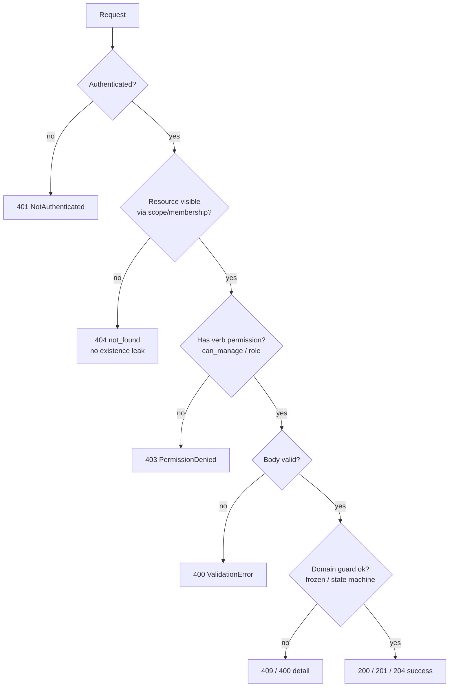

# Fixture Platform — Complete API / Endpoint Reference

> **Status:** exhaustive enumeration of every backend route reachable through
> `backend/fixture/urls.py` and every `backend/apps/*/urls.py`, plus the
> WebSocket route in `backend/apps/live/routing.py`.
> **Ground truth:** the source code listed in the `file:symbol (lines)` columns.
> Every claim below was verified against the actual view/serializer/permission
> source, not docs. Where the code and a docstring disagree, the code wins and
> the discrepancy is noted.
> **Scope:** backend HTTP + WS routes. (Third-party mounts under
> `.venv/.../site-packages/.../urls.py` are NOT part of the application and are
> excluded.)

---

## 0. Global conventions (apply to every endpoint unless overridden)

These come from `backend/fixture/settings/base.py` `REST_FRAMEWORK` (lines 160-180)
and the architectural invariants in `CLAUDE.md`.

| Concern | Default | Source |
|---|---|---|
| **Authentication** | `SessionAuthentication` only — cookie session, no JWT (invariant 15) | `base.py:REST_FRAMEWORK['DEFAULT_AUTHENTICATION_CLASSES']` (161-163) |
| **CSRF** | DRF `SessionAuthentication` enforces Django CSRF on **all unsafe methods** (POST/PUT/PATCH/DELETE) for authenticated session requests. SPA sends the `csrftoken` cookie value in a header; `CSRF_COOKIE_HTTPONLY=False` so JS can read it. | `base.py` (156-157); DRF built-in |
| **Default permission** | `IsAuthenticated` | `base.py` (164-166) |
| **Default throttles** | `AnonRateThrottle` 60/min + `UserRateThrottle` 240/min | `base.py` (168-179) |
| **Named throttle rates** | `signup`=3/hour, `school_registration`=30/hour (others set per-class) | `base.py` (172-179) |
| **DB transactions** | `ATOMIC_REQUESTS = True` — every request is wrapped in a transaction | `base.py:110` |
| **PKs** | UUID v7 everywhere; public URLs are `(slug, UUID)` pairs (invariant 1) | `CLAUDE.md` |
| **Idempotency** | Mutations accept a client `event_id` (UUID); replay returns the existing record (200, not 201). Enforced via `AuditEvent.idempotency_key` uniqueness — see `apps/audit/services.py::emit_audit` (45-49) | invariant 3 |
| **404-vs-403 policy** | Tenant-scoped resources: **404 when not accessible** (no existence leak — invariant 2). **403 only after** the resource is confirmed visible but the verb is not permitted. See §1 below. | `tournaments/scope.py`, `tournaments/views.py::_get_tournament_or_404` |
| **OpenAPI** | drf-spectacular at `/api/schema/` + Swagger UI `/api/docs/` (dev) | `fixture/urls.py` (86-87) |
| **Default Django Admin** | `/admin/` **intentionally disabled** in v1 (v1Users §1.5) | `fixture/urls.py` (12-13) |

### The 404-vs-403 contract (critical, used everywhere)

Two distinct patterns appear in the codebase:

1. **Existence-hiding 404 (tenant isolation).** A resource the caller can't
   *see* returns `404` (`NotFound` / `Http404`) regardless of whether it
   exists. Implemented by checking membership/scope first. Examples:
   `tournaments/views.py::_get_tournament_or_404` (62-71) raises
   `NotFound("tournament_not_found")` if `accessible_tournaments(user)` doesn't
   contain the id; `matches/views.py::_match_or_404` (58-68);
   `forms/views.py::_get_manageable_form` (58-65); the entire `/sadmin/`
   surface via `@superadmin_required` (404 for authenticated non-SA).

2. **Permission 403 (verb gating).** Once a resource is confirmed visible, an
   *insufficient role* for the requested verb returns `403`
   (`PermissionDenied`). Examples: `can_manage_tournament` gates POST/PATCH on
   visible tournaments → `403 not_tournament_manager`; org admin/owner verbs →
   `403`.

So the canonical sequence for a tenant-scoped mutation is:
**`404 if !visible` → `403 if !manager` → `400 if bad body` → `409 if frozen` → success.**

### Root mount map (`backend/fixture/urls.py`)

| Prefix | Included app | Lines |
|---|---|---|
| `/api/accounts/` | `apps.accounts.urls` | 30 |
| `/api/orgs/` | `apps.organizations.urls` | 31 |
| `/api/invitations:accept/` | `organizations.views.InvitationAcceptView` (root colon-verb) | 33-37 |
| `/api/invitations/` + `<uuid>:accept/` + `<uuid>:decline/` | `organizations.views.MyInvitationsView` / `InvitationAcceptByIdView` / `InvitationDeclineView` | 42-56 |
| `/api/permissions/` | `apps.permissions.urls` | 57 |
| `/api/audit/` | `apps.audit.urls` | 58 |
| `/api/sports/` | `apps.sports.urls` | 60 |
| `/api/tournaments/` | `apps.tournaments.urls` | 62 |
| `/api/register/` | `apps.teams.urls` | 64 |
| `/api/forms/` | `apps.forms.urls` | 66 |
| `/api/matches/` | `apps.matches.urls` | 68 |
| `/api/notifications/` | `apps.notifications.urls` | 70 |
| `/api/disputes/` | `apps.disputes.urls` | 72 |
| `/api/live/` | `apps.live.urls` | 74 |
| `/api/feedback/submit/` | `sadmin.views.FeedbackSubmitView` | 77-81 |
| `/api/schema/`, `/api/docs/` | drf-spectacular | 86-87 |
| `/sadmin/` | `apps.sadmin.urls` (HTML console + JSON verbs) | 88 |
| `ws/match/<uuid>/` | `live.consumers.MatchConsumer` (ASGI/Channels) | `live/routing.py:8` |

---

## 1. accounts (`/api/accounts/`)

All views are function-based (`@api_view`) in `apps/accounts/views.py`. URLs in
`apps/accounts/urls.py`. Several paths have both an underscore (canonical) and a
hyphen (SPA alias) form mapping to the same view; aliases are noted.

| Path | Method | View (file:symbol, lines) | Auth/Perm | Throttle | Request body | Success | Errors | Idempotent? |
|---|---|---|---|---|---|---|---|---|
| `auth/signup/` | POST | `views.signup` (84-138) | `AllowAny` | `SignupRateThrottle` 3/hr/IP (`accounts/throttling.py:21`) | `SignupSerializer`: `email`, `password`(≥12), `name?`, `org_name?`, `event_id?` | `{"status":"pending_verification"}` **201** new; **200** on event_id replay; **201** on duplicate-email (enumeration-safe, identical body) | 400 validation; 429 throttle | **Yes** — `event_id` → 200 |
| `auth/verify_email/` (+ `auth/verify-email/` alias) | POST | `views.verify_email` (141-176) | `AllowAny`, `@transaction.atomic` | default anon | `VerifyEmailSerializer`: `token` | `{"status":"verified"}` 200 | 400 `invalid_or_expired_token` | No (token single-use) |
| `auth/resend-verification/` | POST | `views.resend_verification` (179-217) | `AllowAny` | `SignupRateThrottle` 3/hr/IP | `{email}` (raw `request.data`) | `{"status":"ok"}` **202** always (enumeration-safe) | 429 throttle | n/a |
| `auth/login/` | POST | `views.login_view` (225-325) | `AllowAny` | default anon | `LoginSerializer`: `email`, `password`, `totp_code?` | `{"status":"ok"}` 200; `{"requires_2fa":true}` 200 when 2FA needed | 400 `invalid_credentials`/`invalid_2fa`; 403 `email_not_verified`/`account_inactive`; 429 `twofa_locked`; axes lockout (10 fails/15min) | No |
| `auth/logout/` | POST | `views.logout_view` (328-343) | `IsAuthenticated` | default user | none | `{"status":"ok"}` 200 | 401 | No |
| `auth/reauth/` | POST | `views.reauth_view` (346-357) | `IsAuthenticated` | default user | `ReauthSerializer`: `password` | `{"status":"ok"}` 200 (sets `last_password_reauth` session ts) | 400 `invalid_password`; 401 | No |
| `auth/password_reset_request/` (+ hyphen alias) | POST | `views.password_reset_request_view` (365-376) | `AllowAny` | default anon (svc enforces 5/email/hr, 10/IP/hr per `base.py` 224-225) | `PasswordResetRequestSerializer`: `email` | `{"status":"ok"}` 200 always (enumeration-safe) | 400 validation | n/a |
| `auth/password_reset_complete/` (+ hyphen alias) | POST | `views.password_reset_complete_view` (379-395) | `AllowAny` | default anon | `PasswordResetCompleteSerializer`: `token`, `new_password`(≥12) | `{"status":"ok"}` 200 | 400 (service `ValueError` → detail) | No |
| `auth/2fa/enroll/` | POST | `views.twofa_enroll_view` (403-418) | `IsAuthenticated` | default user | none | `{otpauth_uri, qr_data_uri, device_id}` 200 | 401 | No |
| `auth/2fa/confirm/` | POST | `views.twofa_confirm_view` (421-438) | `IsAuthenticated` | default user | `TwoFAConfirmSerializer`: `code` | `{recovery_codes:[...]}` 200 | 400 (bad code → `ValueError`); 401 | No |
| `auth/2fa/disable/` | POST | `views.twofa_disable_view` (441-454) | `IsAuthenticated` | default user | `TwoFADisableSerializer`: `reason?` | `{"status":"ok"}` 200 | 401 | No |
| `auth/2fa/recovery_codes:regenerate/` | POST | `views.twofa_recovery_regenerate_view` (457-468) | `IsAuthenticated` | default user | none | `{recovery_codes:[...]}` 200 | 401 | No |
| `me/` | GET | `views.me_view` (488-513) | `IsAuthenticated` | default user | none | `MeSerializer` 200 (`id,email,name,is_superuser,has_2fa_enrolled,twofa_enrolled_at,email_verified_at,last_active_org_id,last_active_org_slug,memberships[],deleted_at`) | 401 | n/a |
| `me/` | PATCH | `views.me_view` (488-513) | `IsAuthenticated` | default user | `MeSerializer` partial (writable: `name`, `last_active_org_id`) | `MeSerializer` 200 | 400; 401 | No |
| `users/<uuid:user_id>:soft_delete/` | POST | `views.user_soft_delete_view` (521-546) | `IsAuthenticated` + **manual `is_superuser` check** | default user | `SoftDeleteSerializer`: `reason?` | `{"status":"ok"}` 200 | **403 `forbidden`** if not superuser; **404 `not_found`** if target missing | No |

**Notes (accounts):**
- `user_soft_delete_view` returns **403** (not 404) for a non-superuser caller —
  it is not tenant-isolated; the superuser check precedes the lookup
  (`views.py` 526-527), and the target lookup yields **404** (line 530-532).
- Login auditing: `user_login_failed` / `user_login_success` rows emitted via
  `emit_audit`.

---

## 2. organizations (`/api/orgs/`) + top-level invitations

URLs in `apps/organizations/urls.py` (note: the file rebinds `urlpatterns`
twice; the **second** binding, lines 35-128, is authoritative). Views in
`apps/organizations/views.py`. **Verb routes are ordered before the catch-all
`<str:slug_or_uuid>/` so colon-verbs win** (urls.py 85-91).

Permission classes from `apps/organizations/permissions.py`:
`IsOrgMember` / `IsOrgAdminOrOwner` (role=ADMIN) / `IsOrgOwner`
(ADMIN+`is_org_owner`) / `IsSuperUser`. The base `_OrgMembershipPermission`
(69-99) returns `True` (pass-through) when no org kwarg resolves, deferring to
queryset filtering; superusers always pass.

| Path | Method | View (lines) | Auth/Perm | Request body | Success | Errors | Idempotent? |
|---|---|---|---|---|---|---|---|
| `` (`/api/orgs/`) | GET | `OrgListCreateView.get` (134-141) | `IsAuthenticated` | none | `OrganizationSerializer(many)` 200 — superuser: all active; else orgs with active membership | 401 | n/a |
| `` | POST | `OrgListCreateView.post` (143-164) | `IsAuthenticated` + manual superuser check | `OrganizationCreateSerializer`: `slug`, `name`, `time_zone=Asia/Kolkata` | `OrganizationSerializer` **201** | **403** (PermissionDenied) if not superuser; 400 validation | No |
| `<uuid:uuid>:change_slug/` | POST | `OrgChangeSlugView` (234-253) | `IsAuthenticated, IsOrgAdminOrOwner` | `ChangeSlugSerializer`: `new_slug` | `OrganizationSerializer` 200 | 400; 403; 404 | No |
| `<uuid:uuid>:suspend/` | POST | `OrgSuspendView` (256-273) | `IsAuthenticated, IsSuperUser` | `SuspendSerializer`: `reason` | `OrganizationSerializer` 200 | 400; 403; 404 | No |
| `<uuid:uuid>:unsuspend/` | POST | `OrgUnsuspendView` (276-289) | `IsAuthenticated, IsSuperUser` | none | `OrganizationSerializer` 200 | 403; 404 | No |
| `<uuid:uuid>:archive/` | POST | `OrgArchiveView` (292-321) | `IsAuthenticated` + manual owner-or-superuser check | `ArchiveSerializer`: `reason` | `OrganizationSerializer` 200 | **403** if not owner/superuser; 400; 404 | No |
| `<uuid:uuid>:transfer_ownership/` | POST | `OrgTransferOwnershipView` (324-347) | `IsAuthenticated, IsOrgOwner` | `TransferOwnershipSerializer`: `new_owner_user_id`\|`to_user_id`, `reason?`, `event_id?`, `conflict_acknowledged?` | `OrganizationSerializer` 200 | 400; 403; 404 (new_owner via `get_object_or_404`) | Accepts `event_id` (svc) |
| `<uuid:uuid>/members/` | GET | `OrgMembersListView` (355-371) | `IsAuthenticated, HasModule("org.member_directory")` | none | `OrganizationMembershipSerializer(many)` 200 | 403 (module); 404 | n/a |
| `<uuid:uuid>/members/<uuid:membership_id>/` | DELETE | `OrgMemberRemoveView` (374-405) | `IsAuthenticated, IsOrgAdminOrOwner` | none | **204** No Content | **403** if target `is_org_owner` (must transfer first); 404 (membership) | Soft no-op if already inactive |
| `<uuid:uuid>/invitations/` | GET | `OrgInvitationsView.get` (413-420) | `IsAuthenticated, IsOrgAdminOrOwner` | none | `AdminInvitationSerializer(many)` 200 | 403; 404 | n/a |
| `<uuid:uuid>/invitations/` | POST | `OrgInvitationsView.post` (422-441) | `IsAuthenticated, IsOrgAdminOrOwner` | `AdminInvitationCreateSerializer`: `email`, `role?`\|`roles?`, `event_id?` | `AdminInvitationSerializer` **201** | 400; 403; 404 | Accepts `event_id` (svc) |
| `<uuid:uuid>/invitations/<uuid:invitation_id>:revoke/` | POST | `OrgInvitationRevokeView` (444-464) | `IsAuthenticated, IsOrgAdminOrOwner` | `RevokeInvitationSerializer`: `reason?` | `AdminInvitationSerializer` 200 | 400; 403; 404 | No |
| `invitations/accept/` (`/api/orgs/invitations/accept/`) | POST | `InvitationAcceptByPathView` (802-806) → `InvitationAcceptView` | `AllowAny` | `AcceptInvitationSerializer`: `token`, `password?`(≥12), `name?` | `{org_slug, tournament_id}` 200 | 400 `invalid_or_used_invitation`/`password_required`; **401 `login_required`** (active acct exists) | No |
| `<str:slug>/members/` | GET | `OrgMembersBySlugView` (683-730) | `IsAuthenticated, HasModule("org.member_directory")` | none | `OrgMemberDetailSerializer(many)` 200 (one row per user, roles aggregated) | 403; 404 | n/a |
| `<str:slug>/invitations/` | GET | `OrgInvitationsBySlugView.get` (741-745) | `IsAuthenticated, IsOrgAdminOrOwner` | none | `AdminInvitationSerializer(many)` 200 | 403; 404 | n/a |
| `<str:slug>/invitations/` | POST | `OrgInvitationsBySlugView.post` (747-768) | `IsAuthenticated, IsOrgAdminOrOwner` | `AdminInvitationCreateSerializer` (`role` or `roles`), `event_id?` | `AdminInvitationSerializer` **201** | 400; 403; 404 | Accepts `event_id` |
| `<str:slug>/invitations/<uuid:invitation_id>/` | DELETE | `OrgInvitationByIdSlugView` (771-799) | `IsAuthenticated, IsOrgAdminOrOwner` | none | **204** (revoke) | 400; 403; 404 | No |
| `<str:slug>/ownership/transfer/` | POST | `OwnershipTransferBySlugView` (809-841) | `IsAuthenticated, IsOrgOwner` | `TransferOwnershipSerializer` | `OrganizationSerializer` 200 | 400; 403; 404 | Accepts `event_id` |
| `<str:slug_or_uuid>/` | GET | `OrgDetailView.get` (176-198) | `IsAuthenticated` + manual member/superuser check | none | `OrganizationSerializer` 200; **301** redirect on stale slug; 404 | **403** if not a member (after resolve); 404 unknown slug | n/a |
| `<str:slug_or_uuid>/` | PATCH | `OrgDetailView.patch` (200-226) | `IsAuthenticated` + manual ADMIN/superuser check | `OrganizationUpdateSerializer`: `name?`, `time_zone?` | `OrganizationSerializer` 200 | 400 (slug not allowed for PATCH — `DRFValidationError`); **403** if not admin; 404 | No |

### Top-level invitation routes (mounted in `fixture/urls.py`, not under `/orgs/`)

| Path | Method | View (lines) | Auth/Perm | Request body | Success | Errors |
|---|---|---|---|---|---|---|
| `/api/invitations:accept/` | POST | `InvitationAcceptView` (467-547) | `AllowAny` | `AcceptInvitationSerializer`: `token`, `password?`, `name?` (email NEVER from body — takeover guard, 481-524) | `{org_slug, tournament_id}` 200 | 400 invalid/used; 401 `login_required` |
| `/api/invitations/` | GET | `MyInvitationsView` (555-602) | `IsAuthenticated` | none | array of pending invites for the user's email | 401 |
| `/api/invitations/<uuid:invitation_id>:accept/` | POST | `InvitationAcceptByIdView` (605-639) | `IsAuthenticated` | none | `{membership_id, role, status:"accepted", tournament_id?}` 200 | **403** wrong email; **404** `invitation_not_found`; 400 used/expired |
| `/api/invitations/<uuid:invitation_id>:decline/` | POST | `InvitationDeclineView` (642-666) | `IsAuthenticated` | none | `{"status":"declined"}` 200 | 403 wrong email; 404 not found; 400 not-pending |

---

## 3. permissions (`/api/permissions/`)

URLs `apps/permissions/urls.py`; views `apps/permissions/views.py`.

| Path | Method | View (lines) | Auth/Perm | Request body | Success | Errors |
|---|---|---|---|---|---|---|
| `modules/` | GET | `ModuleCatalogView` (73-88) | `IsAuthenticated` | none | `ModuleSerializer(many)` 200 (`id,code,name,description,category,default_for_roles`) | 401 |
| `me/modules/?org={uuid}` | GET | `MyEffectiveModulesView` (91-136) | `IsAuthenticated` | `?org=` UUID **required** | `{modules:[codes]}` 200 | **400** missing/invalid org; **404** org not found |
| `orgs/<uuid:org_uuid>/users/<uuid:user_uuid>/grants/` | GET | `UserGrantsView.get` (171-198) | `IsAuthenticated, IsOrgAdminOrOwner` | none | `{grants:[GrantRow], effective_modules:[]}` 200 | **404** org not found; 403; 404 user (`get_object_or_404`) |
| same | PUT | `UserGrantsView.put` (210-269) | `IsAuthenticated, IsOrgAdminOrOwner` | `BulkGrantsSerializer` `{grants:[{module,state}],reason(≥20)}` **OR** `BulkGrantsCellsSerializer` `{cells:{code:state},reason,event_id?}` (cells wins if both) | `{grants,effective_modules}` 200 | 400 (`GrantValidationError`); 403; 404 |
| `orgs/<slug:slug>/grants/matrix/` | GET | `MatrixView` (340-371) | `IsAuthenticated, IsOrgAdminOrOwner` | none | `MatrixResponseSerializer` `{modules[],members[]}` 200 | 403; **404** org not found |
| `orgs/<slug:slug>/me/modules/` | GET | `MyModulesBySlugView` (277-300) | `IsAuthenticated` | none | `{modules:[]}` 200 | **404** org not found |
| `orgs/<slug:slug>/users/<uuid:user_uuid>/grants/` | GET/PUT | `UserGrantsBySlugView` (303-337) | `IsAuthenticated, IsOrgAdminOrOwner` | (same as UUID variant) | (same) | 403; 404 |

**Notes:** Grant management gated on **role** (`IsOrgAdminOrOwner`), not on
`HasModule("org.member_directory")` — v1Users §2 reserves override-grants to
Admin (views 139-148, 340-352). `BulkGrantsCellsSerializer.event_id` is
**accepted but ignored** at the service layer in Phase 1A (serializers.py
108-110).

---

## 4. audit (`/api/audit/`)

URLs `apps/audit/urls.py`; view `apps/audit/views.py`. Read-only; append-only at
the Postgres role layer (invariant 5).

| Path | Method | View (lines) | Auth/Perm | Query params | Success | Errors |
|---|---|---|---|---|---|---|
| `orgs/<slug:slug>/` | GET | `OrgAuditListView` (90-200) | `IsAuthenticated, HasModule("org.audit_log")` | `cursor?`, `limit?`(def 50, max 200), `actor_id?`, `event_type?`, `from?`, `to?` | `{results:[AuditEvent], next_cursor, previous_cursor}` 200 | **400** invalid cursor / invalid actor_id; 403 (module); **404** org not found |

Cursor is urlsafe-base64 of `"<iso8601>|<uuid>"`, ordered `-created_at,-id`.

---

## 5. sports (`/api/sports/`)

URLs `apps/sports/urls.py`; views `apps/sports/views.py`. **Fully public.**

| Path | Method | View (lines) | Auth/Perm | Params | Success | Errors |
|---|---|---|---|---|---|---|
| `` | GET | `SportListView` (33-53) | `AllowAny`, `pagination_class=None` | `?status=`, `?category=` (validated against enums) | `SportSerializer(many)` 200, ordered by `display_order` | — |
| `<slug:code>/` | GET | `SportDetailView` (56-64) | `AllowAny`, lookup by `code` | — | `SportSerializer` 200 | 404 unknown code |

---

## 6. tournaments (`/api/tournaments/`)

URLs `apps/tournaments/urls.py` — this file **also mounts views from disputes,
fixtures, forms, matches, and teams apps under the tournament prefix** (imports
at top). Tournament-owned views: `apps/tournaments/views.py`. All
tenant-isolated via `accessible_tournaments` → 404, then `can_manage_tournament`
→ 403. Helper `_get_tournament_or_404` (views 62-71).

| Path | Method | View (file:symbol, lines) | Auth/Perm | Request body | Success | Errors | Idempotent? |
|---|---|---|---|---|---|---|---|
| `` | GET | `TournamentListCreateView.get` (43-45) | `IsAuthenticated` (scope-filtered) | none | `TournamentSerializer(many)` 200 | 401 | n/a |
| `` | POST | `TournamentListCreateView.post` (47-59) | `IsAuthenticated` | `TournamentCreateSerializer`: `name`, `sport_code?`, `event_id?` | `TournamentSerializer` **201** | **403 `verify_email_first`** if email unverified; 400 | **Yes** — `create_tournament` replays on `event_id` (`services/create.py` 47-54) |
| `constraint-types/` | GET | `ConstraintTypesView` (154-162) | `IsAuthenticated` | none | `CONSTRAINT_TYPES` catalog 200 | 401 | n/a |
| `<uuid:tournament_id>/settings/` | GET | `TournamentSettingsView.get` (128-130) | `IsAuthenticated` (visible only) | none | `{rules, constraints, rules_frozen_at, can_edit}` 200 | 404 | n/a |
| `<uuid:tournament_id>/settings/` | PATCH | `TournamentSettingsView.patch` (132-151) | `IsAuthenticated` + `can_manage_tournament` | `{rules?, constraints?, amend?, reason?, event_id?}` (raw) | `_settings_payload` 200 | 404; 403; **409 `rules_frozen`** (PermissionError); 400 (ValueError) | Accepts `event_id` (svc) |
| `<uuid:tournament_id>/invitations/` | POST | `TournamentInvitationCreateView` (74-106) | `IsAuthenticated` + `can_manage_tournament` | `TournamentInvitationCreateSerializer`: `email`, `role`(tournament role), `event_id?` | `{id,email,role,tournament_id,status}` **201** | 404; 403; 400 | Accepts `event_id` |
| `<uuid:tournament_id>/members/` | GET | `TournamentMembersView` (177-196) | `IsAuthenticated` (visible) | none | `TournamentMembershipSerializer(many)` 200 (active+suspended) | 404 | n/a |
| `<uuid:tournament_id>/members/<uuid:membership_id>/` | PATCH | `TournamentMemberDetailView` (199-281) | `IsAuthenticated` + `can_manage_tournament` | `TournamentMembershipUpdateSerializer`: `role?`, `status?` | `TournamentMembershipSerializer` 200 | 404; 403; **400 `last_admin`** (last active admin guard); 404 membership | No |
| `<uuid:tournament_id>/audit/` | GET | `TournamentAuditView` (284-317) | `IsAuthenticated` + `can_manage_tournament` | `?limit=` (def 50, max 200) | `{results:[AuditEvent]}` 200 | 404; 403 | n/a |
| `<uuid:tournament_id>/registration-link/` | POST | `teams.views.RegistrationLinkCreateView` (24-49) | `IsAuthenticated` + `can_manage_tournament` | `{label?}` (raw) | `{token, path:/register/{token}, tournament_id}` **201** | 404; 403 | No |
| `<uuid:tournament_id>/teams/` | GET | `teams.views.TournamentTeamsListView` (95-125) | `IsAuthenticated` (visible) | none | array of teams w/ `player_count` 200 | 404 | n/a |
| `<uuid:tournament_id>/forms/` | GET | `forms.views.TournamentFormsView.get` (73-79) | `IsAuthenticated` (visible) | none | `FormSerializer(many)` 200 | 404 | n/a |
| `<uuid:tournament_id>/forms/` | POST | `forms.views.TournamentFormsView.post` (81-91) | `IsAuthenticated` + `can_manage_tournament` | `FormCreateSerializer`: `title`, `purpose`, `schema?` | `FormSerializer` **201** | 404; 403; 400 (schema) | No |
| `<uuid:tournament_id>/matches/` | GET | `matches.views.TournamentMatchListView` (86-96) | `IsAuthenticated` (visible) | none | `MatchSerializer(many)` 200 | 404 | n/a |
| `<uuid:tournament_id>/standings/` | GET | `matches.views.TournamentStandingsView` (99-114) | `IsAuthenticated` (visible) | none | `{groups:[{group_label, rows}]}` 200 | 404 | n/a |
| `<uuid:tournament_id>/generate-fixtures/` | POST | `fixtures.views.GenerateFixturesView` (20-46) | `IsAuthenticated` + `can_manage_tournament` | `{format=round_robin\|knockout\|knockout_from_groups, group_size?}` (raw) | `{generated:N, format}` **201** | 404; 403; 400 (ValueError/TypeError from generator) | No |
| `<uuid:tournament_id>/disputes/` | GET | `disputes.views.TournamentDisputeView.get` (46-51) | `IsAuthenticated` (visible) | none | `DisputeSerializer(many)` 200 — manager sees all, else only own | 404 | n/a |
| `<uuid:tournament_id>/disputes/` | POST | `disputes.views.TournamentDisputeView.post` (53-70) | `IsAuthenticated` (visible) | `RaiseDisputeSerializer`: `kind`, `description`, `match_id?`, `event_id?` | `DisputeSerializer` **201** | 404; 400 | Accepts `event_id` |

---

## 7. teams / public registration (`/api/register/`)

URLs `apps/teams/urls.py` (only the public route). The organizer routes live
under `/api/tournaments/` (see §6). Views `apps/teams/views.py`.

| Path | Method | View (lines) | Auth/Perm | Throttle | Request body | Success | Errors | Idempotent? |
|---|---|---|---|---|---|---|---|---|
| `<str:token>/` | GET | `PublicRegistrationView.get` (60-66) | `AllowAny` | `RegistrationRateThrottle` (GET exempt, `teams/throttling.py` 16-19) | none | `{tournament_name, tournament_id}` 200 | **404 `invalid_link`** | n/a |
| `<str:token>/` | POST | `PublicRegistrationView.post` (68-92) | `AllowAny` | `RegistrationRateThrottle` 30/hr/IP on POST | `SchoolRegistrationSerializer`: `school_name`, `teams[]` (each `name`,`short_name?`,`players[]`), `event_id?` | `{registered:N, teams:[names]}` **201** | 404 invalid_link; 400 validation; **400 `duplicate_team_name_or_jersey_in_submission`** (IntegrityError) | Accepts `event_id` (svc `register_school`) |

`PlayerInSerializer` fields: `full_name`, `jersey_no?`(1-999), `position?`,
`dob_year?`(1950-2025), `is_goalkeeper?`, `captain?`. Validation rejects >1
captain per team (`serializers.py` 28-37).

---

## 8. forms (`/api/forms/`)

URLs `apps/forms/urls.py`; views `apps/forms/views.py`. Builder/responses
endpoints are organizer-only (`_get_manageable_form`: 404 → 403). Public
submit/upload are `AllowAny` + `PublicFormThrottle` 30/hr/IP.

| Path | Method | View (lines) | Auth/Perm | Throttle | Request body | Success | Errors |
|---|---|---|---|---|---|---|---|
| `field-types/` | GET | `FieldTypesView` (151-159) | `IsAuthenticated` | default user | none | `[{type, has_options}]` 200 | 401 |
| `r/<str:token>/` | GET | `PublicFormView.get` (203-207) | `AllowAny` | `PublicFormThrottle` | none | `_public_payload` or `{closed:true,...}` 200 | **404 `invalid_link`** |
| `r/<str:token>/` | POST | `PublicFormView.post` (209-232) | `AllowAny` | `PublicFormThrottle` | `PublicSubmitSerializer`: `answers{}`, `event_id?`, `upload_refs{}` | `{response_id, message}` **201** | 404; 400 `registration_closed`; 400 `{errors}` (AnswerError) |
| `<uuid:form_id>/public/` | GET | `PublicFormView.get` (203-207) | `AllowAny` | `PublicFormThrottle` | none | (same as token GET) | **404 `form_not_found`** |
| `<uuid:form_id>/public/` | POST | `PublicFormView.post` (209-232) | `AllowAny` | `PublicFormThrottle` | `PublicSubmitSerializer` | `{response_id, message}` **201** | 404; 400 closed; 400 errors |
| `<uuid:form_id>/uploads/` | POST | `PublicUploadView` (235-269) | `AllowAny`, `MultiPartParser`/`FormParser` | `PublicFormThrottle` | multipart `file` (+ `field_key?`); max 10 MB; pdf/png/jpeg only | `{upload_ref}` **201** | **404** form_not_found/closed; 400 `no_file`/`file_too_large`/`unsupported_type` |
| `<uuid:form_id>/responses/` | GET | `FormResponsesView` (278-308) | `IsAuthenticated`+manager | default user | `?export=csv` optional | `FormResponseSerializer(many)` 200 **or** CSV attachment | 404; 403 |
| `<uuid:form_id>/responses/<uuid:response_id>/` | PATCH | `FormResponseDetailView` (311-328) | `IsAuthenticated`+manager | default user | `{status}` (raw) — must be valid `ResponseStatus` | `FormResponseSerializer` 200 | 404; 403; **404 `response_not_found`**; 400 `invalid_status` |
| `<uuid:form_id>:send-stage2/` | POST | `FormSendStage2View` (331-365) | `IsAuthenticated`+manager | default user | `{target_form_id}` (raw) | `{sent:N, links:[...]}` **201** | 404; 403; 400 `target_form_not_found` |
| `<uuid:form_id>/` | GET | `FormDetailView.get` (99-100) | `IsAuthenticated`+manager | default user | none | `FormSerializer` 200 | 404; 403 |
| `<uuid:form_id>/` | PATCH | `FormDetailView.patch` (102-107) | `IsAuthenticated`+manager | default user | `FormSerializer` partial | `FormSerializer` 200 | 404; 403; 400 (schema/FormEditError) |
| `<uuid:form_id>/` | DELETE | `FormDetailView.delete` (109-113) | `IsAuthenticated`+manager | default user | none | **204** (soft-delete) | 404; 403 |
| `<uuid:form_id>:publish/` | POST | `FormPublishView` (116-127) | `IsAuthenticated`+manager | default user | none | `FormSerializer` 200 (draft→open) | 404; 403; **400** (`FormEditError`) |
| `<uuid:form_id>:close/` | POST | `FormCloseView` (130-138) | `IsAuthenticated`+manager | default user | none | `FormSerializer` 200 (open→closed) | 404; 403 |
| `<uuid:form_id>:duplicate/` | POST | `FormDuplicateView` (141-148) | `IsAuthenticated`+manager | default user | none | `FormSerializer` **201** (clone) | 404; 403 |

---

## 9. matches (`/api/matches/`)

URLs `apps/matches/urls.py`; views `apps/matches/views.py`. Tenant-isolated via
`_match_or_404` (58-68 → 404). Scoring authorization via `_can_score` (71-83):
tournament manager **OR** assigned `match.scorer` **OR** active `match_scorer`
member. Non-mutating list/read views require only visibility.

| Path | Method | View (lines) | Auth/Perm | Request body | Success | Errors | Idempotent? |
|---|---|---|---|---|---|---|---|
| `<uuid:match_id>/score/` | POST | `RecordScoreView` (138-160) | `IsAuthenticated` + `_can_score` | `RecordScoreSerializer`: `home_score`(0-99), `away_score`(0-99), `event_id?` | `MatchSerializer` 200 | 404; **403 `not_allowed_to_score`**; 400 (ValidationError detail) | **Yes** — `record_score(event_id=)` |
| `<uuid:match_id>/scorer/` | POST | `AssignScorerView` (117-135) | `IsAuthenticated` + `can_manage_tournament` | `{user_id}` (raw) | `MatchSerializer` 200 | 404; **403 `not_tournament_manager`**; 400 `user_not_found`/invalid_assignment | No |
| `<uuid:match_id>/events/` | POST | `RecordMatchEventView` (163-221) | `IsAuthenticated` + `_can_score` | `RecordEventSerializer`: `event_type`, `side?(home/away)`, `player_id?`, `related_player_id?`, `minute?(0-200)`, `event_id?` | `MatchSerializer` **201** | 404; 403; 400 `player_not_found`/`player_not_on_team`/`related_player_*` | **Yes** — `record_match_event(event_id=)` |
| `<uuid:match_id>/events/export/` | GET | `MatchEventsExportView` (250-293) | `IsAuthenticated` (visible) | none | CSV attachment (formula-injection safe via `_csv_safe`) 200 | 404 | n/a |
| `<uuid:match_id>/transition/` | POST | `TransitionMatchView` (224-247) | `IsAuthenticated` + `_can_score` | `TransitionSerializer`: `to_status`, `reason?` | `MatchSerializer` 200 | 404; **403 `not_allowed_to_transition`**; 400 `illegal_transition` | No |
| `<uuid:match_id>/lineups/` | GET | `MatchLineupView.get` (313-321) | `IsAuthenticated` (visible) | none | `{lineups:[LineupSerializer]}` 200 | 404 | n/a |
| `<uuid:match_id>/lineups/` | POST | `MatchLineupView.post` (323-351) | `IsAuthenticated` + `_can_score` | `SetLineupSerializer`: `team_id`, `entries[]`(`player_id`,`role?`,`shirt_no?`), `event_id?` | `LineupSerializer` — **201** if new, **200** if updating existing | 404; **403 `not_allowed_to_set_lineup`**; 400 `team_not_in_match`/`team_id_required`/`invalid_lineup` | **Yes** — `set_lineup(event_id=)` |
| `<uuid:match_id>/lineups/confirm/` | POST | `ConfirmLineupView` (354-382) | `IsAuthenticated` + `_can_score` | `ConfirmLineupSerializer`: `team_id`, `event_id?` | `LineupSerializer` 200 | 404; **403 `not_allowed_to_confirm_lineup`**; 400 `invalid_confirm`/team checks | **Yes** — `confirm_lineup(event_id=)` |
| `<uuid:match_id>/incidents/` | GET | `MatchIncidentView.get` (391-394) | `IsAuthenticated` (visible) | none | `MatchIncidentSerializer(many)` 200 | 404 | n/a |
| `<uuid:match_id>/incidents/` | POST | `MatchIncidentView.post` (396-425) | `IsAuthenticated` + `_can_score` | `FileIncidentSerializer`: `kind`, `description`, `minute?(0-200)`, `player_id?`, `event_id?` | `MatchIncidentSerializer` **201** | 404; **403 `not_allowed_to_file_incident`**; 400 `player_not_found`/`invalid_incident` | **Yes** — `file_incident(event_id=)` |

`MatchSerializer` body: `id, stage, group_label, round_no, match_no, status,
home_team{id,name,short_name}, away_team{...}, home_score, away_score,
scheduled_at, current_period`.

---

## 10. notifications (`/api/notifications/`)

URLs `apps/notifications/urls.py`; views `apps/notifications/views.py`.
Per-user scoped (no org/tournament leak — filters on `user=request.user`).

| Path | Method | View (lines) | Auth/Perm | Request body | Success | Errors |
|---|---|---|---|---|---|---|
| `` | GET | `NotificationListView` (13-28) | `IsAuthenticated` | none | `{results:[Notification] (max 50), unread_count}` 200 | 401 |
| `read-all/` | POST | `MarkAllReadView` (42-46) | `IsAuthenticated` | none | `{marked:N}` 200 | 401 |
| `<uuid:notification_id>/read/` | POST | `MarkReadView` (31-39) | `IsAuthenticated` | none | `NotificationSerializer` 200 | **404 `notification_not_found`** (not the user's / missing); 401 |

---

## 11. disputes (`/api/disputes/`)

URLs `apps/disputes/urls.py`; views `apps/disputes/views.py`. (The
list+raise GET/POST live under `/api/tournaments/{id}/disputes/`, §6.)
Tenant-isolated via `_dispute_or_404` (29-37 → 404).

| Path | Method | View (lines) | Auth/Perm | Request body | Success | Errors |
|---|---|---|---|---|---|---|
| `<uuid:dispute_id>/resolve/` | POST | `ResolveDisputeView` (94-95) → `_ManagerTransitionView` (73-91) | `IsAuthenticated` + `can_manage_tournament` | `ResolveDisputeSerializer`: `resolution` | `DisputeSerializer` 200 (→RESOLVED) | 404; **403 `not_tournament_manager`**; 400 invalid transition |
| `<uuid:dispute_id>/reject/` | POST | `RejectDisputeView` (98-99) → `_ManagerTransitionView` | `IsAuthenticated` + `can_manage_tournament` | `ResolveDisputeSerializer`: `resolution` | `DisputeSerializer` 200 (→REJECTED) | 404; 403; 400 |
| `<uuid:dispute_id>/withdraw/` | POST | `WithdrawDisputeView` (102-119) | `IsAuthenticated` + **raiser-only check** | none | `DisputeSerializer` 200 (→WITHDRAWN) | 404; **403 `only_raiser_can_withdraw`**; 400 |

---

## 12. live (`/api/live/`) + WebSocket

Public viewer surface (one-way, invariant 11). HTTP view
`apps/live/views.py`; WS consumer `apps/live/consumers.py`.

| Path | Method | View (lines) | Auth/Perm | Request | Success | Errors |
|---|---|---|---|---|---|---|
| `/api/live/match/<uuid:match_id>/` | GET | `LiveMatchSnapshotView` (47-103) | `AllowAny` | none | `{match{...,home_score,away_score,home_team,away_team}, events[] (last 30, voided dropped)}` 200 | **404 `match_not_found`** |

Rosters only included when match status ∈ {LIVE, HALF_TIME, COMPLETED}
(`_ROSTER_VISIBLE`, line 13); player names use public-safe `display_name`.

### WebSocket (ASGI / Channels)

`fixture/asgi.py` wraps `websocket` traffic in
`AllowedHostsOriginValidator(AuthMiddlewareStack(URLRouter(...)))` (21-28).

| Route | Consumer (file:symbol, lines) | Auth | Protocol |
|---|---|---|---|
| `ws/match/<uuid:match_id>/` | `live.consumers.MatchConsumer` (`routing.py:8`; consumer 9-30) | `AuthMiddlewareStack` (session) + `AllowedHostsOriginValidator` (origin check); **the consumer itself does NOT check membership — it `accept()`s any connection** that passes origin/host validation | bidirectional; client→server `{type:"ping"}` echoed as `{type:"pong"}`; server→client `match.event` broadcasts on group `match_<id>` |

> **Verified gap:** `MatchConsumer.connect` (12-16) accepts every connection
> joining `match_<id>` without verifying the user can access that match. The
> room is delivery-only (writes go through REST), but the snapshot is also
> public, so this is consistent with the "public viewer" design rather than a
> leak of private data.

---

## 13. Super-admin console (`/sadmin/`) — HTML + JSON verbs

URLs `apps/sadmin/urls.py`; views under `apps/sadmin/views/`. **Every view is
gated by `@superadmin_required`** (`apps/sadmin/decorators.py` 18-42): anonymous
→ **302** to `/sadmin/login/?next=`; authenticated non-superuser (or
inactive/deleted) → **404** (surface-hiding, v1Users §1.5). `login/` is the only
public entry. An optional IP allowlist middleware
(`apps/sadmin/middleware.py`) returns **404** for non-allowlisted IPs when
`SADMIN_IP_ALLOWLIST` is set (no-op in dev). These are **Django HTML views, not
DRF** (except the JSON verbs under `/sadmin/api/`).

| Path | Method | View (file:symbol) | Auth | Body / params | Response |
|---|---|---|---|---|---|
| `login/` | GET, POST | `views/auth.py::sadmin_login` (27-54) | **public** | POST form `email`,`password`; only `is_superuser` accepted | renders `sadmin/login.html`; 302 to dashboard on success |
| `logout/` | POST | `views/auth.py::sadmin_logout` (57-70) | `@require_POST` (implicit SA via session) | none | 302 to login |
| `` | GET | `views/dashboard.py::dashboard` (26-38) | `@superadmin_required @require_GET` | none | dashboard HTML (live KPIs) |
| `kpis/` | GET | `views/dashboard.py::dashboard_kpis` (41-52) | SA, `@require_GET` | none | HTMX `_kpi_cards.html` partial |
| `orgs/` | GET | `views/orgs.py::orgs_list` (16-40) | SA, `@require_GET` | `?q`,`?status`,`?page` | paginated org list HTML |
| `orgs/<uuid:org_id>/` | GET | `views/orgs.py::orgs_detail` (43-54) | SA, `@require_GET` | none | org detail HTML (404 if missing) |
| `orgs/<uuid:org_id>/<str:verb>/` | POST | `views/orgs.py::org_verb` (57-84) | SA, `@require_POST` | `reason?`; verb ∈ {approve, reject, suspend, unsuspend} | verb-result partial (ok/err) |
| `users/` | GET | `views/users.py::users_list` (19-40) | SA, `@require_GET` | `?q`,`?status`(active/inactive/deleted),`?page` | paginated user list HTML |
| `users/<uuid:user_id>/` | GET | `views/users.py::users_detail` (43-67) | SA, `@require_GET` | none | user detail HTML (404 if missing) |
| `users/<uuid:user_id>/<str:verb>/` | POST | `views/users.py::user_verb` (70-116) | SA, `@require_POST` | `reason?`; verb ∈ {suspend, unsuspend, force_logout_all, force_password_reset, unlock_account, impersonate_start} | verb-result partial |
| `impersonate/stop/` | POST | `views/users.py::impersonate_stop` (119-123) | SA, `@require_POST` | none | 302 to dashboard |
| `feedback/` | GET | `views/feedback.py::feedback_list` (55-79) | SA, `@require_GET` | `?status`,`?category`,`?page` | feedback inbox HTML (emails redacted per B.11) |
| `feedback/<uuid:feedback_id>/triage/` | POST | `views/feedback.py::feedback_triage` (82-100) | SA, `@require_POST` | `status`, `internal_notes?` | verb-result partial |
| `audit/` | GET | `views/audit.py::audit_search` (15-45) | SA, `@require_GET` | `?event_type`,`?actor`,`?org`,`?page` | audit search HTML |
| `api/bulk-email/` | POST | `views/superadmin.py::bulk_email_api` (45-81) | SA, `@require_POST @csrf_exempt` | JSON `{subject, body?, target_filter?{}}` | `{recipients, subject, body}` 200; 400 if no subject / bad target_filter |
| `api/system-health/` | GET | `views/superadmin.py::system_health_api` (84-92) | SA, `@require_GET` | none | `{db, redis, tables}` 200 (read-only) |
| `api/feedback/<uuid:feedback_id>:archive/` | POST | `views/superadmin.py::archive_feedback_api` (95-114) | SA, `@require_POST @csrf_exempt` | none | `{id, status}` 200; 404 if missing |

---

## 14. Public feedback (`/api/feedback/submit/`) — DRF, mounted at root

| Path | Method | View (file:symbol, lines) | Auth/Perm | Throttle | Request body | Success | Errors | Idempotent? |
|---|---|---|---|---|---|---|---|---|
| `/api/feedback/submit/` | POST | `sadmin/views/feedback.py::FeedbackSubmitView` (119-202) | `IsAuthenticated` | `FeedbackSubmitThrottle` (`UserRateThrottle` scope `feedback_submit`) **10/hour/user** (108-116) | `FeedbackSubmitSerializer`: `message`(1-5000), `page_url?`, `screenshot_data_uri?`, `category?`, `subject?`, `event_id?` | `{id}` — **201** new, **200** on `event_id` replay | 400 validation; 429; 500 `Could not record feedback.` (caught) | **Yes** — `event_id` → 200 (checks `AuditEvent.idempotency_key`, 175-181) |

---

## 15. Throttle catalog (all view-scoped + named)

| Throttle | Rate | Scope key | Applied to | Source |
|---|---|---|---|---|
| `AnonRateThrottle` (default) | 60/min | IP | all anon requests | `base.py` 169,173 |
| `UserRateThrottle` (default) | 240/min | user | all authed requests | `base.py` 170,174 |
| `SignupRateThrottle` | 3/hour | IP | `signup`, `resend_verification` | `accounts/throttling.py` 21-37 |
| `RegistrationRateThrottle` | 30/hour | IP (POST only) | `PublicRegistrationView` | `teams/throttling.py` 13-26 |
| `PublicFormThrottle` | 30/hour | IP | `PublicFormView`, `PublicUploadView` | `forms/throttling.py` 14-23 |
| `FeedbackSubmitThrottle` | 10/hour | user | `FeedbackSubmitView` | `sadmin/views/feedback.py` 108-116 |
| Password-reset (service-level, not DRF) | 5/email/hr, 10/IP/hr | email + IP | `password_reset_request_view` | `base.py` 224-225 |
| `django-axes` login lockout | 10 fails / 15 min | (ip, username) | `login_view`, `sadmin_login` | `base.py` 190-193 |

---

## 16. Idempotency (`event_id`) coverage matrix

Per invariant 3, mutations should accept a client `event_id`. Actual coverage
(verified at the **service** layer where the dedupe happens via
`AuditEvent.idempotency_key`):

| Endpoint | `event_id` accepted by serializer? | Replay returns existing (200/no-op)? | Verified at |
|---|---|---|---|
| `accounts/signup` | yes | yes → 200 | `views.signup` 120-121 |
| `tournaments` POST (create) | yes | yes → existing 201-equivalent | `services/create.py` 47-54 |
| `tournaments/{id}/settings` PATCH | yes | svc `update_settings(event_id=)` | `views` 144 |
| `tournaments/{id}/invitations` POST | yes | svc `create_invitation(event_id=)` | `views` 94 |
| org `invitations` POST (slug variant) | yes | svc `create_invitation(event_id=)` | `views` 762 |
| org `transfer_ownership` | yes (serializer) | passed to svc | serializer 98 |
| `register/{token}` POST | yes | svc `register_school(event_id=)` | `views` 80 |
| `forms` public submit POST | yes | svc `submit_response(event_id=)` | `views` 219 |
| `matches/{id}/score` POST | yes | svc `record_score(event_id=)` | `views` 154 |
| `matches/{id}/events` POST | yes | svc `record_match_event(event_id=)` | `views` 218 |
| `matches/{id}/lineups` POST | yes | svc `set_lineup(event_id=)` | `views` 340 |
| `matches/{id}/lineups/confirm` | yes | svc `confirm_lineup(event_id=)` | `views` 372 |
| `matches/{id}/incidents` POST | yes | svc `file_incident(event_id=)` | `views` 420 |
| `disputes` raise POST | yes | svc `raise_dispute(event_id=)` | `views` 67 |
| `feedback/submit` | yes | yes → 200 | `views` 169-201 |
| permissions grants PUT (`cells` shape) | yes | **accepted but IGNORED** in Phase 1A | `permissions/serializers.py` 108-110 |
| **No `event_id`:** assign-scorer, transition, generate-fixtures, form publish/close/duplicate, member PATCH, org verbs (suspend/archive/change_slug), 2FA verbs, dispute resolve/reject/withdraw | n/a | n/a | per-serializer |

---

## 17. Authentication / permission class summary (cross-reference)

| Class | File:symbol | Semantics |
|---|---|---|
| `IsAuthenticated` (DRF) | default | logged-in session |
| `AllowAny` (DRF) | default | public |
| `IsSuperUser` | `organizations/permissions.py:121` | Django `is_superuser` |
| `IsOrgMember` | `organizations/permissions.py:102` | any active membership in resolved org |
| `IsOrgAdminOrOwner` | `organizations/permissions.py:108` | active ADMIN role |
| `IsOrgOwner` | `organizations/permissions.py:114` | active ADMIN + `is_org_owner` |
| `HasModule(code)` | `permissions/permissions.py:30` | module-RBAC gate; needs `view.get_organization()`; superuser bypass; returns class |
| `can_manage_tournament(user,t)` | `tournaments/permissions.py:17` | tournament ADMIN/CO_ORGANIZER, or org ADMIN of workspace (function, not a perm class — called inline) |
| `accessible_tournaments(user)` | `tournaments/scope.py:19` | scope queryset for 404-isolation (function) |
| `@superadmin_required` | `sadmin/decorators.py:18` | HTML gate: anon→302, non-SA→404 |

> Note: `_OrgMembershipPermission.has_permission` returns `True` when it cannot
> resolve an org from the view kwargs (permissions.py 85-88), intentionally
> deferring authorization to queryset/object filtering. This means
> resource-collection routes without an org kwarg are not blocked by these
> classes — they rely on the view's own scoping.

---

## 18. Ambiguities / discrepancies found during verification

1. **`organizations/urls.py` defines `urlpatterns` twice** (lines 19-31, then
   35-128). Python keeps the **second** binding; the first (which lacked all the
   verb routes) is dead code. The header comment in §2 reflects the live one.
2. **No POST on `/api/orgs/{slug_or_uuid}/`** — org creation is only at the
   collection root `/api/orgs/` (POST → superuser-only). The detail route is
   GET/PATCH only.
3. **`/api/orgs/` POST** uses a manual `request.user.is_superuser` check raising
   `PermissionDenied` (403) rather than the `IsSuperUser` permission class —
   functionally equivalent but inconsistent with the verb views.
4. **`MatchConsumer` does no per-match authorization** (see §12) — acceptable
   given the snapshot endpoint is also public, but worth flagging for the
   restructure if private rooms are ever needed.
5. **Permissions grants `event_id`** is accepted by the serializer but explicitly
   not deduped in Phase 1A (serializers.py 108-110) — the only mutation in the
   matrix where idempotency is declared-but-not-enforced.
6. **`feedback/submit` returns 500** in a `try/except Exception` (views 192-197)
   rather than letting it propagate — a deliberate swallow that hides the cause.
7. **Hyphen vs underscore aliases** in accounts (`verify-email`,
   `password-reset-request`, etc.) duplicate routes with no `name=` on the alias;
   both resolve to the same view. Not a bug, but doubles the surface.
8. **`update_settings` raises `PermissionError` mapped to 409** (`rules_frozen`,
   views 147-148) — note this 409 is a *domain conflict*, distinct from the 403
   permission path (`not_tournament_manager`) earlier in the same handler.
9. **`base.py:CHANNEL_LAYERS`** is `InMemoryChannelLayer` in dev (no cross-process
   fan-out); prod uses Redis (`prod.py` 52-57). WS broadcasts only work
   single-process in dev.
10. **`sadmin` JSON verbs are `@csrf_exempt`** (`bulk_email_api`,
    `archive_feedback_api`) — they rely solely on the session SA gate, not CSRF.
