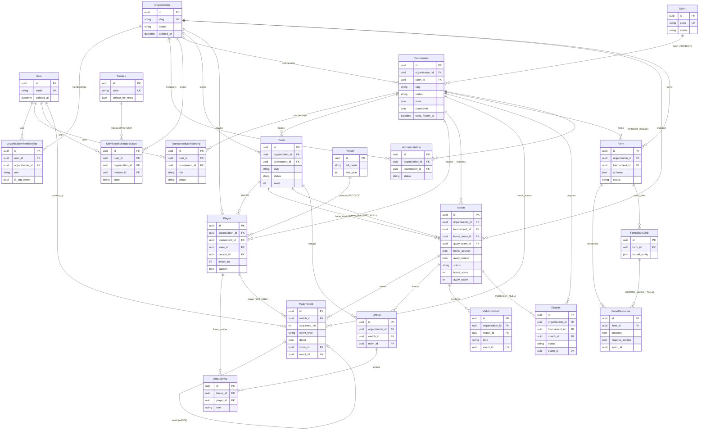

# Fixture Platform — Complete Data Model / ERD

Exhaustive, source-verified reference of every Django model in `backend/apps/*/models.py`.
Ground truth = the source files; every claim below cites `file:symbol` + line ranges.

**Scope:** 13 model files, **33 concrete models** (32 domain models + the custom `User`).
The `fixtures` app and `live` app define **no models** (`apps/fixtures/` is a pure service
layer; `apps/live/` is SSE/WS transport) — verified: `find backend/apps -name models.py`
returns 12 files, and `apps/fixtures`/`apps/live` directory listings contain no `models.py`.

**PK convention (invariant #1):** every model uses
`id = models.UUIDField(primary_key=True, default=uuid7, editable=False)` where
`uuid7` is `apps/accounts/models.py:uuid7` (lines 28-30) — returns a stdlib
`uuid.UUID` wrapping `uuid_utils.uuid7()`. The lone exception is `User`, which still
overrides `id` to `uuid7` (`apps/accounts/models.py:69`). No auto-increment anywhere.

**Timestamps:** the project runs `USE_TZ = True` (invariant #14); all `DateTimeField`s
store UTC.

---

## 1. Model inventory (by app)

| App | Model | Table | File:lines | Org-scoped? |
|-----|-------|-------|-----------|-------------|
| accounts | `User` | `accounts_user` | `accounts/models.py:66-117` | No (global identity) |
| accounts | `TwoFactorDevice` | `accounts_twofactor_device` | `accounts/models.py:125-159` | No (per-user) |
| accounts | `RecoveryCode` | `accounts_recovery_code` | `accounts/models.py:162-191` | No (per-user) |
| accounts | `PasswordResetToken` | `accounts_password_reset_token` | `accounts/models.py:199-232` | No (per-user) |
| accounts | `EmailVerificationToken` | `accounts_email_verification_token` | `accounts/models.py:240-267` | No (per-user) |
| organizations | `Organization` | `organizations_organization` | `organizations/models.py:114-164` | **Is the tenant root** |
| organizations | `OrganizationMembership` | `organizations_membership` | `organizations/models.py:172-239` | Yes (FK `organization`) |
| organizations | `AdminInvitation` | `organizations_admin_invitation` | `organizations/models.py:252-337` | Yes (FK `organization`) |
| organizations | `SlugRedirect` | `organizations_slug_redirect` | `organizations/models.py:345-359` | Yes (FK `organization`) |
| permissions | `Module` | `permissions_module` | `permissions/models.py:43-81` | No (global catalog) |
| permissions | `MembershipModuleGrant` | `permissions_membership_module_grant` | `permissions/models.py:84-161` | Yes (FK `organization`) |
| audit | `AuditEvent` | `audit_event` | `audit/models.py:35-100` | Soft (`organization_id` UUIDField, no FK) |
| sadmin | `Feedback` | `sadmin_feedback` | `sadmin/models.py:42-97` | No (platform/super-admin) |
| sadmin | `UsageEvent` | `sadmin_usage_event` | `sadmin/models.py:105-134` | Soft (`organization_id` UUIDField, no FK) |
| sadmin | `KPISnapshot` | `sadmin_kpi_snapshot` | `sadmin/models.py:142-155` | No (platform-wide) |
| sports | `Sport` | `sports_sport` | `sports/models.py:62-131` | No (global catalog) |
| tournaments | `Tournament` | `tournaments_tournament` | `tournaments/models.py:53-113` | Yes (FK `organization`) |
| tournaments | `TournamentMembership` | `tournaments_membership` | `tournaments/models.py:116-159` | Indirect (via `tournament`) |
| teams | `Person` | `teams_person` | `teams/models.py:28-46` | **No** (platform identity, invariant #8) |
| teams | `Team` | `teams_team` | `teams/models.py:49-93` | Yes (FK `organization`) |
| teams | `Player` | `teams_player` | `teams/models.py:96-143` | Yes (FK `organization`) |
| teams | `RegistrationLink` | `teams_registration_link` | `teams/models.py:146-176` | Yes (FK `organization`) |
| matches | `Match` | `matches_match` | `matches/models.py:52-124` | Yes (FK `organization`) |
| matches | `Lineup` | `matches_lineup` | `matches/models.py:132-168` | Yes (FK `organization`) |
| matches | `LineupEntry` | `matches_lineup_entry` | `matches/models.py:171-195` | Indirect (via `lineup`) |
| matches | `MatchIncident` | `matches_match_incident` | `matches/models.py:206-242` | Yes (FK `organization`) |
| matches | `MatchEvent` | `matches_match_event` | `matches/models.py:245-304` | Yes (FK `organization`) |
| disputes | `Dispute` | `disputes_dispute` | `disputes/models.py:24-64` | Yes (FK `organization`) |
| notifications | `Notification` | `notifications_notification` | `notifications/models.py:12-37` | Indirect (per-user; optional `tournament`) |
| forms | `Form` | `forms_form` | `forms/models.py:17-62` | Yes (FK `organization`) |
| forms | `FormShareLink` | `forms_share_link` | `forms/models.py:65-91` | Yes (FK `organization`) |
| forms | `FormResponse` | `forms_response` | `forms/models.py:94-136` | Yes (FK `organization`) |
| forms | `FormFileUpload` | `forms_file_upload` | `forms/models.py:139-160` | Yes (FK `organization`) |

> **`app_label` overrides:** `Module` & `MembershipModuleGrant` set `app_label = "permissions_app"`
> (`permissions/models.py:73, 143`) even though the directory is `apps/permissions`. `Sport` sets
> `app_label = "sports"` (`sports/models.py:122`).

---

## 2. Per-model field reference

Notation: `null/blank` shown as `n/b` (e.g. `Y/Y`). `auto_now_add` ⇒ set on insert;
`auto_now` ⇒ touched on every save. "—" = not set / not applicable.

### 2.1 accounts.User — `accounts_user` (`accounts/models.py:66-117`)
Custom user extending `AbstractUser`; `username` dropped, `email` is `USERNAME_FIELD`.
Manager = `UserManager` (email-based, lowercases on create). `REQUIRED_FIELDS = []`.

| Field | Type | n/b | Default | Notes |
|-------|------|-----|---------|-------|
| `id` | UUIDField PK | N/N | `uuid7` | editable=False (line 69) |
| `email` | EmailField | N/N | — | `unique=True`; lowercased in `save()` (113-117) & manager (41) |
| `name` | CharField(200) | N/Y | `""` | full name |
| `deleted_at` | DateTimeField | Y/Y | — | `db_index=True`; soft-delete (invariant) |
| `has_2fa_enrolled` | BooleanField | N/N | `False` | |
| `twofa_enrolled_at` | DateTimeField | Y/Y | — | |
| `email_verified_at` | DateTimeField | Y/Y | — | flip `is_active`→True on verify |
| `last_password_change_at` | DateTimeField | Y/Y | — | rotation tracking |
| `last_active_org_id` | UUIDField | Y/Y | — | SPA org switcher (B.20); **no FK**, raw UUID |
| (inherited) | `is_active`,`is_staff`,`is_superuser`,`password`,`last_login`,`date_joined`,`first_name`,`last_name`,`groups`,`user_permissions` | from `AbstractUser` | — | `is_active` default False → True on email verify (docstring line 13) |

`soft_delete()` (103-111) anonymizes: `email=f"deleted-{id}@invalid"`, `name="[Deleted]"`, `is_active=False`.
No `Meta.constraints`/`indexes` beyond `db_table`; `email` carries Django's implicit unique index.

### 2.2 accounts.TwoFactorDevice — `accounts_twofactor_device` (`accounts/models.py:125-159`)
| Field | Type | n/b | Default | Notes |
|-------|------|-----|---------|-------|
| `id` | UUIDField PK | N/N | `uuid7` | |
| `user` | FK→User | N/N | — | `on_delete=CASCADE`, `related_name="totp_devices"` |
| `secret_b32` | CharField(512) | N/N | — | Fernet ciphertext when `cryptography` present, else plaintext |
| `confirmed_at` | DateTimeField | Y/Y | — | |
| `created_at` | DateTimeField | N/N | `auto_now_add` | |

**Constraint:** partial `UniqueConstraint(fields=["user"], condition=Q(confirmed_at__isnull=False), name="one_confirmed_totp_per_user")` (150-156) — one *confirmed* device per user.

### 2.3 accounts.RecoveryCode — `accounts_recovery_code` (`accounts/models.py:162-191`)
| Field | Type | n/b | Default | Notes |
|-------|------|-----|---------|-------|
| `id` | UUIDField PK | N/N | `uuid7` | |
| `user` | FK→User | N/N | — | CASCADE, `related_name="recovery_codes"` |
| `code_hash` | CharField(256) | N/N | — | argon2id hash (B.14) |
| `used_at` | DateTimeField | Y/Y | — | single-use marker |
| `created_at` | DateTimeField | N/N | `auto_now_add` | |

**Index:** `Index(["user","used_at"], name="recovery_user_used_idx")` (183).

### 2.4 accounts.PasswordResetToken — `accounts_password_reset_token` (`accounts/models.py:199-232`)
| Field | Type | n/b | Default | Notes |
|-------|------|-----|---------|-------|
| `id` | UUIDField PK | N/N | `uuid7` | |
| `user` | FK→User | N/N | — | CASCADE, `related_name="password_reset_tokens"` |
| `token_hash` | CharField(128) | N/N | — | `db_index=True`; sha256, plaintext emailed only |
| `expires_at` | DateTimeField | N/N | — | TTL `PASSWORD_RESET_TTL_MINUTES` (def 60) |
| `used_at` | DateTimeField | Y/Y | — | single-use |
| `requested_ip` | GenericIPAddressField | Y/Y | — | |
| `created_at` | DateTimeField | N/N | `auto_now_add` | |

**Index:** `Index(["user","-created_at"], name="prt_user_created_idx")` (220).

### 2.5 accounts.EmailVerificationToken — `accounts_email_verification_token` (`accounts/models.py:240-267`)
| Field | Type | n/b | Default | Notes |
|-------|------|-----|---------|-------|
| `id` | UUIDField PK | N/N | `uuid7` | |
| `user` | FK→User | N/N | — | CASCADE, `related_name="email_verification_tokens"` |
| `token_hash` | CharField(128) | N/N | — | `db_index=True`; sha256 |
| `expires_at` | DateTimeField | N/N | — | TTL `EMAIL_VERIFICATION_TTL_HOURS` (def 48) |
| `used_at` | DateTimeField | Y/Y | — | single-use |
| `created_at` | DateTimeField | N/N | `auto_now_add` | |

No extra indexes/constraints (`Meta` only sets `db_table`, 258-259).

### 2.6 organizations.Organization — `organizations_organization` (`organizations/models.py:114-164`)
**The tenant root.** Two managers: `objects` (all rows) + `active_objects` (filters `deleted_at IS NULL`, 76-80).

| Field | Type | n/b | Default | Choices | Notes |
|-------|------|-----|---------|---------|-------|
| `id` | UUIDField PK | N/N | `uuid7` | — | |
| `slug` | CharField(63) | N/N | — | — | `unique=True` |
| `name` | CharField(200) | N/N | — | — | |
| `status` | CharField(24) | N/N | `PENDING_REVIEW` | `OrgStatus` (36-43) | `db_index=True` |
| `time_zone` | CharField(64) | N/N | `"Asia/Kolkata"` | — | IANA TZ |
| `created_at` | DateTimeField | N/N | `auto_now_add` | — | |
| `created_by` | FK→User | Y/Y | — | — | `SET_NULL`, `related_name="orgs_created"` |
| `archived_at` | DateTimeField | Y/Y | — | — | |
| `suspended_at` | DateTimeField | Y/Y | — | — | |
| `suspended_reason` | TextField | N/Y | `""` | — | |
| `deleted_at` | DateTimeField | Y/Y | — | — | `db_index=True` |

**`OrgStatus` choices:** `pending_review`, `active`, `suspended`, `archived`, `orphaned`.
**Indexes** (153-157): `org_status_idx(status)`, `org_slug_idx(slug)`, `org_deleted_at_idx(deleted_at)`.

### 2.7 organizations.OrganizationMembership — `organizations_membership` (`organizations/models.py:172-239`)
Manager = `OrganizationMembershipManager` exposing `user_org_ids()` / `active_for()` (the scope-filter source).

| Field | Type | n/b | Default | Choices | Notes |
|-------|------|-----|---------|---------|-------|
| `id` | UUIDField PK | N/N | `uuid7` | — | |
| `user` | FK→User | N/N | — | — | CASCADE, `related_name="org_memberships"` |
| `organization` | FK→Organization | N/N | — | — | CASCADE, `related_name="memberships"` |
| `role` | CharField(24) | N/N | — | `MembershipRole` (46-54) | |
| `is_org_owner` | BooleanField | N/N | `False` | — | only meaningful when role=admin |
| `is_active` | BooleanField | N/N | `True` | — | |
| `created_at` | DateTimeField | N/N | `auto_now_add` | — | |
| `created_by` | FK→User | Y/Y | — | — | `SET_NULL`, `related_name="memberships_created"` |
| `removed_at` | DateTimeField | Y/Y | — | — | |

**`MembershipRole` choices (6):** `admin`, `co_organizer`, `game_coordinator`, `match_scorer`, `referee`, `team_manager`.
**Constraints** (211-235):
- `unique_active_role_per_user_per_org`: `Unique(["user","organization","role"], condition=is_active=True)` — multi-role per (user,org) allowed.
- `one_owner_per_org`: `Unique(["organization"], condition=is_org_owner=True & is_active=True)`. *(Declarative & IMMEDIATE; the spec's DEFERRABLE INITIALLY DEFERRED RunSQL was a TODO that is **not** present in any migration — verified `grep -rn DEFERRABLE backend/apps/*/migrations` returns nothing.)*
- `owner_flag_only_on_admin_role`: `Check(is_org_owner=False OR role="admin")`.

**Indexes** (204-210): `mem_org_role_active_idx(organization,role,is_active)`, `mem_user_active_idx(user,is_active)`.

### 2.8 organizations.AdminInvitation — `organizations_admin_invitation` (`organizations/models.py:252-337`)
| Field | Type | n/b | Default | Choices | Notes |
|-------|------|-----|---------|---------|-------|
| `id` | UUIDField PK | N/N | `uuid7` | — | |
| `organization` | FK→Organization | N/N | — | — | CASCADE, `related_name="invitations"` |
| `email` | EmailField | N/N | — | — | lowercased in `save()` (319-322) |
| `invited_by` | FK→User | Y/Y | — | — | `SET_NULL`, `related_name="invitations_sent"` |
| `role` | CharField(24) | N/N | `CO_ORGANIZER` | `MembershipRole` | |
| `tournament` | FK→Tournament | Y/Y | — | — | CASCADE, `related_name="invitations"`; null = org-level invite |
| `token_hash` | CharField(128) | N/N | — | — | `db_index=True`; sha256 |
| `status` | CharField(16) | N/N | `PENDING` | `InviteStatus` (57-64) | |
| `expires_at` | DateTimeField | N/N | `_default_invite_expiry` (247-249) | — | now + `INVITE_TOKEN_TTL_DAYS` (def 7) |
| `accepted_at` | DateTimeField | Y/Y | — | — | |
| `accepted_by_user` | FK→User | Y/Y | — | — | `SET_NULL`, `related_name="invitations_accepted"` |
| `revoked_at` | DateTimeField | Y/Y | — | — | |
| `revoked_reason` | TextField | N/Y | `""` | — | |
| `created_at` | DateTimeField | N/N | `auto_now_add` | — | |

**`InviteStatus` choices:** `pending`, `accepted`, `expired`, `revoked`, `declined`.
**Constraint** (311-316): `unique_pending_invite_per_email_per_org_tournament`: `Unique(["organization","tournament","email"], condition=status="pending")`.
**Indexes** (307-310): `inv_email_status_idx(email,status)`, `inv_token_hash_idx(token_hash)`.
`effective_status` property (327-334) surfaces expired pendings on read.

### 2.9 organizations.SlugRedirect — `organizations_slug_redirect` (`organizations/models.py:345-359`)
| Field | Type | n/b | Default | Notes |
|-------|------|-----|---------|-------|
| `id` | UUIDField PK | N/N | `uuid7` | |
| `old_slug` | CharField(63) | N/N | — | `unique=True` |
| `organization` | FK→Organization | N/N | — | CASCADE, `related_name="slug_redirects"` |
| `created_at` | DateTimeField | N/N | `auto_now_add` | |

### 2.10 permissions.Module — `permissions_module` (`permissions/models.py:43-81`)
Global catalog (22 modules, loaded from `apps/permissions/fixtures/modules.json` via `load_modules`). `app_label="permissions_app"`.

| Field | Type | n/b | Default | Notes |
|-------|------|-----|---------|-------|
| `id` | UUIDField PK | N/N | `uuid7` | |
| `code` | CharField(64) | N/N | — | `unique=True`; e.g. `"tournament.editor"` |
| `name` | CharField(200) | N/N | — | |
| `description` | TextField | N/Y | `""` | |
| `category` | CharField(64) | N/N | `""` | `db_index=True`; e.g. `org_scoped`/`tournament_scoped` |
| `default_for_roles` | **JSONField** | N/Y | `list` | list of `MembershipRole` strings (see §4) |
| `created_at` | DateTimeField | N/N | `auto_now_add` | |

`Meta.ordering=["category","code"]`. **Index:** `perm_module_category_idx(category)` (76-78).

### 2.11 permissions.MembershipModuleGrant — `permissions_membership_module_grant` (`permissions/models.py:84-161`)
**Keyed on (user, organization)** — NOT on a membership row (audit fix A.4, docstring 84-99). `app_label="permissions_app"`.

| Field | Type | n/b | Default | Choices | Notes |
|-------|------|-----|---------|---------|-------|
| `id` | UUIDField PK | N/N | `uuid7` | — | |
| `user` | FK→User | N/N | — | — | CASCADE, `related_name="module_grants"` |
| `organization` | FK→Organization | N/N | — | — | CASCADE, `related_name="module_grants"` |
| `module` | FK→Module | N/N | — | — | **`PROTECT`**, `related_name="grants"` |
| `state` | CharField(16) | N/N | `DEFAULT` | `GrantState` (27-40) | |
| `granted_by` | FK→User | Y/Y | — | — | `SET_NULL`, `related_name="grants_made"` |
| `reason` | TextField | N/Y | `""` | — | service layer enforces ≥20 chars |
| `created_at` | DateTimeField | N/N | `auto_now_add` | — | |
| `updated_at` | DateTimeField | N/N | `auto_now` | — | |

**`GrantState` choices:** `default`, `grant`, `deny`.
**Constraint** (145-150): `unique_grant_per_user_org_module`: `Unique(["user","organization","module"])`.
**Index** (151-156): `perm_grant_user_org_idx(user,organization)`.

### 2.12 audit.AuditEvent — `audit_event` (`audit/models.py:35-100`)
**Append-only at DB level** (invariant #5) — a `BEFORE UPDATE/DELETE` trigger raises `42501`
(migration `audit/migrations/0002_audit_append_only.py`, `audit_event_append_only()` fn + two triggers).
Scope columns are **raw UUIDFields, not FKs** (decoupled from cascade).

| Field | Type | n/b | Default | Choices | Notes |
|-------|------|-----|---------|---------|-------|
| `id` | UUIDField PK | N/N | `uuid7` | — | |
| `idempotency_key` | UUIDField | Y/Y | — | — | **`unique=True`** (idempotency #3) |
| `actor_user` | FK→User | Y/Y | — | — | `SET_NULL`, `related_name="+"` |
| `actor_role` | CharField(32) | N/N | — | `ActorRole` (22-32) | |
| `deleted_user_handle` | CharField(64) | N/Y | `""` | — | preserves deleted actor identity |
| `impersonating_user_id` | UUIDField | Y/Y | — | — | raw UUID |
| `organization_id` | UUIDField | Y/Y | — | — | `db_index=True` (tenant scope, no FK) |
| `tournament_id` | UUIDField | Y/Y | — | — | `db_index=True` |
| `match_id` | UUIDField | Y/Y | — | — | `db_index=True` |
| `event_type` | CharField(64) | N/N | — | — | `db_index=True` |
| `target_type` | CharField(64) | N/N | — | — | `db_index=True` |
| `target_id` | UUIDField | N/N | — | — | `db_index=True` |
| `payload_before` | **JSONField** | Y/Y | — | — | snapshot dict (free-form) |
| `payload_after` | **JSONField** | Y/Y | — | — | snapshot dict (free-form) |
| `reason` | TextField | N/Y | `""` | — | |
| `ip_address` | GenericIPAddressField | Y/Y | — | — | |
| `user_agent` | CharField(255) | N/Y | `""` | — | |
| `created_at` | DateTimeField | N/N | `auto_now_add` | — | `db_index=True` |

**`ActorRole` choices (8):** `super_admin`, `admin`, `co_organizer`, `game_coordinator`, `match_scorer`, `referee`, `team_manager`, `system`.
**Indexes** (83-96): `audit_org_created_idx(organization_id,-created_at)`, `audit_target_created_idx(target_type,target_id,-created_at)`, `audit_actor_created_idx(actor_user,-created_at)`. No `Meta.ordering` (UUID7 PK + created_at gives natural order, comment line 97).

### 2.13 sadmin.Feedback — `sadmin_feedback` (`sadmin/models.py:42-97`)
| Field | Type | n/b | Default | Choices | Notes |
|-------|------|-----|---------|---------|-------|
| `id` | UUIDField PK | N/N | `uuid7` | — | |
| `submitted_by` | FK→User | Y/Y | — | — | `SET_NULL`, `related_name="feedback_submissions"`; null=anon |
| `category` | CharField(24) | N/N | `OTHER` | `FeedbackCategory` (27-32) | |
| `subject` | CharField(200) | N/N | — | — | |
| `body` | TextField | N/N | — | — | |
| `status` | CharField(16) | N/N | `PENDING` | `FeedbackStatus` (35-39) | |
| `triaged_by` | FK→User | Y/Y | — | — | `SET_NULL`, `related_name="feedback_triaged"` |
| `triaged_at` | DateTimeField | Y/Y | — | — | |
| `resolved_at` | DateTimeField | Y/Y | — | — | |
| `internal_notes` | TextField | N/Y | `""` | — | super-admin only |
| `created_at` | DateTimeField | N/N | `auto_now_add` | — | `db_index=True` |
| `updated_at` | DateTimeField | N/N | `auto_now` | — | |

**`FeedbackCategory`:** `bug`, `feature_request`, `complaint`, `praise`, `other`. **`FeedbackStatus`:** `pending`, `triaged`, `resolved`, `wontfix`.
**Index** (89-94): `sadmin_fb_status_created_idx(status,created_at)`.

### 2.14 sadmin.UsageEvent — `sadmin_usage_event` (`sadmin/models.py:105-134`)
| Field | Type | n/b | Default | Notes |
|-------|------|-----|---------|-------|
| `id` | UUIDField PK | N/N | `uuid7` | |
| `user` | FK→User | Y/Y | — | `SET_NULL`, `related_name="usage_events"` |
| `organization_id` | UUIDField | Y/Y | — | `db_index=True` (scope, no FK) |
| `event_type` | CharField(64) | N/N | — | |
| `payload` | **JSONField** | N/Y | `dict` | free-form telemetry |
| `created_at` | DateTimeField | N/N | `auto_now_add` | `db_index=True` |

**Index** (126-131): `sadmin_ue_evt_created_idx(event_type,created_at)`.

### 2.15 sadmin.KPISnapshot — `sadmin_kpi_snapshot` (`sadmin/models.py:142-155`)
| Field | Type | n/b | Default | Notes |
|-------|------|-----|---------|-------|
| `id` | UUIDField PK | N/N | `uuid7` | |
| `snapshot_date` | DateField | N/N | — | **`unique=True`** (idempotency key per day) |
| `metrics` | **JSONField** | N/N | `dict` | rolled-up KPI dict |
| `created_at` | DateTimeField | N/N | `auto_now_add` | |

`Meta.ordering=["-snapshot_date"]`.

### 2.16 sports.Sport — `sports_sport` (`sports/models.py:62-131`)
Global, platform-level catalog (intentionally **not** org-scoped, docstring line 12). `app_label="sports"`.

| Field | Type | n/b | Default | Choices | Notes |
|-------|------|-----|---------|---------|-------|
| `id` | UUIDField PK | N/N | `uuid7` | — | |
| `code` | SlugField(64) | N/N | — | — | `unique=True`; lowercase ASCII slug |
| `name` | CharField(200) | N/N | — | — | |
| `category` | CharField(32) | N/N | `OTHER` | `SportCategory` (40-59) | `db_index=True` |
| `status` | CharField(16) | N/N | `PLANNED` | `SportStatus` (24-37) | `db_index=True` |
| `description` | TextField | N/Y | `""` | — | |
| `indigenous_to` | CharField(128) | N/Y | `""` | — | free-form origin label |
| `is_team_sport` | BooleanField | N/N | `False` | — | |
| `is_individual_sport` | BooleanField | N/N | `False` | — | |
| `python_module_path` | CharField(200) | N/Y | `""` | — | dotted plugin path |
| `icon` | CharField(64) | N/Y | `""` | — | |
| `display_order` | PositiveIntegerField | N/N | `1000` | — | |
| `created_at` | DateTimeField | N/N | `auto_now_add` | — | |
| `updated_at` | DateTimeField | N/N | `auto_now` | — | |

**`SportStatus`:** `planned`, `coming_soon`, `active`, `deprecated`.
**`SportCategory` (13):** `team`, `individual`, `racket`, `combat`, `athletics`, `aquatics`, `gymnastics`, `strength`, `shooting`, `mind`, `indigenous`, `adventure`, `other`.
`Meta.ordering=["display_order","name"]`. **Indexes** (125-128): `sport_status_idx(status)`, `sport_category_idx(category)`.

### 2.17 tournaments.Tournament — `tournaments_tournament` (`tournaments/models.py:53-113`)
Org-scoped root of the competition graph.

| Field | Type | n/b | Default | Choices | Notes |
|-------|------|-----|---------|---------|-------|
| `id` | UUIDField PK | N/N | `uuid7` | — | |
| `organization` | FK→Organization | N/N | — | — | **CASCADE**, `related_name="tournaments"` |
| `sport` | FK→Sport | Y/Y | — | — | **`PROTECT`**, `related_name="tournaments"` |
| `slug` | CharField(63) | N/N | — | — | unique per-org (constraint below) |
| `name` | CharField(200) | N/N | — | — | |
| `status` | CharField(24) | N/N | `DRAFT` | `TournamentStatus` (24-33) | `db_index=True` |
| `time_zone` | CharField(64) | N/N | `"Asia/Kolkata"` | — | TZ frozen once scheduled (invariant #14) |
| `inputs_hash` | CharField(64) | N/Y | `""` | — | generator regen tracking (#10) |
| `last_manual_edit_at` | DateTimeField | Y/Y | — | — | (#10) |
| `rules` | **JSONField** | N/Y | `dict` | — | structured ruleset (see §3.1) |
| `constraints` | **JSONField** | N/Y | `list` | — | scheduling constraints (see §3.2) |
| `rules_frozen_at` | DateTimeField | Y/Y | — | — | freeze gate at registration_open (#7) |
| `created_at` | DateTimeField | N/N | `auto_now_add` | — | |
| `created_by` | FK→User | Y/Y | — | — | `SET_NULL`, `related_name="tournaments_created"` |
| `deleted_at` | DateTimeField | Y/Y | — | — | `db_index=True` |

**`TournamentStatus` (7):** `draft`, `published`, `registration_open`, `scheduled`, `live`, `completed`, `archived`.
**Constraint** (97-103): `unique_tournament_slug_per_org`: `Unique(["organization","slug"], condition=deleted_at IS NULL)`.
**Index** (104-106): `trn_org_status_idx(organization,status)`.

### 2.18 tournaments.TournamentMembership — `tournaments_membership` (`tournaments/models.py:116-159`)
Where tournament-admin identity lives (the 6 tournament-scoped roles).

| Field | Type | n/b | Default | Choices | Notes |
|-------|------|-----|---------|---------|-------|
| `id` | UUIDField PK | N/N | `uuid7` | — | |
| `user` | FK→User | N/N | — | — | CASCADE, `related_name="tournament_memberships"` |
| `tournament` | FK→Tournament | N/N | — | — | CASCADE, `related_name="memberships"` |
| `role` | CharField(24) | N/N | — | `TournamentMembershipRole` (36-44) | |
| `status` | CharField(16) | N/N | `ACTIVE` | `TournamentMembershipStatus` (47-50) | |
| `assigned_by` | FK→User | Y/Y | — | — | `SET_NULL`, `related_name="tournament_assignments_made"` |
| `assigned_at` | DateTimeField | N/N | `auto_now_add` | — | |
| `revoked_at` | DateTimeField | Y/Y | — | — | |

**`TournamentMembershipRole` (6):** `admin`, `co_organizer`, `game_coordinator`, `match_scorer`, `referee`, `team_manager`.
**`TournamentMembershipStatus`:** `active`, `suspended`, `revoked`.
**Constraint** (144-150): `unique_active_tournament_role`: `Unique(["user","tournament","role"], condition=status="active")`.
**Indexes** (151-156): `trnmem_t_role_status_idx(tournament,role,status)`, `trnmem_user_status_idx(user,status)`.

### 2.19 teams.Person — `teams_person` (`teams/models.py:28-46`)
**Platform-scoped identity (invariant #8) — NO organization FK.** Enables cross-tournament stats.

| Field | Type | n/b | Default | Notes |
|-------|------|-----|---------|-------|
| `id` | UUIDField PK | N/N | `uuid7` | |
| `full_name` | CharField(200) | N/N | — | |
| `display_name` | CharField(120) | N/Y | `""` | |
| `dob_year` | PositiveSmallIntegerField | Y/Y | — | coarse DOB; full Fernet DOB is follow-up |
| `created_by` | FK→User | Y/Y | — | `SET_NULL`, `related_name="persons_created"` |
| `deleted_at` | DateTimeField | Y/Y | — | `db_index=True` |
| `created_at` | DateTimeField | N/N | `auto_now_add` | |
| `updated_at` | DateTimeField | N/N | `auto_now` | |

**Index** (43): `person_full_name_idx(full_name)`.

### 2.20 teams.Team — `teams_team` (`teams/models.py:49-93`)
| Field | Type | n/b | Default | Choices | Notes |
|-------|------|-----|---------|---------|-------|
| `id` | UUIDField PK | N/N | `uuid7` | — | |
| `organization` | FK→Organization | N/N | — | — | CASCADE, `related_name="teams"` |
| `tournament` | FK→Tournament | N/N | — | — | CASCADE, `related_name="teams"` |
| `slug` | CharField(80) | N/N | — | — | unique per-tournament |
| `name` | CharField(200) | N/N | — | — | |
| `short_name` | CharField(40) | N/Y | `""` | — | |
| `school` | CharField(200) | N/Y | `""` | — | |
| `region` | CharField(120) | N/Y | `""` | — | |
| `pool` | CharField(80) | N/Y | `""` | — | group/category |
| `seed` | PositiveSmallIntegerField | Y/Y | — | — | |
| `status` | CharField(24) | N/N | `REGISTERED` | `TeamStatus` (19-25) | `db_index=True` |
| `created_by` | FK→User | Y/Y | — | — | `SET_NULL`, `related_name="teams_created"` |
| `deleted_at` | DateTimeField | Y/Y | — | — | `db_index=True` |
| `created_at` | DateTimeField | N/N | `auto_now_add` | — | |
| `updated_at` | DateTimeField | N/N | `auto_now` | — | |

**`TeamStatus` (6):** `draft`, `pending_approval`, `registered`, `rejected`, `withdrawn`, `disqualified`.
**Constraints** (78-87): `unique_team_slug_per_tournament`: `Unique(["tournament","slug"])` (unconditional); `unique_team_name_per_tournament`: `Unique(["tournament","name"], condition=deleted_at IS NULL)`.
**Index** (88-90): `team_trn_status_idx(tournament,status)`.

### 2.21 teams.Player — `teams_player` (`teams/models.py:96-143`)
Per-tournament registration referencing a `Person`.

| Field | Type | n/b | Default | Notes |
|-------|------|-----|---------|-------|
| `id` | UUIDField PK | N/N | `uuid7` | |
| `organization` | FK→Organization | N/N | — | CASCADE, `related_name="players"` |
| `tournament` | FK→Tournament | N/N | — | CASCADE, `related_name="players"` |
| `team` | FK→Team | N/N | — | CASCADE, `related_name="players"` |
| `person` | FK→Person | N/N | — | **`PROTECT`**, `related_name="players"` |
| `jersey_no` | PositiveSmallIntegerField | Y/Y | — | |
| `position` | CharField(16) | N/Y | `""` | |
| `captain` | BooleanField | N/N | `False` | |
| `is_goalkeeper` | BooleanField | N/N | `False` | |
| `added_by` | FK→User | Y/Y | — | `SET_NULL`, `related_name="players_added"` |
| `deleted_at` | DateTimeField | Y/Y | — | `db_index=True` |
| `created_at` | DateTimeField | N/N | `auto_now_add` | |
| `updated_at` | DateTimeField | N/N | `auto_now` | |

**Constraints** (120-136):
- `unique_jersey_per_team`: `Unique(["team","jersey_no"], condition=deleted_at IS NULL & jersey_no IS NOT NULL)`.
- `unique_person_per_tournament`: `Unique(["tournament","person"], condition=deleted_at IS NULL)`.
- `unique_captain_per_team`: `Unique(["team"], condition=captain=True & deleted_at IS NULL)`.
**Indexes** (137-140): `player_team_idx(team)`, `player_person_idx(person)`.

### 2.22 teams.RegistrationLink — `teams_registration_link` (`teams/models.py:146-176`)
| Field | Type | n/b | Default | Notes |
|-------|------|-----|---------|-------|
| `id` | UUIDField PK | N/N | `uuid7` | |
| `organization` | FK→Organization | N/N | — | CASCADE, `related_name="registration_links"` |
| `tournament` | FK→Tournament | N/N | — | CASCADE, `related_name="registration_links"` |
| `token_hash` | CharField(128) | N/N | — | `db_index=True`; sha256 |
| `label` | CharField(120) | N/Y | `""` | |
| `is_active` | BooleanField | N/N | `True` | |
| `expires_at` | DateTimeField | Y/Y | — | |
| `max_submissions` | PositiveIntegerField | Y/Y | — | |
| `submission_count` | PositiveIntegerField | N/N | `0` | |
| `created_by` | FK→User | Y/Y | — | `SET_NULL`, `related_name="registration_links_created"` |
| `created_at` | DateTimeField | N/N | `auto_now_add` | |

No extra indexes/constraints (Meta only sets `db_table`). **Note:** the more general `forms.FormShareLink` generalizes this (docstring `forms/models.py:66`).

### 2.23 matches.Match — `matches_match` (`matches/models.py:52-124`)
The scoring unit. Typed dependency pointers (invariant #9); event-derived score.

| Field | Type | n/b | Default | Choices | Notes |
|-------|------|-----|---------|---------|-------|
| `id` | UUIDField PK | N/N | `uuid7` | — | |
| `organization` | FK→Organization | N/N | — | — | CASCADE, `related_name="matches"` |
| `tournament` | FK→Tournament | N/N | — | — | CASCADE, `related_name="matches"` |
| `stage` | CharField(40) | N/Y | `""` | — | e.g. `"group"`, `"knockout"` |
| `group_label` | CharField(80) | N/Y | `""` | — | e.g. `"Group A"` |
| `round_no` | PositiveSmallIntegerField | N/N | `1` | — | |
| `match_no` | PositiveIntegerField | N/N | `0` | — | order within tournament |
| `home_team` | FK→Team | Y/Y | — | — | **`SET_NULL`**, `related_name="home_matches"` |
| `away_team` | FK→Team | Y/Y | — | — | **`SET_NULL`**, `related_name="away_matches"` |
| `home_source` | **JSONField** | N/Y | `dict` | — | typed dependency pointer (see §3.3) |
| `away_source` | **JSONField** | N/Y | `dict` | — | typed dependency pointer (see §3.3) |
| `status` | CharField(16) | N/N | `SCHEDULED` | `MatchStatus` (16-24) | `db_index=True` |
| `home_score` | PositiveSmallIntegerField | Y/Y | — | — | DERIVED (cache of event recompute) |
| `away_score` | PositiveSmallIntegerField | Y/Y | — | — | DERIVED |
| `scheduled_at` | DateTimeField | Y/Y | — | — | |
| `venue` | CharField(120) | N/Y | `""` | — | |
| `current_period` | CharField(24) | N/Y | `""` | — | e.g. `"first_half"` |
| `scorer` | FK→User | Y/Y | — | — | `SET_NULL`, `related_name="matches_scoring"` |
| `inputs_hash` | CharField(64) | N/Y | `""` | — | (#10) |
| `deleted_at` | DateTimeField | Y/Y | — | — | `db_index=True` |
| `created_at` | DateTimeField | N/N | `auto_now_add` | — | |
| `updated_at` | DateTimeField | N/N | `auto_now` | — | |

**`MatchStatus` (8):** `scheduled`, `live`, `half_time`, `completed`, `cancelled`, `postponed`, `abandoned`, `walkover`.
**Indexes** (99-102): `match_trn_status_idx(tournament,status)`, `match_trn_group_idx(tournament,group_label)`. No constraints.
Derived props: `winner_id`/`loser_id` (107-124) only resolve for `completed`/`walkover` with both scores set.

### 2.24 matches.Lineup — `matches_lineup` (`matches/models.py:132-168`)
| Field | Type | n/b | Default | Notes |
|-------|------|-----|---------|-------|
| `id` | UUIDField PK | N/N | `uuid7` | |
| `organization` | FK→Organization | N/N | — | CASCADE, `related_name="lineups"` |
| `match` | FK→Match | N/N | — | CASCADE, `related_name="lineups"` |
| `team` | FK→Team | N/N | — | CASCADE, `related_name="lineups"` |
| `confirmed_at` | DateTimeField | Y/Y | — | |
| `confirmed_by` | FK→User | Y/Y | — | `SET_NULL`, `related_name="lineups_confirmed"` |
| `deleted_at` | DateTimeField | Y/Y | — | `db_index=True` |
| `created_at` | DateTimeField | N/N | `auto_now_add` | |
| `updated_at` | DateTimeField | N/N | `auto_now` | |

**Constraint** (156-162): `unique_lineup_per_match_team`: `Unique(["match","team"], condition=deleted_at IS NULL)`.
**Index** (163-165): `lineup_match_idx(match)`.

### 2.25 matches.LineupEntry — `matches_lineup_entry` (`matches/models.py:171-195`)
Indirectly org-scoped (via `lineup`). No own `organization` FK.

| Field | Type | n/b | Default | Choices | Notes |
|-------|------|-----|---------|---------|-------|
| `id` | UUIDField PK | N/N | `uuid7` | — | |
| `lineup` | FK→Lineup | N/N | — | — | CASCADE, `related_name="entries"` |
| `player` | FK→Player | N/N | — | — | CASCADE, `related_name="lineup_entries"` |
| `role` | CharField(16) | N/N | `STARTER` | `LineupRole` (127-129) | |
| `shirt_no` | PositiveSmallIntegerField | Y/Y | — | — | |
| `created_at` | DateTimeField | N/N | `auto_now_add` | — | |

**`LineupRole`:** `starter`, `substitute`. `Meta.ordering=["role","shirt_no"]`. **Index** (190-192): `lineup_entry_lineup_idx(lineup)`. No unique constraint on (lineup, player).

### 2.26 matches.MatchIncident — `matches_match_incident` (`matches/models.py:206-242`)
Append-only referee report; idempotent on `event_id`.

| Field | Type | n/b | Default | Choices | Notes |
|-------|------|-----|---------|---------|-------|
| `id` | UUIDField PK | N/N | `uuid7` | — | |
| `organization` | FK→Organization | N/N | — | — | CASCADE, `related_name="match_incidents"` |
| `match` | FK→Match | N/N | — | — | CASCADE, `related_name="incidents"` |
| `reported_by` | FK→User | Y/Y | — | — | `SET_NULL`, `related_name="match_incidents_reported"` |
| `kind` | CharField(20) | N/N | — | `MatchIncidentKind` (198-203) | |
| `description` | TextField | N/N | — | — | |
| `minute` | PositiveSmallIntegerField | Y/Y | — | — | |
| `player` | FK→Player | Y/Y | — | — | `SET_NULL`, `related_name="match_incidents"` |
| `event_id` | UUIDField | Y/Y | — | — | **`unique=True`** (idempotency #3) |
| `created_at` | DateTimeField | N/N | `auto_now_add` | — | |

**`MatchIncidentKind` (5):** `foul_play`, `misconduct`, `injury`, `abandonment`, `other`.
`Meta.ordering=["-created_at"]`. **Index** (237-239): `incident_match_idx(match)`.

### 2.27 matches.MatchEvent — `matches_match_event` (`matches/models.py:245-304`)
**DB-first event log (invariant #4) — system of record; scores derived.** Corrections = `VOID` rows, never UPDATE/DELETE.

| Field | Type | n/b | Default | Choices | Notes |
|-------|------|-----|---------|---------|-------|
| `id` | UUIDField PK | N/N | `uuid7` | — | |
| `organization` | FK→Organization | N/N | — | — | CASCADE, `related_name="match_events"` |
| `tournament` | FK→Tournament | N/N | — | — | CASCADE, `related_name="match_events"` |
| `match` | FK→Match | N/N | — | — | CASCADE, `related_name="events"` |
| `sequence_no` | PositiveIntegerField | N/N | — | — | gapless per-match (Max+1 under `select_for_update`) |
| `event_type` | CharField(20) | N/N | — | `MatchEventType` (27-43) | |
| `team` | FK→Team | Y/Y | — | — | `SET_NULL`, `related_name="match_events"` |
| `player` | FK→Player | Y/Y | — | — | `SET_NULL`, `related_name="match_events"` |
| `related_player` | FK→Player | Y/Y | — | — | `SET_NULL`, `related_name="match_events_related"` (sub-on/assist) |
| `minute` | PositiveSmallIntegerField | Y/Y | — | — | |
| `period` | CharField(24) | N/Y | `""` | — | |
| `detail` | **JSONField** | N/Y | `dict` | — | event-type-specific payload (see §3.4) |
| `voids` | FK→self | Y/Y | — | — | `SET_NULL`, `related_name="voided_by"`; set when event_type=VOID |
| `event_id` | UUIDField | Y/Y | — | — | **`unique=True`** (idempotency #3) |
| `created_by` | FK→User | Y/Y | — | — | `SET_NULL`, `related_name="match_events_created"` |
| `created_at` | DateTimeField | N/N | `auto_now_add` | — | |

**`MatchEventType` (16):** `goal`, `own_goal`, `penalty_scored`, `penalty_missed`, `penalty_awarded`, `shot`, `save`, `corner`, `free_kick`, `foul`, `yellow_card`, `red_card`, `substitution`, `period_start`, `period_end`, `void`.
Module-level `SCORING_EVENT_TYPES = {goal, penalty_scored}` (47-49) — count toward score.
`Meta.ordering=["match","sequence_no"]`. **Constraint** (294-298): `unique_event_seq_per_match`: `Unique(["match","sequence_no"])`. **Index** (299-301): `event_match_seq_idx(match,sequence_no)`.

### 2.28 disputes.Dispute — `disputes_dispute` (`disputes/models.py:24-64`)
| Field | Type | n/b | Default | Choices | Notes |
|-------|------|-----|---------|---------|-------|
| `id` | UUIDField PK | N/N | `uuid7` | — | |
| `organization` | FK→Organization | N/N | — | — | CASCADE, `related_name="disputes"` |
| `tournament` | FK→Tournament | N/N | — | — | CASCADE, `related_name="disputes"` |
| `match` | FK→Match | Y/Y | — | — | `SET_NULL`, `related_name="disputes"` |
| `raised_by` | FK→User | Y/Y | — | — | `SET_NULL`, `related_name="disputes_raised"` |
| `kind` | CharField(64) | N/N | — | — | free-form: `"score"`, `"eligibility"`, `"conduct"` |
| `description` | TextField | N/N | — | — | |
| `status` | CharField(16) | N/N | `OPEN` | `DisputeStatus` (16-21) | `db_index=True` |
| `resolution` | TextField | N/Y | `""` | — | |
| `reviewed_by` | FK→User | Y/Y | — | — | `SET_NULL`, `related_name="disputes_reviewed"` |
| `reviewed_at` | DateTimeField | Y/Y | — | — | |
| `event_id` | UUIDField | Y/Y | — | — | **`unique=True`** (idempotency #3) |
| `created_at` | DateTimeField | N/N | `auto_now_add` | — | |
| `updated_at` | DateTimeField | N/N | `auto_now` | — | |

**`DisputeStatus` (5):** `open`, `under_review`, `resolved`, `rejected`, `withdrawn`.
`Meta.ordering=["-created_at"]`. **Index** (59-61): `dispute_trn_status_idx(tournament,status)`.

### 2.29 notifications.Notification — `notifications_notification` (`notifications/models.py:12-37`)
Per-user durable record (SSE delivery layer is `apps.live`).

| Field | Type | n/b | Default | Notes |
|-------|------|-----|---------|-------|
| `id` | UUIDField PK | N/N | `uuid7` | |
| `user` | FK→User | N/N | — | CASCADE, `related_name="notifications"` |
| `tournament` | FK→Tournament | Y/Y | — | `SET_NULL`, `related_name="notifications"` |
| `kind` | CharField(64) | N/N | — | free-form: `"team_registered"`, `"match_scored"` |
| `title` | CharField(200) | N/N | — | |
| `body` | TextField | N/Y | `""` | |
| `url` | CharField(300) | N/Y | `""` | |
| `read_at` | DateTimeField | Y/Y | — | `db_index=True` |
| `event_id` | UUIDField | Y/Y | — | **`unique=True`** (idempotency #3) |
| `created_at` | DateTimeField | N/N | `auto_now_add` | `db_index=True` |

`Meta.ordering=["-created_at"]`. **Index** (32-34): `notif_user_read_idx(user,read_at)`.

### 2.30 forms.Form — `forms_form` (`forms/models.py:17-62`)
Data-driven form definition (`schema` JSONB). Choices in `apps/forms/constants.py`.

| Field | Type | n/b | Default | Choices | Notes |
|-------|------|-----|---------|---------|-------|
| `id` | UUIDField PK | N/N | `uuid7` | — | |
| `organization` | FK→Organization | N/N | — | — | CASCADE, `related_name="forms"` |
| `tournament` | FK→Tournament | N/N | — | — | CASCADE, `related_name="forms"` |
| `slug` | CharField(63) | N/N | — | — | unique per-tournament |
| `title` | CharField(200) | N/N | — | — | |
| `description` | TextField | N/Y | `""` | — | |
| `purpose` | CharField(32) | N/N | `GENERIC` | `FormPurpose` (constants 13-16) | |
| `schema` | **JSONField** | N/Y | `dict` | — | form definition (see §3.5) |
| `status` | CharField(12) | N/N | `DRAFT` | `FormStatus` (constants 7-10) | `db_index=True` |
| `opens_at` | DateTimeField | Y/Y | — | — | |
| `closes_at` | DateTimeField | Y/Y | — | — | |
| `version` | PositiveIntegerField | N/N | `1` | — | |
| `max_responses` | PositiveIntegerField | Y/Y | — | — | |
| `response_count` | PositiveIntegerField | N/N | `0` | — | |
| `confirmation_message` | TextField | N/Y | `""` | — | |
| `settings` | **JSONField** | N/Y | `dict` | — | misc form settings |
| `created_by` | FK→User | Y/Y | — | — | `SET_NULL`, `related_name="forms_created"` |
| `deleted_at` | DateTimeField | Y/Y | — | — | `db_index=True` |
| `created_at` | DateTimeField | N/N | `auto_now_add` | — | |
| `updated_at` | DateTimeField | N/N | `auto_now` | — | |

**`FormPurpose`:** `organization_registration`, `team_registration`, `generic`. **`FormStatus`:** `draft`, `open`, `closed`.
**Constraint** (52-58): `unique_form_slug_per_tournament`: `Unique(["tournament","slug"], condition=deleted_at IS NULL)`. **Index** (59): `form_trn_status_idx(tournament,status)`.

### 2.31 forms.FormShareLink — `forms_share_link` (`forms/models.py:65-91`)
| Field | Type | n/b | Default | Notes |
|-------|------|-----|---------|-------|
| `id` | UUIDField PK | N/N | `uuid7` | |
| `organization` | FK→Organization | N/N | — | CASCADE, `related_name="form_share_links"` |
| `form` | FK→Form | N/N | — | CASCADE, `related_name="share_links"` |
| `token_hash` | CharField(128) | N/N | — | `db_index=True`; sha256 |
| `label` | CharField(120) | N/Y | `""` | |
| `is_active` | BooleanField | N/N | `True` | |
| `expires_at` | DateTimeField | Y/Y | — | |
| `max_submissions` | PositiveIntegerField | Y/Y | — | |
| `submission_count` | PositiveIntegerField | N/N | `0` | |
| `bound_entity` | **JSONField** | N/Y | `dict` | e.g. `{"team_id": "..."}` binding (see §3.6) |
| `prefill` | **JSONField** | N/Y | `dict` | field-key→value prefill map |
| `created_by` | FK→User | Y/Y | — | `SET_NULL`, `related_name="form_share_links_created"` |
| `created_at` | DateTimeField | N/N | `auto_now_add` | |

No extra indexes/constraints (Meta only `db_table`).

### 2.32 forms.FormResponse — `forms_response` (`forms/models.py:94-136`)
| Field | Type | n/b | Default | Choices | Notes |
|-------|------|-----|---------|---------|-------|
| `id` | UUIDField PK | N/N | `uuid7` | — | |
| `form` | FK→Form | N/N | — | — | CASCADE, `related_name="responses"` |
| `organization` | FK→Organization | N/N | — | — | CASCADE, `related_name="form_responses"` |
| `tournament` | FK→Tournament | N/N | — | — | CASCADE, `related_name="form_responses"` |
| `answers` | **JSONField** | N/Y | `dict` | — | field-key→value (see §3.5) |
| `form_version` | PositiveIntegerField | N/N | `1` | — | schema version snapshot |
| `respondent_email` | CharField(254) | N/Y | `""` | — | `db_index=True`; promoted from answers |
| `respondent_phone` | CharField(32) | N/Y | `""` | — | `db_index=True`; promoted |
| `respondent_name` | CharField(200) | N/Y | `""` | — | promoted |
| `title` | CharField(200) | N/Y | `""` | — | `db_index=True`; promoted |
| `status` | CharField(12) | N/N | `SUBMITTED` | `ResponseStatus` (constants 19-23) | `db_index=True` |
| `event_id` | UUIDField | Y/Y | — | — | idempotency (constraint below, **not** field-level unique) |
| `submitted_via` | FK→FormShareLink | Y/Y | — | — | `SET_NULL`, `related_name="responses"` |
| `mapped_entities` | **JSONField** | N/Y | `dict` | — | e.g. `{"team_ids": [...]}` (see §3.6) |
| `deleted_at` | DateTimeField | Y/Y | — | — | `db_index=True` |
| `created_at` | DateTimeField | N/N | `auto_now_add` | — | |

**`ResponseStatus`:** `submitted`, `accepted`, `rejected`, `waitlisted`.
**Constraint** (123-129): `unique_form_response_event_id`: `Unique(["form","event_id"], condition=event_id IS NOT NULL)` — idempotency scoped per-form (note: different pattern from the global field-level `unique` used by Match/Dispute/Notification/Incident `event_id`).
**Indexes** (130-133): `resp_form_status_idx(form,status)`, `resp_form_created_idx(form,created_at)`.

### 2.33 forms.FormFileUpload — `forms_file_upload` (`forms/models.py:139-160`)
| Field | Type | n/b | Default | Notes |
|-------|------|-----|---------|-------|
| `id` | UUIDField PK | N/N | `uuid7` | |
| `organization` | FK→Organization | N/N | — | CASCADE, `related_name="form_uploads"` |
| `form` | FK→Form | N/N | — | CASCADE, `related_name="uploads"` |
| `response` | FK→FormResponse | Y/Y | — | `SET_NULL`, `related_name="files"` |
| `field_key` | CharField(80) | N/N | — | which form field |
| `upload_ref` | UUIDField | N/N | `uuid7` | `db_index=True`, editable=False; client correlation token |
| `file` | FileField | N/N | — | `upload_to="form_uploads/%Y/%m/"` |
| `original_name` | CharField(255) | N/N | — | |
| `content_type` | CharField(127) | N/N | — | |
| `size` | PositiveIntegerField | N/N | — | |
| `created_at` | DateTimeField | N/N | `auto_now_add` | |

No extra indexes/constraints (Meta only `db_table`).

---

## 3. JSONB fields — runtime shapes

All shapes are verified against the service code that reads/writes them.

### 3.1 `Tournament.rules` (dict) — `apps/tournaments/services/rules.py:18-27` (`DEFAULT_RULES`)
Whitelist-merged (`merge_rules`, line 33+); unknown top-level keys rejected; nested keys `points`/`match`/`squad`/`discipline` are per-key merged (`_NESTED`, line 30).
```jsonc
{
  "format": "round_robin",        // round_robin | knockout | groups_knockout
  "group_size": 5,
  "advance_per_group": 2,
  "points": { "win": 3, "draw": 1, "loss": 0 },
  "tiebreakers": ["points", "goal_difference", "goals_for", "head_to_head", "name"],
  "match": { "halves": 2, "half_minutes": 45, "extra_time": false, "penalties": true },
  "squad": { "min_players": 7, "max_players": 23, "max_subs": 5 },
  "discipline": { "yellow_suspension_threshold": 2, "red_matches_banned": 1 }
}
```
`compute_standings` reads `rules.points` + `rules.tiebreakers` (CLAUDE.md / standings service).

### 3.2 `Tournament.constraints` (list) — `apps/fixtures/services/constraints.py:14-46`
Catalog of 5 types; `validate_constraints` normalizes each item to `{type, scope, hard, weight, params}`.
```jsonc
[
  { "type": "min_rest_minutes", "scope": "all", "hard": true, "weight": null,
    "params": { "minutes": 60 } }
]
```
Allowed `type` values + their `params_schema`: `no_double_booking_team` (hard, `{}`); `min_rest_minutes` (hard, `{minutes:int}`); `venue_single_use` (hard, `{}`); `preferred_window` (soft, `{days:list, from:time, to:time}`); `avoid_back_to_back` (soft, `{}`). Defaults: `scope="all"`, `hard`=catalog default, `weight`=`item.get("weight")` (may be `None`), `params`={}.

### 3.3 `Match.home_source` / `Match.away_source` (dict) — invariant #9
Typed dependency pointers. Documented variants (CLAUDE.md / model comment `matches/models.py:73`):
`winner_of` / `loser_of` / `group_position` / `team` / `tbd`. **Materialized by the generators** (`apps/fixtures/services/generate.py`):
```jsonc
{ "type": "team",      "team_id": "<uuid>" }        // round-robin & seeded KO leaves (gen lines 115-116)
{ "type": "winner_of", "match_id": "<uuid>" }       // KO later rounds (gen lines 133-134)
```
**Resolved by** `apps/fixtures/services/advance.py:35-41` — reads `src.get("type")`, branches `winner_of`→winner_id / `loser_of`→loser_id, matches on `src.get("match_id")`. NOTE: `loser_of`, `group_position`, and `tbd` are part of the typed contract but the current generators emit only `team` and `winner_of`; `knockout_from_groups` resolves group standings eagerly into concrete `team` pointers (gen lines 175-189) rather than emitting `group_position`. Default value is `{}` (empty dict) for unscheduled/TBD slots.

### 3.4 `MatchEvent.detail` (dict) — `apps/matches/services/events.py`
Free-form, event-type-specific. Defaults to `{}` (line 105). The only shape the service itself writes is for VOID events: `{"voids_seq": <int>}` (line 138, in `void_match_event`). Goal/card/substitution callers pass arbitrary detail dicts (e.g. assist info, card reason) through `record_match_event(detail=...)`.

### 3.5 `Form.schema` + `FormResponse.answers` — `apps/forms/services/validation.py`
`Form.schema`:
```jsonc
{
  "sections": [
    { "key": "section1", "visibility": null,
      "fields": [
        { "key": "team_name", "type": "short_text", "required": true,
          "role": "title",            // optional: email|phone|name|title → promoted to FormResponse cols
          "visibility": null,         // optional conditional-show rule
          "options": [ ... ] }        // present for single_choice|multi_choice|dropdown
      ] }
  ]
}
```
Field `type` ∈ `FIELD_TYPES` (constants 28-32: `short_text`, `long_text`, `single_choice`, `multi_choice`, `dropdown`, `email`, `phone`, `number`, `date`, `time`, `rating`, `linear_scale`, `address`, `file_upload`, `section_text`, `yes_no`, `group`). `visibility` rules use ops in `VISIBILITY_OPS` (`equals`, `not_equals`, `in`, `includes`, `gt`, `lt`, `answered`). `role` ∈ `PROMOTED_ROLES` (`email`, `phone`, `name`, `title`).
`FormResponse.answers` is a flat `{ field_key: value }` map (read at validation.py:98 `answers.get(key)`); values are coerced per the field-type registry in `services/fields.py`.
`Form.settings` (dict): misc per-form settings (free-form; default `{}`).

### 3.6 forms entity-binding JSONB
- `FormShareLink.bound_entity` (`forms/services/links.py:35`): e.g. `{"team_id": "<uuid>"}` — entity the link is bound to. Default `{}`.
- `FormShareLink.prefill` (`links.py:36`): `{ field_key: value }` prefill map. Default `{}`.
- `FormResponse.mapped_entities` (`forms/services/mapping.py:74`): written as `{"team_ids": ["<uuid>", ...]}` after mapping a response to domain entities. Default `{}`.

### 3.7 audit / sadmin JSONB
- `AuditEvent.payload_before` / `payload_after` (nullable): before/after snapshot dicts; callers pass arbitrary shape (e.g. events.py:119 `{"type","seq","team_id"}`). `serialize_payload` (audit/models.py:103-107) is a stub.
- `UsageEvent.payload` (dict): free-form telemetry, default `{}`.
- `KPISnapshot.metrics` (dict): rolled-up daily KPI numbers, default `{}`.
- `Module.default_for_roles` (list): list of `MembershipRole` string values, e.g. `["admin","co_organizer"]`.

---

## 4. Idempotency keys (invariant #3)

| Model | Field | Uniqueness mechanism | Source |
|-------|-------|---------------------|--------|
| `AuditEvent` | `idempotency_key` | field-level `unique=True` (nullable) | `audit/models.py:48` |
| `MatchEvent` | `event_id` | field-level `unique=True` (nullable) | `matches/models.py:284` |
| `MatchIncident` | `event_id` | field-level `unique=True` (nullable) | `matches/models.py:231` |
| `Dispute` | `event_id` | field-level `unique=True` (nullable) | `disputes/models.py:52` |
| `Notification` | `event_id` | field-level `unique=True` (nullable) | `notifications/models.py:26` |
| `FormResponse` | `event_id` | **partial `UniqueConstraint(["form","event_id"])`** scoped per-form | `forms/models.py:123-129` |
| `KPISnapshot` | `snapshot_date` | field-level `unique=True` (one row/day) | `sadmin/models.py:146` |

`record_match_event` short-circuits on an existing `event_id` and returns the prior row (replay → 200, not 201) — `apps/matches/services/events.py:83-86`.

---

## 5. Tenancy boundary

The tenant root is **`Organization`**. Three tenancy patterns exist:

| Pattern | Models | How scoped |
|---------|--------|-----------|
| **Direct FK** `organization → Organization` (CASCADE) | `OrganizationMembership`, `AdminInvitation`, `SlugRedirect`, `MembershipModuleGrant`, `Tournament`, `Team`, `Player`, `RegistrationLink`, `Match`, `Lineup`, `MatchIncident`, `MatchEvent`, `Dispute`, `Form`, `FormShareLink`, `FormResponse`, `FormFileUpload` | Cascade delete with org; queries filtered via `apps/tournaments/scope.py::accessible_tournaments` + `OrganizationMembershipManager.user_org_ids` |
| **Indirect** (org reached through a parent FK; no own `organization`) | `TournamentMembership` (→`tournament`→org), `LineupEntry` (→`lineup`→org), `Notification` (per-`user`, optional `tournament`) | Scoped transitively; isolation enforced at the view/service layer |
| **Soft scope** (raw `organization_id` UUIDField, **no FK**, nullable) | `AuditEvent.organization_id`, `UsageEvent.organization_id` | Indexed UUID column; decoupled from cascade so logs survive org deletion |
| **Global / platform-level (NOT org-scoped)** | `User`, `TwoFactorDevice`, `RecoveryCode`, `PasswordResetToken`, `EmailVerificationToken`, `Person`, `Module`, `Sport`, `Feedback`, `KPISnapshot` | Platform identity / catalogs / super-admin surfaces |

**Notable design choices:**
- `Person` is deliberately **platform-scoped (no org FK)** so career stats roll up across orgs/tournaments without migration (invariant #8, `teams/models.py:1-7`). `Player` (org+tournament scoped) references it via `PROTECT`.
- `Tournament.organization` is the canonical day-one tenant FK; every tournament-child model (`Team`, `Match`, `Form`, etc.) *also* carries its own `organization` FK directly (denormalized) for cheap filtering, in addition to the `tournament` FK.
- Org is a "hidden personal workspace": users interact with **tournaments**, and `TournamentMembership` carries the 6 tournament-scoped roles (CLAUDE.md; `tournaments/models.py:36-44`).
- Cross-org isolation is a tested invariant (#2): user in org X cannot reach org Y data; views 404 (no existence leak) via `accessible_tournaments` / `can_manage_tournament`.

**`on_delete` summary across the graph:**
- `CASCADE` for tenant-owned children (org → its tournaments/teams/matches/etc.; tournament → its teams/matches/forms; match → its events/lineups/incidents; lineup → entries; form → responses/links/uploads).
- `SET_NULL` for *actor* / *optional* references that must survive the referent's deletion: every `created_by`/`*_by`/`scorer`/`reported_by`/`raised_by`/`reviewed_by` FK to `User`; `Match.home_team`/`away_team`; `MatchEvent.team`/`player`/`related_player`/`voids`; `Dispute.match`; `Notification.tournament`; `FormResponse.submitted_via`; `FormFileUpload.response`.
- `PROTECT` for catalog/identity references that must not be orphaned: `Tournament.sport`, `Player.person`, `MembershipModuleGrant.module`.

---

## 6. Core-entity ERD (mermaid)

Core competition graph + tenancy + RBAC + scoring. (Auxiliary models — tokens, sadmin, audit, slug redirects, file uploads — omitted for legibility; see §1/§5 for their relations.)



---

## 7. Cross-cutting notes & caveats

- **No model in `apps/fixtures` or `apps/live`** — fixtures is service-only (generate/advance/constraints/standings); live is SSE/WS transport (`consumers.py`, `routing.py`).
- **Score is derived, not authoritative in `Match.home_score`/`away_score`** — those columns are a recompute cache; `MatchEvent` rows (filtered for non-voided `SCORING_EVENT_TYPES`) are the system of record (invariant #4).
- **Audit append-only is enforced at the DB layer** via a trigger (not just app code) — `audit/migrations/0002_audit_append_only.py`; an UPDATE/DELETE raises SQLSTATE `42501`.
- **`one_owner_per_org` is currently IMMEDIATE**, not the spec's DEFERRABLE INITIALLY DEFERRED — the RunSQL follow-up is an unfulfilled TODO (model comment `organizations/models.py:219-229`; no DEFERRABLE migration exists). Atomic ownership-swap within one transaction may therefore conflict.
- **Two distinct `event_id` idempotency patterns:** global `unique=True` (Match/Incident/Dispute/Notification/Audit) vs. per-form partial unique on `FormResponse` (`["form","event_id"]`). Restructuring should pick one.
- **Denormalized `organization` FK** on every tournament-child is redundant with the `tournament → organization` path but kept for cheap tenant filtering; this is a deliberate trade-off worth noting for the restructure.
- **`User.last_active_org_id`, `AuditEvent.organization_id`/`tournament_id`/`match_id`/`impersonating_user_id`, `UsageEvent.organization_id`** are raw UUIDFields (no FK / no cascade) — intentional decoupling.
- **Choices enums live in two places:** most in `models.py` as `TextChoices`; the forms enums (`FormStatus`, `FormPurpose`, `ResponseStatus`) live in `apps/forms/constants.py` alongside the field-type frozensets.
