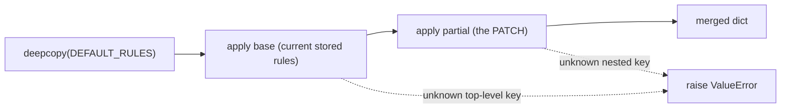
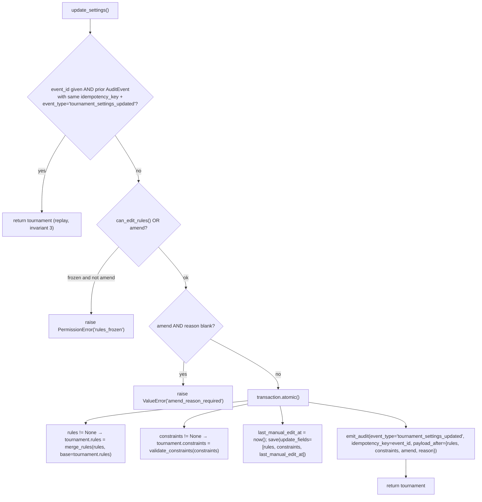
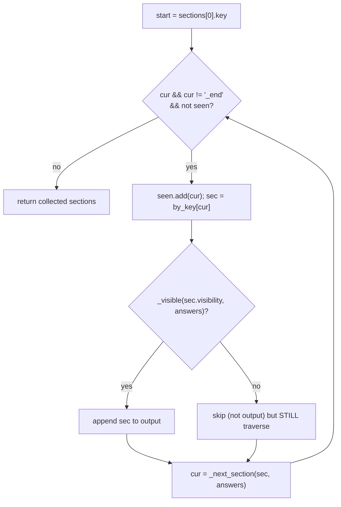
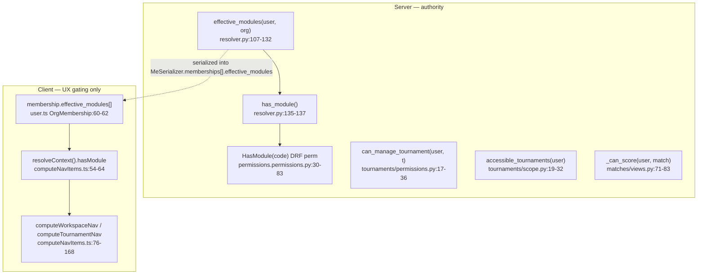

# Data-Driven Engines: Rules/Constraints & Forms Branching

Exhaustive reference for the two FET-style data-driven engines on the Fixture
Platform, plus the client↔server parity surfaces for forms branching/validation
and RBAC. **Source code is ground truth**; every claim below cites
`file:symbol` + line ranges verified against the tree at
`/home/ubuntu/Fixture` on 2026-06-08. Do not treat the breadth-pass notes under
`docs/superpowers/analysis/` as authoritative — they are orientation only.

> Scope note. "Data-driven" here means: domain behaviour (scoring, format,
> tiebreaks, form questions, branching) lives in **JSONB columns interpreted at
> runtime**, never in hardcoded Python/TS. `Tournament.rules` / `.constraints`
> and `Form.schema` / `FormResponse.answers` are the four data columns the
> engines read.

---

## Part 1 — Tournament Rules / Constraints Engine

### 1.0 File map

| Concern | File | Key symbols |
|---|---|---|
| Defaults, merge, freeze gate, update | `backend/apps/tournaments/services/rules.py` | `DEFAULT_RULES`, `_NESTED`, `merge_rules`, `can_edit_rules`, `freeze_rules`, `update_settings` |
| Standings (points + tiebreakers) | `backend/apps/matches/services/standings.py` | `_sort_key`, `compute_standings` |
| Constraint catalog + shape validation | `backend/apps/fixtures/services/constraints.py` | `CONSTRAINT_TYPES`, `_BY_TYPE`, `validate_constraints` |
| HTTP wiring (GET/PATCH settings, catalog) | `backend/apps/tournaments/views.py` | `_settings_payload`, `TournamentSettingsView`, `ConstraintTypesView` |
| Standings HTTP | `backend/apps/matches/views.py` | `TournamentStandingsView` (L99–114) |
| Storage | `backend/apps/tournaments/models.py` | `Tournament.rules`, `.constraints`, `.rules_frozen_at` (L84), `.last_manual_edit_at` |
| Spec | `docs/superpowers/specs/2026-06-06-tournament-rules-constraints-design.md` | — |

### 1.1 `DEFAULT_RULES` — the canonical schema + whitelist

`rules.py:18-27`. This dict is simultaneously (a) the football-v1 default values
and (b) the **whitelist of legal keys** — `merge_rules` rejects any key not
present here, so the schema cannot silently drift.

```python
DEFAULT_RULES = {
    "format": "round_robin",              # round_robin | knockout | groups_knockout
    "group_size": 5,
    "advance_per_group": 2,
    "points": {"win": 3, "draw": 1, "loss": 0},
    "tiebreakers": ["points", "goal_difference", "goals_for", "head_to_head", "name"],
    "match": {"halves": 2, "half_minutes": 45, "extra_time": False, "penalties": True},
    "squad": {"min_players": 7, "max_players": 23, "max_subs": 5},
    "discipline": {"yellow_suspension_threshold": 2, "red_matches_banned": 1},
}
```

`_NESTED = {"points", "match", "squad", "discipline"}` (`rules.py:30`) marks the
four keys whose values are dicts that may be **partially** overridden (per-key
merge). All other top-level keys (`format`, `group_size`, `advance_per_group`,
`tiebreakers`) are replaced wholesale when supplied.

| Top-level key | Type | Merge behaviour | Notes |
|---|---|---|---|
| `format` | str | replace | not enum-validated by `merge_rules`; any string accepted (validation gap) |
| `group_size` | int | replace | not range-validated |
| `advance_per_group` | int | replace | not range-validated |
| `points` | dict | **per-key merge** (`_NESTED`) | sub-keys whitelisted to `{win,draw,loss}` |
| `tiebreakers` | list[str] | replace | **list members are NOT validated** against the `_sort_key` vocabulary; unknown tiebreaks become no-ops at sort time (`standings.py:27`) |
| `match` | dict | per-key merge | sub-keys: `halves, half_minutes, extra_time, penalties` |
| `squad` | dict | per-key merge | sub-keys: `min_players, max_players, max_subs` |
| `discipline` | dict | per-key merge | sub-keys: `yellow_suspension_threshold, red_matches_banned` |

> Validation gap (verified): `merge_rules` enforces **key membership only**, not
> value types/ranges, and does **not** validate the contents of the
> `tiebreakers` list nor `format`'s enum. A PATCH of
> `{"format":"banana","points":{"win":"x"}}` passes `merge_rules` and is stored.
> Type/range enforcement is a restructuring candidate.

### 1.2 `merge_rules(partial, base=None)` — layered merge

`rules.py:33-58`. Three layers, lowest→highest precedence:
`DEFAULT_RULES < base < partial`.



Algorithm (`rules.py:43-57`):
1. `out = copy.deepcopy(DEFAULT_RULES)`.
2. For each `layer in (base, partial)` (skipping falsy layers):
   - `unknown = set(layer) - set(DEFAULT_RULES)`; raise `ValueError("unknown rule keys: …")` if any.
   - For each `key, value`:
     - if `key in _NESTED and isinstance(value, dict)`: validate sub-keys
       (`set(value) - set(DEFAULT_RULES[key])` → `ValueError("unknown {key} keys: …")`),
       then `out[key].update(value)` (shallow per-key merge).
     - else: `out[key] = value` (replace).

`base` is **the tournament's currently-stored rules**, so a PATCH of just
`{"points":{"win":2}}` keeps the rest of the existing ruleset rather than
resetting unspecified keys to bare defaults. Call site: `update_settings`
(`rules.py:103`) passes `base=tournament.rules`. The GET payload also normalizes
via `merge_rules(tournament.rules)` (`views.py:112`) so old/partial stored rules
always render a complete object.

### 1.3 Freeze gate (invariant 7)

Three functions cooperate:

| Function | Lines | Purpose |
|---|---|---|
| `can_edit_rules(tournament)` | `rules.py:61-63` | `True` iff `status ∈ {DRAFT, PUBLISHED}` |
| `freeze_rules(tournament)` | `rules.py:66-70` | idempotently stamps `rules_frozen_at = now()` if null |
| `update_settings(...)` | `rules.py:73-124` | enforces the gate on write |

`TournamentStatus` (`models.py:27-33`): `draft, published, registration_open,
scheduled, live, completed, archived`. Editing is open in `draft`/`published`,
frozen from `registration_open` onward.

> **Wiring gap (verified, important for restructuring):** `freeze_rules` is
> **only ever called from tests** (`grep` confirms the sole non-test reference
> is the definition; `tests/test_rules.py:57` calls it). There is **no
> tournament status-transition service** in the codebase — `create_tournament`
> (`services/create.py:71`) is the only place a `Tournament.status` is set, and
> it sets `DRAFT`. So in practice `rules_frozen_at` is never populated in
> production paths, and the freeze gate is enforced **purely by reading
> `status`** in `can_edit_rules`. The `rules_frozen_at` column (surfaced in the
> GET payload at `views.py:113`) is currently decorative. The 24h-grace/amend
> machinery from invariant 7 is partially present (`amend` flag + reason) but
> the grace window itself is not implemented.

### 1.4 `update_settings(...)` — the write path

`rules.py:73-124`. Signature:
`update_settings(*, tournament, rules=None, constraints=None, by, amend=False, reason="", event_id=None, request=None)`.



Key behaviours:
- **Idempotency (invariant 3):** pre-check on `AuditEvent.idempotency_key ==
  event_id AND event_type=="tournament_settings_updated"` (`rules.py:90-94`).
  On replay returns the tournament unchanged. Note this is a *check-then-act*
  (no `select_for_update`), so it is not race-hardened the way
  `submit_response` is (§2.7).
- **Freeze enforcement:** `if not can_edit_rules(tournament) and not amend: raise
  PermissionError("rules_frozen")` (`rules.py:96-97`).
- **Amend requires a reason:** `if amend and not reason.strip(): raise
  ValueError("amend_reason_required")` (`rules.py:98-99`).
- Errors map to HTTP in `TournamentSettingsView.patch` (`views.py:132-151`):
  `PermissionError → 409 {"detail":"rules_frozen"}`; `ValueError → 400 DRF
  ValidationError`. Both `merge_rules` and `validate_constraints` raise
  `ValueError`, so a bad rule key or constraint type also yields 400.
- Audit `payload_after` carries the **post-merge** `rules` and the normalized
  `constraints`, plus `amend`/`reason` (`rules.py:116-122`).

### 1.5 Authorization for settings

`TournamentSettingsView` (`views.py:119-151`):
- GET: any accessible member (resolved via `_get_tournament_or_404` →
  `accessible_tournaments`, 404 on no access).
- PATCH: `can_manage_tournament(request.user, tournament)` else
  `PermissionDenied("not_tournament_manager")` (403) (`views.py:134-135`).
- GET payload's `can_edit` is `can_edit_rules(tournament) AND
  can_manage_tournament(user, tournament)` (`views.py:115`) — the client uses
  this to show/hide the edit affordance (parity-relevant, §4.2).

### 1.6 `compute_standings(tournament, group_label=None)` — the table

`standings.py:32-83`. Reads `rules.points` and `rules.tiebreakers` so the table
is data-driven (changing rules changes the table with no code change).

Algorithm:
1. `rules = merge_rules(getattr(tournament, "rules", None))` (`standings.py:35`)
   — normalizes against defaults so even an empty rules object yields 3-1-0.
2. Pull `win_pts, draw_pts, loss_pts` from `rules["points"]`; `tiebreakers` from
   `rules["tiebreakers"]` (`standings.py:37-38`).
3. Query `Match` where `tournament=…, status=COMPLETED, deleted_at IS NULL`,
   `select_related(home_team, away_team)`; optional `.filter(group_label=…)`
   (`standings.py:40-47`).
4. Accumulate a per-team row `{team_id, name, school, P,W,D,L,GF,GA,Pts}`
   (`row()` helper, `standings.py:51-63`). Matches with a missing team or
   missing score are skipped (`standings.py:67`).
5. For each match (`standings.py:65-77`): increment P; add GF/GA both sides;
   then win/draw/loss branch awards `win_pts`/`draw_pts`/`loss_pts`.
6. Compute `GD = GF - GA` per row (`standings.py:80-81`).
7. `rows.sort(key=lambda r: _sort_key(r, tiebreakers))` (`standings.py:82`).

`_sort_key(row, tiebreakers)` (`standings.py:12-29`) maps each tiebreaker token
to a sort component (ascending tuple compare, so wins/points/GD/GF are negated):

| Tiebreaker token | Sort component | Direction |
|---|---|---|
| `points` | `-row["Pts"]` | higher first |
| `goal_difference` | `-row["GD"]` | higher first |
| `goals_for` | `-row["GF"]` | higher first |
| `goals_against` | `row["GA"]` | lower first |
| `wins` | `-row["W"]` | higher first |
| `name` | `row["name"]` | A→Z |
| `head_to_head` | **no-op** | needs pairwise data (v1 gap) |
| anything else | **no-op** | unknown token silently ignored |

A final `key.append(row["name"])` (`standings.py:28`) is always appended as a
stable deterministic fallback regardless of the configured tiebreakers.

> Standings are **server-only**: there is no TS reimplementation. The FE fetches
> `GET /api/tournaments/{id}/standings/` (`frontend/src/api/tournaments.ts:155-156`)
> served by `TournamentStandingsView` (`matches/views.py:99-114`), which groups
> by distinct `group_label` and returns `{groups:[{group_label, rows}]}`. So
> standings is **not** a parity surface — there is nothing to keep in sync.

### 1.7 Constraints catalog + validation

`fixtures/services/constraints.py`. This module owns the **catalog** of
constraint types and validates the **shape** of a stored `constraints` list.
Schedule-level *enforcement* (`validate_schedule` / `score_schedule`) is
explicitly deferred to a later increment (module docstring `constraints.py:5-7`)
— so today the engine validates and stores constraints but does not yet solve
against them.

`CONSTRAINT_TYPES` (`constraints.py:14-20`) — each `{type, label, hard, params_schema}`:

| `type` | `label` | `hard` default | `params_schema` |
|---|---|---|---|
| `no_double_booking_team` | No team double-booking | `True` | `{}` |
| `min_rest_minutes` | Minimum rest between a team's matches | `True` | `{"minutes":"int"}` |
| `venue_single_use` | One match per venue per slot | `True` | `{}` |
| `preferred_window` | Preferred match window | `False` | `{"days":"list","from":"time","to":"time"}` |
| `avoid_back_to_back` | Avoid back-to-back matches | `False` | `{}` |

`_BY_TYPE = {c["type"]: c for c in CONSTRAINT_TYPES}` (`constraints.py:22`).

`validate_constraints(items)` (`constraints.py:25-48`):
- raises `ValueError("constraints must be a list")` if not a list;
- per item: raises `ValueError("unknown constraint type: …")` if the item is not
  a dict or `item["type"]` is not in `_BY_TYPE`;
- normalizes each to `{type, scope, hard, weight, params}`:
  - `scope` ← `item.get("scope", "all")`
  - `hard` ← `bool(item.get("hard", spec["hard"]))` (per-item override of catalog default)
  - `weight` ← `item.get("weight")` (may be `None`; intended for soft constraints; not range-checked)
  - `params` ← `item.get("params", {})` only if a dict, else coerced to `{}`
    (note: `params` content is **not** validated against `params_schema` —
    `params_schema` is purely a UI hint today).

The catalog is exposed read-only at `GET /api/tournaments/constraint-types/` via
`ConstraintTypesView` (`views.py:154-162`), returning `CONSTRAINT_TYPES`
verbatim for the (not-yet-built) Settings UI builder.

---

## Part 2 — Forms Branching Engine

### 2.0 File map

| Layer | Backend | Frontend |
|---|---|---|
| Schema constants / vocab | `apps/forms/constants.py` (`FIELD_TYPES`, `CHOICE_TYPES`, `DISPLAY_TYPES`, `VISIBILITY_OPS`, `PROMOTED_ROLES`) | `features/forms/types.ts` (`FieldType`, `VisibilityOp`, `FieldRole`, `Section`, `FormSchema`) |
| Schema validation (author-time) | `apps/forms/services/schema.py` (`validate_schema`, `_collect_fields`, `_check_field`, `_check_visibility`) | builder enforces shape loosely; server is authority |
| Per-field coerce/validate | `apps/forms/services/fields.py` (`validate_value`, `_HANDLERS`, `_text/_email/…`) | `features/forms/fieldRenderers.tsx` (render only; client does **not** re-coerce) |
| Branching traversal + answer validation | `apps/forms/services/validation.py` (`_visible`, `_next_section`, `validate_answers`, `promote`) | `lib/formLogic.ts` (`isVisible`, `nextSectionKey`, `reachableSections`, `reachableFieldKeys`, `validateRequired`) |
| Submit (idempotent) | `apps/forms/services/responses.py` (`submit_response`) | `features/forms/PublicFormPage.tsx` (`submit` mutation) |
| Entity mapping | `apps/forms/services/mapping.py` (`map_response`, `_map_team_registration`) | n/a |
| Lifecycle / freeze / publish | `apps/forms/services/forms.py` (`create_form`, `update_form`, `publish_form`, `close_form`, `is_open`) | `features/forms/builderStore.ts`, `FormBuilderPage.tsx` |
| HTTP | `apps/forms/views.py` (`PublicFormView`, `PublicUploadView`, builder/responses views) | `api/forms.ts` |

### 2.1 Schema shape (`Form.schema` JSONB)

Stored object: `{version:int, sections:[Section]}`. A `Section`
(`types.ts:78-86`): `{key, title, description?, visibility?, next?, fields:[Field]}`.
A `Field` (`types.ts:64-76`):
`{key, type, label, help?, required?, role?, options?, validation?, visibility?, fields?}`.

Field type vocabulary — must match exactly across BE/FE:

| Source | Symbol | Members |
|---|---|---|
| BE | `FIELD_TYPES` (`constants.py:28-32`) | `short_text, long_text, single_choice, multi_choice, dropdown, email, phone, number, date, time, rating, linear_scale, address, file_upload, section_text, yes_no, group` |
| FE | `FieldType` (`types.ts:11-28`) | identical 17-member union |
| BE | `CHOICE_TYPES` (`constants.py:35`) | `single_choice, multi_choice, dropdown` |
| FE | `CHOICE_TYPES` (`builderStore.ts:30-34`) | identical |
| BE | `DISPLAY_TYPES` (`constants.py:38`) | `section_text` |
| FE | `DISPLAY_TYPES` (`formLogic.ts:18`) | identical |
| BE | `PROMOTED_ROLES` (`constants.py:46`) | `email, phone, name, title` |
| FE | `FieldRole` (`types.ts:62`) | `title, email, phone, name` (same set) |

### 2.2 Visibility operators — `VISIBILITY_OPS`

`constants.py:41-43`: `equals, not_equals, in, includes, gt, lt, answered`.
FE mirror `VisibilityOp` (`types.ts:30-37`) — identical 7-member set.

A visibility `rule` is `{field, op, value?}`. Both engines evaluate against the
**flat `answers` dict** (field-key → value). Semantics (BE `_visible`
`validation.py:19-44`; FE `isVisible` `formLogic.ts:35-60`):

| op | BE (`validation.py`) | FE (`formLogic.ts`) | Parity |
|---|---|---|---|
| `answered` | `val not in (None,"",[],{})` | `!isEmpty(val)` where `isEmpty` covers `undefined/null/""/[]/{}` (`formLogic.ts:21-33`) | ✅ (FE also treats `undefined` empty; BE uses `.get()`→`None`) |
| `equals` | `val == target` | `val === target` | ✅ (caveat: JS `===` vs Py `==` for number/string coercion — see §4.3) |
| `not_equals` | `val != target` | `val !== target` | ✅ (same caveat) |
| `in` | `val in (target or [])` | `Array.isArray(target) && target.includes(val)` | ✅ membership of scalar in list |
| `includes` | `isinstance(val,list) and target in val` | `Array.isArray(val) && val.includes(target)` | ✅ list contains scalar |
| `gt` | `float(val) > float(target)`; `False` on `TypeError/ValueError` | `Number(val) > Number(target)` (`NaN` compares false) | ✅ both false on non-numeric |
| `lt` | `float(val) < float(target)`; `False` on error | `Number(val) < Number(target)` | ✅ |
| no rule (`None`/undefined) | `return True` | `if (!rule) return True` | ✅ |
| unknown op | `return False` (final fallthrough) | `default: return False` | ✅ |

### 2.3 Section traversal — `_next_section` / `nextSectionKey`

The branch resolution order is the load-bearing parity contract, documented in
both files (`validation.py:48-50`; `formLogic.ts:9-13,62-82`):

**Resolution order for the next section after `S`:**
1. The chosen option's `goto` — scan `S.fields`, take the **first**
   `single_choice`/`dropdown` field whose selected option (matched by
   `str(o["value"]) == str(chosen)`) has a truthy `goto`. *"First goto-bearing
   single_choice/dropdown field in a section wins."*
2. Else `S.next` (explicit section pointer).
3. Else the **next section in document (array) order**.
4. Else end (past the last section / `_end`).

BE split: `_next_section` (`validation.py:47-64`) handles all three; FE splits it
into `nextSectionKey` (`formLogic.ts:68-82`, steps 1–2 only, returns
`undefined` if neither) and the document-order fallback inlined in
`reachableSections` (`formLogic.ts:103-104`: `cur = explicit ?? (idx+1 < len ?
sections[idx+1].key : undefined)`).

Both treat the sentinel `"_end"` as a terminator (BE loop guard
`validation.py:81`; FE `cur !== "_end"` `formLogic.ts:97`).

### 2.4 `reachableSections` / `_visible` walk + cycle guard



Critical subtlety (verified): an **invisible section is still traversed** — it is
just excluded from the output/required-check, and its `next`/`goto` still routes
the walk. Both engines do this (BE `validation.py:90` gates only the field loop
under `if _visible(section.visibility)`; FE `formLogic.ts:102` gates only the
`out.push`). This means a hidden section can still redirect the path via its
`next` pointer.

**Cycle/termination guards differ slightly but are equivalent in effect:**
- BE `validate_answers` (`validation.py:77-86`): `visited` set + `order_guard <
  len(sections)+1` counter; breaks on revisit or guard.
- FE `reachableSections` (`formLogic.ts:95-105`): `seen` set only, in the loop
  condition `!seen.has(cur)`.
- Both halt on first revisit, so a self/loop branch terminates identically.

### 2.5 `validate_answers(schema, answers)` — server authority

`validation.py:67-116`. Returns a **cleaned** answers dict (only reached+visible
fields, coerced); raises `AnswerError(errors)` (`validation.py:13-16`, a
`ValueError` subclass carrying `.errors: dict[key,msg]`) on any failure.

Per reached **and visible** section, for each field (`validation.py:91-110`):
1. Skip `DISPLAY_TYPES` (`section_text`) — never produces an answer.
2. Skip if the field's own `visibility` is false.
3. `raw = answers.get(key)`; `empty = raw in (None,"",[],{})`.
   - If empty **and** `required` → `errors[key] = "required"`; else continue
     (empty optional just dropped).
4. `group` type → stored as-is (`clean[key] = raw`); **no deep validation of
   group children in v1** (`validation.py:104-105`).
5. Else `clean[key] = validate_value(fld, raw)`; on `FieldError` →
   `errors[key] = str(e)`.

**Branching can't be bypassed:** answers to unreached/hidden fields are simply
never copied into `clean`, so posting hidden values is silently dropped
(proved by `tests/test_validation.py::test_hidden_answer_is_dropped` L51-57,
and `…::test_branch_sepak_requires_sepak_cats_only` L41-49).

### 2.6 `validate_value` — per-field coercion (`fields.py`)

`fields.py:155-166` dispatches via `_HANDLERS` (`fields.py:145-152`). Each
handler coerces + validates and raises `FieldError` on bad input. `validation`
sub-keys are read from `field.get("validation")` (`fields.py:24`).

| Field type | Handler | Coerced result | Validation keys honoured |
|---|---|---|---|
| `short_text`, `long_text` | `_text` (L28-38) | `str` | `minLength, maxLength, pattern` |
| `email` | `_email` (L41-45) | `str` | `_text` checks + `_EMAIL` regex |
| `phone` | `_phone` (L48-52) | `str` | `_text` checks + `_PHONE` regex |
| `number` | `_number` (L55-65) | `int` or `float` | `min, max` |
| `single_choice`, `dropdown` | `_single_choice` (L68-72) | `str` (must be an option value) | option membership |
| `multi_choice` | `_multi_choice` (L75-87) | `list[str]` | option membership, `minSelections, maxSelections` |
| `date` | `_date` (L90-94) | `str` | `^\d{4}-\d{2}-\d{2}$` |
| `time` | `_time` (L97-101) | `str` | `^\d{2}:\d{2}$` |
| `rating` | `_rating` (L104-109) | `int` | `0..validation.max(=5)` |
| `linear_scale` | `_linear_scale` (L112-117) | `int` | `validation.min(=1)..max(=10)` |
| `address` | `_address` (L120-125) | `dict[str,str]` | keys ⊆ `{line1,line2,city,district,state,pincode}` |
| `yes_no` | `_yes_no` (L128-135) | `bool` | accepts bool / `yes,true,1` / `no,false,0` |
| `file_upload` | `_file_upload` (L138-142) | `list[str]` (upload_ref UUIDs) | none here; refs reconciled in submit |
| `section_text` | (rejected) | — | `validate_value` raises "display field takes no answer" (L159-160) |
| `group` | (rejected here) | — | handled by the walker (L161-162) |
| unknown | (rejected) | — | "unknown field type" (L165) |

> The **client does not re-run this coercion** — `fieldRenderers.tsx` only
> renders inputs; the server is the single source of truth for type/format
> validity. The client only re-checks **required** (§2.8). So format errors are
> reported by the server as `{errors:{key:msg}}` and surfaced via
> `serverFieldErrors` (`PublicFormPage.tsx:19-28`).

### 2.7 `submit_response` — idempotent write (`responses.py`)

`responses.py:21-94`.

```mermaid
flowchart TD
    A["submit_response(form, answers, event_id, …)"] --> B{"event_id given AND\nFormResponse(form, event_id) exists?"}
    B -->|yes| R["return existing (replay, invariant 3)"]
    B -->|no| C["clean = validate_answers(form.schema, answers)\n(raises AnswerError → 400)"]
    C --> D["roles = promote(form.schema, clean)"]
    D --> T["transaction.atomic()"]
    T --> E["inner atomic: FormResponse.objects.create(\n  answers=clean, form_version=form.version,\n  respondent_email/phone/name/title=roles[...][:cap],\n  status=SUBMITTED, event_id=…, submitted_via=share_link)"]
    E -->|IntegrityError on unique(form,event_id)| F{"event_id is None?"}
    F -->|yes| RAISE["re-raise (no constraint to dedupe on)"]
    F -->|no| G["return existing row (race-loser path)"]
    E -->|ok| H["claim FormFileUpload rows by upload_ref (response NULL)"]
    H --> I["Form.response_count += 1 (F-expr)"]
    I --> J["share_link.submission_count += 1 (if link)"]
    J --> K["emit_audit('form_response_submitted', idempotency_key=event_id)"]
    K --> Z["return resp"]
```

Race-hardening (`responses.py:46-68`): a nested savepoint catches the
`IntegrityError` from the unique `(form, event_id)` constraint
(`models.py:123-129`) and returns the row the concurrent writer created — so a
true replay yields the existing response, not a 500. This is **stronger** than
`update_settings`'s plain check-then-act (§1.4) — a restructuring note: the two
idempotency paths are inconsistent.

Field caps applied on write (`responses.py:55-58`): email `[:254]`, phone
`[:32]`, name `[:200]`, title `[:200]`.

### 2.8 `promote` — role→column extraction

`validation.py:119-127`. Walks `schema.sections[].fields[]`; for any field with a
`role` whose `key` is in `clean`, sets `out[role] = str(clean[key])`. Output
keys are the `PROMOTED_ROLES` (`email/phone/name/title`) → written to the
indexed `FormResponse.respondent_*`/`title` columns by `submit_response`.

> Known gap (verified): `promote` iterates only **top-level** section fields, not
> `group` children (`validation.py:122-126` has no recursion). A role tagged on a
> field inside a `group` would not be promoted. Mirror gap: `_collect_fields` in
> schema validation **does** recurse into groups (`schema.py:29-31`), so the two
> walkers are asymmetric.

### 2.9 Entity mapping — `map_response` (`mapping.py`)

`mapping.py:29-76`. Dispatched by `Form.purpose`
(`FormPurpose` `constants.py:13-16`: `organization_registration,
team_registration, generic`).

- **Idempotent:** early return if `resp.mapped_entities` is truthy
  (`mapping.py:33-34`) — `map_response` is called on every public submit
  including idempotent replays (`views.py:226-228`), so this guard prevents
  duplicate teams.
- `team_registration` → `_map_team_registration` (`mapping.py:41-76`):
  - reads `form.settings["bindings"]` (`mapping.py:43`) — a dict mapping logical
    roles (`school_name, team_name, players_group, player_name`) to schema field
    keys, with sensible string defaults.
  - builds `register_school(tournament, school_name, teams=[{name, players:[…]}],
    channel="self", event_id=<derived>)` reusing `apps/teams`
    (`teams/services/registration.py`).
  - **Distinct audit key:** `derived_event_id = uuid5(NAMESPACE_URL,
    f"formresp-teamreg:{resp.id}")` (`mapping.py:65`). The module docstring
    (`mapping.py:8-18`) explains why: `AuditEvent.idempotency_key` is *globally*
    unique (not per-event-type), so reusing the submit's `event_id` would defeat
    `register_school`'s own idempotency (it filters audit by
    `event_type="school_registered"`) and re-create teams on replay.
  - stores `resp.mapped_entities = {"team_ids":[…]}`.
- `organization_registration` + `generic` → no-op; the response row *is* the
  participant record (`mapping.py:36-38`).

### 2.10 Schema validation (author-time) — `validate_schema`

`schema.py:67-93`. Run on every form write (`forms.py:43,78,103`). Raises
`SchemaError` (subclass of `ValueError`, `schema.py:14-15`):
- schema must be an object with a non-empty `sections` list (`schema.py:69-73`).
- section keys unique + non-empty (`schema.py:75-77`).
- `_collect_fields` (`schema.py:18-36`) maps key→field across sections **and
  group children (recursive)**; raises on missing key or duplicate key.
- per field `_check_field` (`schema.py:39-53`): type ∈ `FIELD_TYPES`; label
  required; `role` (if present) ∈ `PROMOTED_ROLES`; choice types need a non-empty
  `options` list, each with `value`+`label`.
- `_check_visibility` (`schema.py:56-64`) on both section- and field-level rules:
  needs `field`+`op`; the referenced `field` must exist; `op` ∈ `VISIBILITY_OPS`.
- `section.next` and each `option.goto` must target a known section key or the
  sentinel `"_end"` (`schema.py:84-93`).

Lifecycle / freeze (`forms.py`): forms are freely editable in `draft`; once
`response_count > 0`, a **destructive** schema change (an answered field key
disappears) bumps `Form.version` (`forms.py:70-95`) so old responses stay pinned
to the schema they were submitted against. `publish_form` requires non-empty +
valid schema (`forms.py:98-109`). `is_open` (`forms.py:131-139`) gates the public
endpoints on `status==OPEN` and the `opens_at`/`closes_at` window.

---

## Part 3 — Forms branching: how FE drives the wizard

`PublicFormPage.tsx` (the public renderer) and `FormPreview.tsx` (builder
preview) both consume `lib/formLogic.ts`:
- `sections = reachableSections(schema, answers)` recomputed every render
  (`PublicFormPage.tsx:68-71`) so choosing a branching option re-routes the
  wizard immediately.
- `stepIndex` clamped to `[0, sections.length-1]` (`PublicFormPage.tsx:72`).
- per-section advance: `validateCurrent()` runs `validateRequired(schema,
  answers)` and keeps only the current section's errors (`PublicFormPage.tsx:122-131`).
- final submit: full-schema `validateRequired` across **all** reachable sections
  (`PublicFormPage.tsx:144-157`); on server 400 it maps `{errors}` via
  `serverFieldErrors` and jumps to the first reachable section owning a failing
  field (`PublicFormPage.tsx:101-118`).
- visible fields in a section additionally filtered by `isVisible(f.visibility,
  answers)` (`PublicFormPage.tsx:232-234`).

`validateRequired` (`formLogic.ts:128-142`) is the **only** validation the client
performs — it checks required-ness on reached+visible non-display fields. All
type/format/option validation is server-side (`validate_value`). This is by
design (`formLogic.ts:1-13` parity contract comment).

---

## Part 4 — CLIENT ↔ SERVER PARITY TABLES

> "Parity" = logic that exists on **both** sides and must produce the same
> decision, or the system mis-behaves (a field required server-side but hidden
> client-side → spurious 400). Each row gives the exact symbol on each side.

### 4.1 Forms — branching + validation parity

| # | Concern | Server symbol (file:line) | Client symbol (file:line) | Must agree on | Risk if they drift |
|---|---|---|---|---|---|
| F1 | Field-type vocabulary | `FIELD_TYPES` `constants.py:28-32` | `FieldType` union `types.ts:11-28` | identical 17 types | renderer/validator reject valid schema |
| F2 | Visibility op set | `VISIBILITY_OPS` `constants.py:41-43` | `VisibilityOp` `types.ts:30-37` | identical 7 ops | unknown op → both `False`, but FE may render hidden field server treats visible |
| F3 | Visibility evaluation | `_visible` `validation.py:19-44` | `isVisible` `formLogic.ts:35-60` | per-op semantics (see §2.2 table) | field required server-side but hidden client-side → spurious 400 |
| F4 | "Empty" definition | inline `raw in (None,"",[],{})` `validation.py:99` & `_visible` `answered` branch | `isEmpty` `formLogic.ts:21-33` | `None/""/[]/{}/undefined` all empty | required check disagrees |
| F5 | Next-section resolution | `_next_section` `validation.py:47-64` | `nextSectionKey` + inline fallback `formLogic.ts:68-82,103-104` | goto > section.next > doc-order > end; "first goto-bearing choice field wins"; `str()` compare of option value vs answer | wizard shows a different path than server validates → required fields skipped or extra 400s |
| F6 | Display types excluded | `DISPLAY_TYPES` `constants.py:38`, skip `validation.py:93` | `DISPLAY_TYPES` `formLogic.ts:18`, skip `formLogic.ts:117,135` | `section_text` never an answer/required | server requires a display field, or client blocks on one |
| F7 | Reachable+visible field set | walk in `validate_answers` `validation.py:81-112` | `reachableFieldKeys` `formLogic.ts:110-122` | same reached∩visible set | hidden-branch answers dropped server-side while client thinks submitted (or vice-versa) |
| F8 | Invisible-section-still-traversed | `validation.py:90` gates field loop only | `formLogic.ts:102` gates push only | hidden section still routes via `next`/`goto` | path divergence on conditional sections |
| F9 | Cycle/termination guard | `visited` + `order_guard` `validation.py:77-85` | `seen` set `formLogic.ts:95-97` | halt on first revisit | infinite loop / mismatched stop point |
| F10 | Required enforcement | `required` + empty → error `validation.py:96-103` | `validateRequired` `formLogic.ts:128-142` | only reached+visible required fields | client lets through a server-required field → 400 on submit |
| F11 | Choice option value matching | `str(o["value"]) == str(chosen)` `validation.py:55` | `String(o.value) === String(chosen)` `formLogic.ts:75-78` | string-coerced equality | goto resolves to different option |
| F12 | `_end` sentinel | `current != "_end"` `validation.py:81` | `cur !== "_end"` `formLogic.ts:97` | terminator token | walk overruns |
| F13 | Per-field format/coercion | `validate_value`/`_HANDLERS` `fields.py:145-166` | **server-only** (FE renders, does not coerce) | n/a — single source of truth | NOT a parity row; FE must surface `{errors}` (`serverFieldErrors` `PublicFormPage.tsx:19-28`) |
| F14 | Role promotion | `promote` `validation.py:119-127` | n/a (server-only) | n/a | not a parity surface |

> Parity caveat F3/F11 (§4.3): `equals`/`not_equals` use Python `==` vs JS
> `===`. For mixed number/string values they can diverge (e.g. answer `5`
> (number) vs rule value `"5"` (string): Py `==` → `5 == "5"` is `False`; JS
> `===` → also `False` — consistent here; but Py `5 == 5.0` True / JS `5===5`
> True — also consistent). The genuinely fragile point is `in`/`includes`/goto
> matching, which the server normalizes with `str()` but `equals`/`not_equals`
> do **not** — authors should keep option values and rule values the same JSON
> type to stay safe.

### 4.2 Forms — lifecycle / authz parity

| # | Concern | Server | Client | Must agree |
|---|---|---|---|---|
| FL1 | Form open window | `is_open` `forms.py:131-139` (status OPEN + opens/closes window) | public GET returns `{closed:true}` → renders "Registration closed" `PublicFormPage.tsx:180-196` | closed forms reject submit (server 400 `registration_closed` `views.py:211-212`) |
| FL2 | Builder manager-only | `_get_manageable_form` → `can_manage_tournament` (403) `views.py:60-64` | `forms` nav item module-gated `computeNavItems.ts:140-147` (module `forms`) | non-managers don't see builder; server still enforces |
| FL3 | Idempotent submit | `event_id` dedupe `responses.py:31-34,46-68` | stable `eventId = useState(newEventId)` `PublicFormPage.tsx:56` | retries reuse the same event_id → one response |

### 4.3 RBAC parity (module-RBAC + verb matrix)

RBAC is **two layers** (CLAUDE.md invariant 12; `v1Users.md §§2-7`):
(a) **module visibility** governs surfaces; (b) the **PRD §3.2 verb matrix**
governs fine-grained actions.



**Module-RBAC parity:**

| # | Concern | Server symbol | Client symbol | Must agree |
|---|---|---|---|---|
| R1 | Module catalog (codes) | `Module.code` rows (`load_modules`/`modules.json`); resolver reads `default_for_roles` `resolver.py:67-86` | `MODULE_FORMS="forms"` `computeNavItems.ts:23`; `ModuleScope` `user.ts:31` | module **code strings** identical (FE hardcodes a subset; comment `computeNavItems.ts:16-23` flags the duplication risk) |
| R2 | Effective module resolution | `effective_modules` `resolver.py:107-132` (roles → base via `default_for_roles`, then grant/deny overrides) | reads precomputed `membership.effective_modules` `computeNavItems.ts:61` (does **not** recompute) | the serialized list the client trusts must equal the resolver output for that (user,org) |
| R3 | Override semantics (grant/deny/default) | `_apply_overrides` `resolver.py:89-104`; matrix `build_matrix` `matrix.py:118-148` | `GrantState` `user.ts:99-109`; matrix render | grant adds, deny removes, default no-op |
| R4 | Surface gating | `HasModule(code)` `permissions.permissions.py:30-83` (superuser bypass L43-44) | `hasModule(key)` nav gate `computeNavItems.ts:62,140` | client hides what server would 403; **server is authority** — client gating is UX only |
| R5 | Scope label derivation | `_scope_for` `matrix.py:36-43` (`org/tournament/match/personal→platform`) | `ModuleScope` union `user.ts:31` | scope strings line up for matrix UI |

**Tournament-scoped (verb-matrix / PRD §3.2) parity:**

| # | Verb (PRD §3.2) | Server gate | Client gate | Must agree |
|---|---|---|---|---|
| V1 | View tournament / isolation | `accessible_tournaments` `scope.py:19-32`; `_get_tournament_or_404` (404, no leak) `tournaments/views.py:62-71` | nav/links only; no client isolation | 404 boundary is server-only; client never leaks because it only sees accessible data |
| V2 | Manage tournament (invite/assign/edit settings/audit) | `can_manage_tournament` `tournaments/permissions.py:17-36` (active tournament admin/co-organizer **or** active org admin) | tournament nav shows Members/Audit to all members; pages render "managers only" on 403 (`computeNavItems.ts:112-167` comment) | client may *show* the page; server enforces 403 (`PermissionDenied("not_tournament_manager")`) |
| V3 | Edit structured rules (pre-freeze) | `can_edit_rules` + `can_manage_tournament` in `update_settings` `rules.py:96`, view L134 | GET payload `can_edit` flag `tournaments/views.py:115` drives the edit affordance | client edit UI shown iff `can_edit`; server re-checks |
| V4 | Amend rules (post-freeze) | `amend` + reason in `update_settings` `rules.py:96-99`; 409 on frozen | (Settings UI not yet built — see §5) | once UI exists, client must send `amend`+`reason` when `can_edit` is false |
| V5 | Live scoring (enter events) | `_can_score` `matches/views.py:71-83` (manager, assigned `match.scorer_id`, or active `match_scorer`) | scorer landing pages (`features/roles/*`) | client routes scorers to console; server authorizes the write |
| V6 | Conflict-of-interest (soft) | server logs ack to `AuditEvent` (does not block) | `ConflictOfInterestBanner` `features/permissions/ConflictOfInterestBanner.tsx` (checkbox ack) | platform does NOT block; both sides record the acknowledgement (v1Users B.22) |
| V7 | Last-admin guard | `tournaments/views.py:227-249` (`last_admin` 400) | client shows error toast on 400 | server-only invariant; client just surfaces |

**RBAC parity caveats (verified):**
- The FE **does not recompute** modules — it trusts `effective_modules` baked
  into `MeSerializer.memberships[]` (`user.ts:60-62`). Parity therefore reduces
  to "the resolver output is faithfully serialized." The TS module-code constant
  (`MODULE_FORMS`) is **manually duplicated** and flagged as a drift risk
  (`computeNavItems.ts:16-23`).
- There is **no client-side reimplementation of the verb matrix** (no
  `hasVerb`); the FE relies on (a) module-gated nav and (b) server 403 +
  friendly empty states. So §3.2 verbs are a **server-only** authority — the only
  client "parity" is that pages must gracefully handle the 403/404 the server
  returns.
- `HasModule` grants a **superuser bypass** (`permissions.permissions.py:43-44`)
  with no client analogue (the FE `User.is_superuser` `user.ts:85` exists but
  drives sadmin routing, not module gating).

---

## Part 5 — Verified gaps & restructuring notes

Concrete, code-verified items that matter for the planned restructuring:

1. **`merge_rules` validates keys only, not values.** No type/range/enum checks
   on `format`, `group_size`, `advance_per_group`, point values, or
   `tiebreakers` list members (`rules.py:33-58`). Unknown tiebreaker tokens
   silently no-op at sort time (`standings.py:27`).
2. **`freeze_rules` has no production caller; no tournament status-transition
   service exists.** `rules_frozen_at` is never populated outside tests; the
   freeze gate works purely off `Tournament.status` via `can_edit_rules`
   (`rules.py:61-70`; only writer of `status` is `create_tournament` →
   `DRAFT`). The invariant-7 24h grace window is not implemented.
3. **Constraint engine validates shape but does not enforce.** `validate_schedule`
   / `score_schedule` are deferred (`constraints.py:5-7`); `params` content is
   not validated against `params_schema`; `weight` is unchecked.
4. **`promote` does not recurse into `group` children** (`validation.py:122-126`)
   while `_collect_fields` does (`schema.py:29-31`) — asymmetric group handling.
   `validate_answers` also stores groups un-deep-validated
   (`validation.py:104-105`).
5. **Inconsistent idempotency hardening.** `submit_response` is race-hardened via
   a savepoint + unique constraint (`responses.py:46-68`); `update_settings`
   uses a plain check-then-act on `AuditEvent` (`rules.py:89-94`).
6. **FE module-code duplication** (`computeNavItems.ts:16-23`) is a known drift
   risk vs `apps/permissions/fixtures/modules.json`.
7. **No client verb-matrix.** §3.2 is server-authoritative only; restructuring
   should decide whether to ship a typed client verb map or keep relying on
   403/404 + module gating.
8. **`equals`/`not_equals` are not type-normalized** in `_visible`/`isVisible`
   (unlike `in`/`includes`/goto which use `str()`/`String()`), a latent Py-`==`
   vs JS-`===` parity hazard for mixed-type option/rule values (§4.3).

---

## Appendix — endpoint ↔ engine map

| Endpoint | View (file:symbol) | Engine functions invoked |
|---|---|---|
| `GET/PATCH /api/tournaments/{id}/settings/` | `tournaments/views.py:TournamentSettingsView` | `merge_rules`, `can_edit_rules`, `update_settings`, `validate_constraints` |
| `GET /api/tournaments/constraint-types/` | `tournaments/views.py:ConstraintTypesView` | `CONSTRAINT_TYPES` |
| `GET /api/tournaments/{id}/standings/` | `matches/views.py:TournamentStandingsView` | `compute_standings` (per `group_label`) |
| `GET/POST /api/forms/{id}/public/`, `/api/forms/r/{token}/` | `forms/views.py:PublicFormView` | `is_open`, `submit_response` → `validate_answers`, `promote`, then `map_response` |
| `POST /api/forms/{id}/uploads/` | `forms/views.py:PublicUploadView` | (file staging; reconciled in `submit_response`) |
| builder CRUD/publish/close/duplicate | `forms/views.py` (`TournamentFormsView`, `FormDetailView`, `FormPublishView`, …) | `create_form`, `update_form`, `publish_form`, `close_form`, `duplicate_form` → `validate_schema` |
