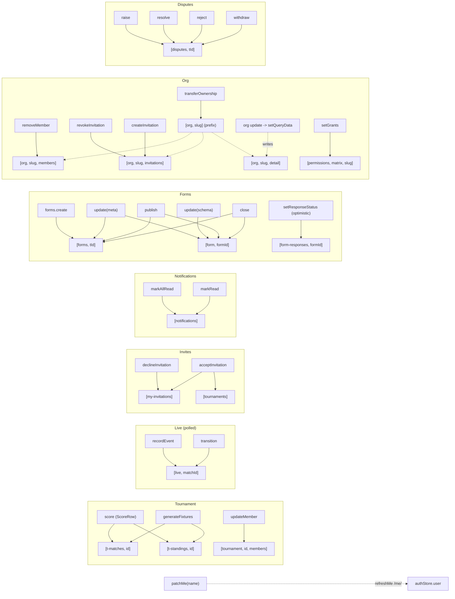
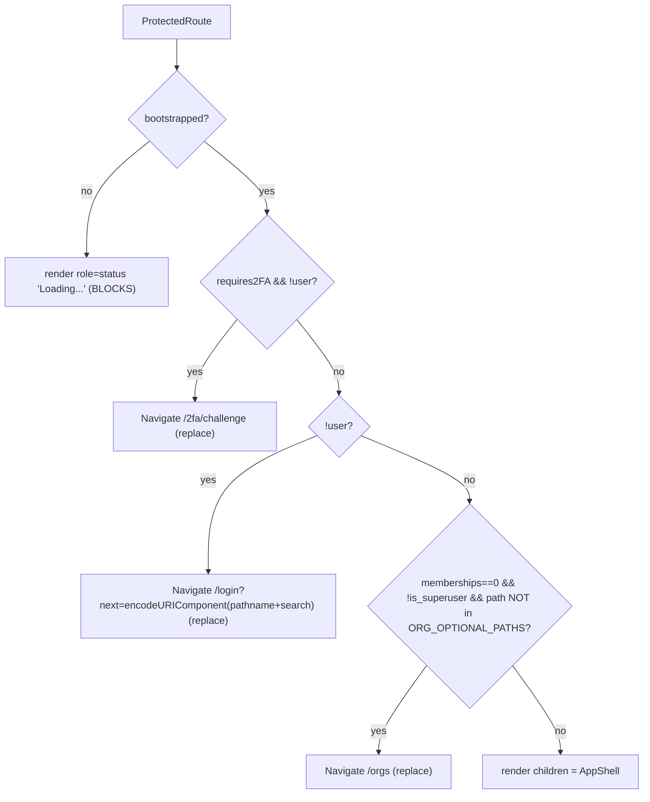

# Frontend State, Data-Flow & Routing — Exhaustive Reference

> Scope: every client-side state container (Zustand stores), every TanStack
> Query `queryKey` + the full cache-invalidation graph, the `apiFetch` transport
> layer (CSRF / credentials / error model), the complete React-Router route table
> + guards (`ProtectedRoute`, nav computation), and the "live" transport wiring.
>
> Ground truth = source. Every claim is cited as `path:line` or `path:Lstart–Lend`
> against the working tree at `/home/ubuntu/Fixture/frontend`. Verified June 2026.
>
> **Headline correction to CLAUDE.md / breadth notes:** the frontend ships **no
> EventSource and no WebSocket client at all.** All "live" surfaces (public
> viewer, scorer console, notification bell) are **TanStack Query polling**
> (`refetchInterval`). See §7.

---

## 1. App composition & provider tree

Entry: `frontend/src/main.tsx`.

- `main.tsx:8` — `void useAuthStore.getState().bootstrap()` runs **before**
  `createRoot(...).render(<App/>)` (`main.tsx:10–14`) so the `/me/` hydrate is in
  flight when `ProtectedRoute` first evaluates.
- Renders inside `<StrictMode>` (`main.tsx:11`) → effects/bootstrap run twice in dev.

`frontend/src/App.tsx:96–248` defines the provider nesting (order is load-bearing,
documented in the docstring at `App.tsx:80–95`):

```
ThemeProvider                         App.tsx:98
  QueryClientProvider(queryClient)    App.tsx:99
    ToastProvider                     App.tsx:100
      ErrorBoundary                   App.tsx:101   (inside Toast, OUTSIDE Router)
        BrowserRouter                 App.tsx:102
          AuthBusBridge               App.tsx:103   (pathless, null-render)
          PasswordReauthModal         App.tsx:104   (global re-auth dialog)
          Routes                      App.tsx:105
```

The `ErrorBoundary` sits inside Toast but outside the router so render-phase throws
in any route fall to the friendly error page; router-level `useRouteError` handlers
bypass it by design (`App.tsx:80–95`).

**Note:** the docstring (`App.tsx:81–88`) lists `QueryClientProvider` as the
outermost; the actual code wraps `ThemeProvider` outermost (`App.tsx:98`). Minor
doc/code drift — the runtime order is `ThemeProvider → QueryClientProvider → ...`.

---

## 2. Zustand stores

Five `create()` stores. None use `persist`/`devtools` middleware; persistence
(where present) is hand-rolled to `localStorage`.

| Store | File | Persistence | Written by |
|---|---|---|---|
| `useAuthStore` | `features/auth/authStore.ts` | none (in-memory; cookie is server-side) | bootstrap/login/logout flows + 401 bus |
| `useBuilderStore` | `features/forms/builderStore.ts` | none (ephemeral edit buffer) | FormBuilderPage |
| `useOrgSwitcher` | `features/orgs/OrgSwitcherStore.ts` | none | AppShell effect (URL mirror) + OrgSwitcher (role) |
| `useThemeStore` | `features/theme/themeStore.ts` | `localStorage["fixture.theme"]` | ThemeToggle / ThemeProvider |
| `useBreakpoint`* | `lib/useBreakpoint.ts` | none (`useSyncExternalStore`, not Zustand) | shared resize listener |

\* `useBreakpoint` is a `useSyncExternalStore` hook, not a Zustand store, but is
the other global client-state primitive; documented in §2.6.

### 2.1 `useAuthStore` — identity lifecycle

`features/auth/authStore.ts:37–167`. Interface at `authStore.ts:6–28`.

**State**

| Field | Type | Init | Meaning | Line |
|---|---|---|---|---|
| `user` | `User \| null` | `null` | hydrated identity (mirror of `MeSerializer`) | `:7,:39` |
| `isLoading` | `boolean` | `false` | a login/bootstrap call is in flight | `:8,:40` |
| `requires2FA` | `boolean` | `false` | login returned `requires_2fa` and no user yet | `:9–10,:41` |
| `error` | `string \| null` | `null` | last login/bootstrap error message | `:11–12,:42` |
| `bootstrapped` | `boolean` | `false` | ≥1 `/me/` hydrate attempted (gate unblocker) | `:13–14,:43` |

**Module-scope secret (NOT state):** `pendingCredentials: {email,password} | null`
(`authStore.ts:35`). Held outside the store deliberately so creds never surface in
devtools or persisted state (`authStore.ts:30–34`). Cleared on success/logout/clear.

**Actions**

| Action | Signature | Behaviour | Lines |
|---|---|---|---|
| `bootstrap` | `() => Promise<void>` | `{isLoading:true,error:null}` → `authApi.me()`; success sets `{user,bootstrapped:true}`; **401 → `{user:null,bootstrapped:true}`** (expected logged-out path, no error); any other error → `{user:null,bootstrapped:true,error}`. **`bootstrapped` set on every terminal path.** | `:44–61` |
| `login` | `(LoginPayload) => Promise<{requires_2fa}>` | `authApi.login`. If `requires_2fa`: stash `pendingCredentials`, clear `user`, `requires2FA:true`, return `{requires_2fa:true}`. Else `user = res.user ?? await authApi.me()`, clear creds, return `{requires_2fa:false}`. On error sets `error` from `ApiError.payload.detail` and **rethrows**. | `:63–104` |
| `completeTotp` | `(totp:string) => Promise<void>` | Requires `pendingCredentials` (else sets `error:"Session expired…"` + throws `no_pending_credentials`). Re-calls `authApi.login({email,password,totp_code})` — **no separate /challenge endpoint; 2FA folded into /login/**. | `:106–137` |
| `logout` | `() => Promise<void>` | `authApi.logout()` (swallows transport error), then clears `pendingCredentials` + `{user:null,requires2FA:false,error:null,isLoading:false}`. **Local state cleared even if server call throws.** | `:139–152` |
| `clear` | `() => void` | Synchronous force-clear (used by the 401 bus). Same shape as logout's `set`. | `:154–157` |
| `refreshMe` | `() => Promise<void>` | `authApi.me()` → `set({user})`; **swallows all errors** ("bus will fire on 401" — also swallows non-401). | `:159–166` |

`User` shape (`types/user.ts:80–93`): `id, email, name, is_superuser,
has_2fa_enrolled, twofa_enrolled_at, email_verified_at, last_active_org_id,
last_active_org_slug, memberships: OrgMembership[], deleted_at`.
`OrgMembership` (`types/user.ts:53–64`): `org_id, org_slug, org_name, roles: Role[],
is_org_owner, effective_modules: string[], active_role?` (client-only).

### 2.2 `useBuilderStore` — form-builder edit buffer

`features/forms/builderStore.ts:85–181`. Interface `BuilderState` at `:51–72`.
Pure client edit buffer for the drag-and-drop form builder; hydrated from server
via `load`, autosaved back by FormBuilderPage (debounced, §5).

**State**

| Field | Type | Init | Lines |
|---|---|---|---|
| `schema` | `FormSchema` | `defaultSchema()` (one "Untitled section") | `:53,:86` |
| `selected` | `{sectionKey, fieldKey} \| null` | `null` | drives the inspector | `:54–55,:87` |
| `activeSectionKey` | `string \| null` | `null` | palette target section | `:56,:88` |

**Actions** (all immutable `set` via the `mapSection` helper at `:74–83`)

| Action | Effect | Lines |
|---|---|---|
| `load(schema)` | replace; if `schema.sections` empty → `defaultSchema()`; resets `selected:null`, `activeSectionKey = sections[0]?.key` | `:89–97` |
| `addSection()` | append new `Untitled section`; set it active | `:98–109` |
| `removeSection(key)` | filter out; clear `selected` if it was in that section; reassign `activeSectionKey` to first remaining | `:110–122` |
| `updateSection(key, patch)` | shallow-merge patch into matched section | `:123–126` |
| `addField(sectionKey, type)` | `newField(type)` (default label + seeded options for choice types); select it; set section active | `:127–138` |
| `updateField(sectionKey, fieldKey, patch)` | shallow-merge patch into matched field | `:139–147` |
| `removeField(sectionKey, fieldKey)` | filter out; clear `selected` if it matched | `:148–159` |
| `reorderFields(sectionKey, from, to)` | bounds-checked splice/move | `:160–176` |
| `select(sectionKey, fieldKey)` | set `selected` + `activeSectionKey` | `:177–178` |
| `clearSelection()` | `selected:null` | `:179` |
| `setActiveSection(sectionKey)` | set `activeSectionKey` | `:180` |

Helpers: `uid(prefix)` monotonic id (`:4–6`); `DEFAULT_LABEL` map of 17 field types
(`:10–28`); `CHOICE_TYPES` set (`:30–34`); `newField` (`:36–42`); `defaultSchema`
(`:44–49`). **This store is a global singleton** — a single builder instance at a
time; FormBuilderPage guards re-hydration with a `loadedId` ref (`FormBuilderPage.tsx:160–166`).

### 2.3 `useOrgSwitcher` — URL-slug mirror

`features/orgs/OrgSwitcherStore.ts:18–23`. Interface `:10–16`.
A **denormalised read-only mirror** of the URL slug (v1Users B.20: URL is the
source of truth for active org). Only AppShell's effect writes `currentSlug`.

| Field | Type | Init | Written by | Lines |
|---|---|---|---|---|
| `currentSlug` | `string \| null` | `null` | `AppShell.tsx:109–111` via `setSlugFromUrl` | `:11,:20,:21` |
| `activeRole` | `string \| null` | `null` | `OrgSwitcher.tsx:45` via `setActiveRole` (multi-role view, §2.7) | `:13,:22,:23` |
| `setSlugFromUrl(slug)` | action | — | — | `:21` |
| `setActiveRole(role)` | action | — | — | `:22` |

`activeRole` is a partially-built feature seam: written by `OrgSwitcher` when a
multi-role user toggles the radiogroup (`OrgSwitcher.tsx:63–87`), but no core file
yet *reads* it for gating.

### 2.4 `useThemeStore` — light/dark/system

`features/theme/themeStore.ts:38–60`. Interface `ThemeState` at `:30–36`.
Only store with persistence: `localStorage["fixture.theme"]` (`:6`).

| Field | Type | Init | Lines |
|---|---|---|---|
| `theme` | `"light" \| "dark" \| "system"` | `readStored()` | `:31,:39` |
| `resolved` | `"light" \| "dark"` | `resolve(readStored())` | `:32,:40` |
| `setTheme(t)` | persists to localStorage, applies `.dark` class, updates state | `:33,:41–45` |
| `init()` | applies current theme, sets `resolved`, subscribes to OS `prefers-color-scheme` while `theme==="system"` | `:34–35,:46–59` |

Helpers: `prefersDark()` (`:8–13`), `resolve()` (`:15–17`), `apply()` toggles
`document.documentElement.classList.toggle("dark", …)` (`:19–22`), `readStored()`
(`:24–28`). Wired by `ThemeProvider` calling `init()` on mount
(`features/theme/ThemeProvider.tsx:10–13`); toggled by `ThemeToggle`.

### 2.5 No `OrgSwitcher` store beyond §2.3
The `OrgSwitcher` *component* (`features/orgs/OrgSwitcher.tsx`) is presentational +
one mutation (`persistLastActive` → `authApi.patchMe({last_active_org_id})`,
`OrgSwitcher.tsx:26–29`). It reads `useAuthStore` (memberships) + `useOrgSwitcher`
(currentSlug/activeRole). Picking an org → `navigate(routes.orgDashboard(slug))` +
fire-and-forget `patchMe` (`OrgSwitcher.tsx:38–42`).

### 2.6 `useBreakpoint` (not Zustand)
`lib/useBreakpoint.ts`. `useScreenWidth()` via `useSyncExternalStore(subscribe,
currentWidth, ()=>SSR_WIDTH=1280)` with one shared resize/orientationchange
listener. `useBreakpoint()` derives `breakpoint`, `isMobile (<768)`, `isTablet
(768–1023)`, `isDesktop (>=1024)`, `up(bp)`. Consumed by AppShell (auto-close
drawer on desktop, `AppShell.tsx:120–122`) and ~12 pages for stacked-card tables.

---

## 3. `apiFetch` transport client

`frontend/src/api/client.ts`. The single choke point for transport policy.

### 3.1 `apiFetch<T>(path, opts)` — `client.ts:31–86`

Step by step:

1. Destructure `{body, skipCsrf, headers, ...rest}`; `method = (rest.method ?? "GET").toUpperCase()` (`:35–36`).
2. Build `Headers(callerHeaders)`; default `Accept: application/json` if unset (`:38–39`).
3. **Body serialisation** (`:41–57`): `null`/`undefined` pass through;
   `string`/`FormData`/`Blob`/`ArrayBuffer`/`URLSearchParams` pass unchanged;
   any other object → `JSON.stringify(body)` + set `Content-Type: application/json` if unset.
4. **CSRF** (`:59–62`): if `!skipCsrf` AND method ∈ `{POST,PUT,PATCH,DELETE}`
   (`UNSAFE_METHODS`, `client.ts:4`), read `getCsrfToken()` and set `X-CSRFToken`
   (header omitted when no cookie present).
5. `fetch(path, {...rest, method, headers, body, credentials:"include"})` (`:64–70`)
   — **session cookie always rides along** (invariant 15, session auth no JWT).
6. **Response model** (`:72–85`): `204 → undefined`; non-2xx → `throw await
   parseApiError(res)`; 2xx non-JSON content-type → `undefined`; 2xx JSON → parsed body.

`parseApiError` (`client.ts:6–15`): reads `res.text()`, `JSON.parse` → payload, else
`{detail: res.statusText}`; returns `new ApiError(res.status, payload)`.

`ApiFetchOptions` (`client.ts:17–22`): extends `RequestInit` (minus `body`); adds
`body?: BodyInit | Record<string,unknown> | unknown[] | null` and `skipCsrf?: boolean`.

### 3.2 `api` convenience object — `client.ts:88–111`
`api.get/post/put/patch/delete` curry method + body into `apiFetch`. `get`/`delete`
take `(path, opts?)`; `post`/`put`/`patch` take `(path, body?, opts?)`.

### 3.3 CSRF source — `lib/csrf.ts:8–12`
`getCsrfToken()` regex-matches the `csrftoken` cookie, `decodeURIComponent`s it,
returns `null` when absent or `document` undefined. Same-origin via the Vite proxy
in dev (§8).

### 3.4 Error model — `types/api.ts`

`ApiError extends Error` (`api.ts:12–46`): `status: number`, `payload: ApiErrorPayload`.

- `ApiErrorPayload` (`api.ts:5–10`): `{detail?, code?, [field]: unknown}` (DRF field errors).
- `get isPasswordReauthRequired` (`api.ts:23–30`): `status===403 &&
  (payload.detail==="password_reauth_required" || payload.code==="password_reauth_required")`.
- `get isUnauthenticated` (`api.ts:32–45`): `401` → true; `403` → **heuristic**
  string-match on lower-cased `payload.detail` containing `"authentication credentials"`
  or `"not authenticated"` (fragile against backend/i18n wording changes).
- `Paginated<T>` (`api.ts:48–53`): `{count, next, previous, results}`.

### 3.5 Idempotent writes
Mutating endpoints carry a client `event_id` (UUID, invariant 3) produced by
`newEventId()` (`lib/eventId.ts`). Seen in: tournament create/invite/score, fixture
gen, permissions setGrants, org invitations + ownership transfer, disputes raise,
match events, public form submit, feedback. (e.g. `MatchConsolePage.tsx:95`,
`TournamentDetailPage.tsx:46`, `ModuleMatrixPage.tsx:101`, `OwnershipTransferModal.tsx:60`).

---

## 4. TanStack Query — client config & every queryKey

### 4.1 QueryClient defaults — `api/queryClient.ts:23–44`
```
queries:   staleTime 30_000 (30s), gcTime 5*60_000 (5m), retry 1, refetchOnWindowFocus false
mutations: retry 0
```
`QueryCache.onError` (`queryClient.ts:35–43`) inspects thrown `ApiError`:
`isUnauthenticated → emit({type:"unauthenticated"})`; else
`isPasswordReauthRequired → emit({type:"password_reauth_required"})`.

### 4.2 Auth-event bus — `queryClient.ts:9–47`
`AuthEvent = {type:"unauthenticated"} | {type:"password_reauth_required"}` (`:9–11`).
`listeners: Set<Listener>` (`:14`); `onAuthEvent(fn)` subscribes + returns
unsubscribe (`:15–18`); `emit(e)` fans out (`:19–21`). `authBus = {emit}` exported
"for mutations to call directly" (`:46–47`) — **dead today** (no mutation call sites;
only query-path errors reach the bus). Decouples queryClient from authStore to
avoid an import cycle.

Subscribers: `App.tsx:AuthBusBridge` (unauthenticated → `clear()` +
`navigate(routes.login())`, `App.tsx:64–78`); `PasswordReauthModal`
(password_reauth_required → open dialog, `PasswordReauthModal.tsx:29–39`).

### 4.3 Complete queryKey catalog

Every `useQuery` key in the app (28 distinct call sites; 18 distinct key shapes).
`staleTime`/`refetchInterval` shown only where overridden from defaults.

| queryKey | queryFn | Where used | Notes |
|---|---|---|---|
| `["t-nav", tournamentId]` | `tournamentsApi.get(id)` | `AppShell.tsx:161–166` | enabled when in tournament ctx; `staleTime 60_000` |
| `["my-invitations"]` | `invitationsApi.myInvitations` | `AppShell.tsx:172–176` (badge, `staleTime 30_000`); `InvitesPage.tsx:190–193` | |
| `["tournaments"]` | `tournamentsApi.list()` | `OrgDashboardPage.tsx:158–161`; `TournamentsListPage.tsx:114–115` | drives dashboard + hub |
| `["t-matches", id]` | `tournamentsApi.matches(id)` | `OrgDashboardPage.tsx:173–177` (enabled `!!featured`); `TournamentDetailPage.tsx:267–270`; `BracketPage.tsx:11–12` | |
| `["tournament", id]` | `tournamentsApi.get(id)` | `TournamentDetailPage.tsx:259–262` | client-side list filter |
| `["t-teams", id]` | `tournamentsApi.teams(id)` | `TournamentDetailPage.tsx:263–266` | |
| `["t-standings", id]` | `tournamentsApi.standings(id)` | `TournamentDetailPage.tsx:271–274` | |
| `["tournament", id, "members"]` | `tournamentsApi.members(id)` | `TournamentMembersPage.tsx:335–339` | enabled `Boolean(id)` |
| `["tournament", id, "audit"]` | `tournamentsApi.audit(id)` | `TournamentAuditPage.tsx:121–129` | `retry:false`; 403 → friendly state |
| `["forms", id/tournamentId]` | `formsApi.list(id)` | `FormsListPage.tsx:223–226`; `ResponsesPage.tsx:296–300` (Stage-2 dialog, enabled `open`) | |
| `["form", formId]` | `formsApi.get(formId)` | `FormBuilderPage.tsx:155–158`; `ResponsesPage.tsx:461–464` | |
| `["form-responses", formId]` | `formsApi.responses(formId)` | `ResponsesPage.tsx:457–460` | optimistic updates (§4.5) |
| `["public-form", formId ?? token]` | `formsApi.publicGetByToken / publicGet` | `PublicFormPage.tsx:43–50` | `retry:false`; public |
| `["reglink", token]` | `registrationApi.info(token)` | `RegistrationFormPage.tsx:65–69` | `retry:false`; public |
| `["live", matchId]` | `liveApi.snapshot(matchId)` | `LiveViewerPage.tsx:28–32` (public); `MatchConsolePage.tsx:74–78` (scorer) | **`refetchInterval 5000`** (polling, §7) |
| `["notifications"]` | `notificationsApi.list` | `NotificationBell.tsx:13–17` | **`refetchInterval 30_000`** (polling) |
| `["org", slug, "members"]` | `orgsApi.members(slug)` | `MemberDirectoryPage.tsx:382–386` | enabled `slug && canViewDirectory` |
| `["org", slug, "invitations"]` | `orgsApi.invitations(slug)` | `InvitationsListPanel.tsx:49–53` | enabled `slug && canManage` |
| `["org", slug, "detail"]` | `api.get("/api/orgs/{slug}/")` | `OrgSettingsPage.tsx:156–160`; `OrgBrandingPage.tsx:114–118` | enabled `slug && canEdit` |
| `["permissions", "matrix", slug]` | `permissionsApi.matrix(slug)` | `ModuleMatrixPage.tsx:77–87` | custom retry (no 403/404) |
| `["audit", slug, cursor]` | `auditApi.list(slug, {cursor,limit})` | `OrgAuditLogPage.tsx:106–111` | cursor pagination; enabled `slug && hasModule` |
| `["disputes", tournamentId]` | `disputesApi.list(id)` | `DisputesPanel.tsx:43–46` | |

**Key-family note:** `["tournament", …]` (singular) and `["t-*", …]` /
`["tournaments"]` are **distinct families**. The AppShell rail uses `["t-nav", …]`,
NOT `["tournament", id]` — so they are independently cached and never invalidate
each other. `tournamentsApi.get` has no retrieve endpoint: it fetches the full
list and filters client-side (`tournamentsApi`/`tournaments.ts:111–114`), so
`["t-nav"]`, `["tournament", id]`, `["tournaments"]` all hit `GET /api/tournaments/`.

### 4.4 Mutation → invalidation map (the cache-invalidation graph)

Every mutation that touches the cache, its `onSuccess`/`onSettled` effect, and which
keys it invalidates / writes. (Mutations with no cache effect — e.g.
`TournamentsListPage.invite`, `OrgSwitcher.persistLastActive`,
`PasswordReauthModal`, `RegistrationFormPage.submit`, `PublicFormPage.submit`,
feedback submit — are listed at the end.)

| Mutation (file:line) | Server call | Invalidates / writes | Lines |
|---|---|---|---|
| ScoreRow `save` | `tournamentsApi.score` | invalidate `["t-matches", id]`, `["t-standings", id]` | `TournamentDetailPage.tsx:41–52` |
| `generate` (fixtures) | `tournamentsApi.generateFixtures` | invalidate `["t-matches", id]`, `["t-standings", id]` | `TournamentDetailPage.tsx:283–290` |
| `createLink` | `tournamentsApi.createRegistrationLink` | none (sets local `linkUrl`) | `TournamentDetailPage.tsx:278–282` |
| MatchConsole `ev` (record event) | `liveApi.recordEvent` | invalidate `["live", matchId]` (`refresh`) | `MatchConsolePage.tsx:85–98`, `:79` |
| MatchConsole `tr` (transition) | `liveApi.transition` | invalidate `["live", matchId]` (`refresh`) | `MatchConsolePage.tsx:99–102` |
| TournamentMembers `mutation` | `tournamentsApi.updateMember` | invalidate `["tournament", id, "members"]` | `TournamentMembersPage.tsx:341–357` |
| Invites `acceptMutation` | `invitationsApi.acceptInvitation` | invalidate `["my-invitations"]` **AND** `["tournaments"]` | `InvitesPage.tsx:195–212` |
| Invites `declineMutation` | `invitationsApi.declineInvitation` | invalidate `["my-invitations"]` | `InvitesPage.tsx:223–228` |
| NotificationBell `markAll` | `notificationsApi.markAllRead` | invalidate `["notifications"]` (`invalidate`) | `NotificationBell.tsx:23–26`, `:21` |
| NotificationBell `markOne` | `notificationsApi.markRead(id)` | invalidate `["notifications"]` | `NotificationBell.tsx:27–30` |
| FormsList `create` | `formsApi.create` | invalidate `["forms", tournamentId]`; then navigate to builder | `FormsListPage.tsx:60–68` |
| Builder settings `save` | `formsApi.update(title/closes/confirm)` | invalidate `["form", form.id]`, `["forms", tournamentId]` | `FormBuilderPage.tsx:57–69` |
| Builder `saveSchema` (debounced) | `formsApi.update({schema})` | invalidate `["form", formId]` | `FormBuilderPage.tsx:169–184` |
| Builder `publish` | `formsApi.publish` | invalidate `["form", formId]`, `["forms", id]` | `FormBuilderPage.tsx:198–211` |
| Builder `close` | `formsApi.close` | invalidate `["form", formId]`, `["forms", id]` | `FormBuilderPage.tsx:213–219` |
| Responses `setStatus` | `formsApi.setResponseStatus` | **optimistic**: cancel + `setQueryData(["form-responses", formId])`; rollback on error; `onSettled` invalidate `["form-responses", formId]` | `ResponsesPage.tsx:148–179` |
| MemberDirectory `removeMember` | `orgsApi.removeMember` | invalidate `["org", slug, "members"]` | `MemberDirectoryPage.tsx:389–403` |
| InvitationsListPanel `revoke` | `orgsApi.revokeInvitation` | invalidate `["org", slug, "invitations"]` | `InvitationsListPanel.tsx:55–64` |
| InviteCreateModal `createInvite` | `orgsApi.createInvitation` | invalidate `["org", slug, "invitations"]` | `InviteCreateModal.tsx:97–116` |
| OwnershipTransfer `transfer` | `orgsApi.transferOwnership` | invalidate `["org", slug]` (prefix → matches members/invitations/detail under that slug) | `OwnershipTransferModal.tsx:55–78` |
| OrgSettings `update` | `api.patch("/api/orgs/{uuid}/")` | **`setQueryData(["org", slug, "detail"], next)`** (write, not invalidate) | `OrgSettingsPage.tsx:178–195` |
| ModuleMatrix `saveRow` | `permissionsApi.setGrants` | invalidate `["permissions", "matrix", slug]`; clears local `edits[userId]` | `ModuleMatrixPage.tsx:91–113` |
| Disputes `raise` | `disputesApi.raise` | invalidate `["disputes", tournamentId]` (`refresh`) | `DisputesPanel.tsx:60–69`, `:47` |
| Disputes `resolve` | `disputesApi.resolve` | invalidate `["disputes", tournamentId]` (`refresh`) | `DisputesPanel.tsx:72–75` |
| Disputes `reject` | `disputesApi.reject` | invalidate `["disputes", tournamentId]` (`refresh`) | `DisputesPanel.tsx:77–80` |
| Disputes `withdraw` | `disputesApi.withdraw` | invalidate `["disputes", tournamentId]` (`refresh`) | `DisputesPanel.tsx:82–84` |
| MyProfile `saveName` | `authApi.patchMe({name})` | **calls `authStore.refreshMe()`** (re-fetches `/me/`, no TanStack key) | `MyProfilePage.tsx:60–79` |

**Mutations with NO cache effect:** TournamentsList `invite`
(`TournamentsListPage.tsx:43–58`); OrgSwitcher `persistLastActive`
(`OrgSwitcher.tsx:26–29`); PasswordReauthModal reauth (plain async, not useMutation);
RegistrationFormPage submit; PublicFormPage submit; OrgDashboard feedback submit
(plain async via `feedbackApi.submit`).

### 4.5 Optimistic update (only one)
`ResponsesPage` status change (`ResponsesPage.tsx:148–179`) is the sole optimistic
mutation: `onMutate` cancels `["form-responses", formId]`, snapshots prev via
`getQueryData`, applies `setQueryData` patch; `onError` restores prev; `onSettled`
invalidates. All other mutations are invalidate-on-success only.

### 4.6 Cache-invalidation graph (mermaid)



**Prefix-match caveat:** `invalidateQueries({queryKey:["org", slug]})` (ownership
transfer) matches every key prefixed `["org", slug, …]` — members, invitations,
detail. Conversely `["org", slug, "members"]` is exact-prefix and does NOT touch
`["org", slug, "detail"]`. `["tournament", id]` invalidations never touch
`["t-nav"|"t-matches"|"t-teams"|"t-standings"]` (different families) — a known
staleness gap for the AppShell rail header after edits.

---

## 5. Form-builder data flow (store ↔ query)
`FormBuilderPage` (`features/forms/FormBuilderPage.tsx`) bridges `useBuilderStore`
and TanStack:
1. `useQuery(["form", formId])` loads the form (`:155–158`).
2. Effect hydrates the store once per id via a `loadedId` ref → `load(query.data.schema)`
   (`:160–166`).
3. Store `schema` subscription drives a **1200ms debounced autosave** that fires
   `saveSchema.mutate()` → `formsApi.update({schema})` (`:186–196`); a `dirtyRef`
   skips the first (hydration) tick.
4. `saveSchema.onSuccess` invalidates `["form", formId]` and sets local `savedAt`.

---

## 6. Routing — full route table + guards

### 6.1 Route table — `App.tsx:105–241`

**Public (no guard, no AppShell):**

| Path | Element | Line |
|---|---|---|
| `/` | `LandingPage` | `:107` |
| `/about` | `AboutPage` | `:108` |
| `/login` | `LoginPage` | `:111` |
| `/signup` | `SignupPage` | `:112` |
| `/verify-email` | `VerifyEmailPage` | `:113` |
| `/password-reset` | `PasswordResetRequestPage` | `:114–117` |
| `/password-reset/complete` | `PasswordResetCompletePage` | `:118–121` |
| `/2fa/enroll` | `TwoFactorEnrollPage` | `:122` |
| `/2fa/challenge` | `TwoFactorChallengePage` | `:123–126` |
| `/accept` | `InviteAcceptPage` | `:127` |
| `/register/:token` | `RegistrationFormPage` | `:128–131` |
| `/f/:formId` | `PublicFormPage` | `:133` |
| `/r/:token` | `PublicFormPage` | `:134` |
| `/m/:matchId` | `LiveViewerPage` | `:135` |

**Protected (wrapped `<ProtectedRoute><AppShell/></ProtectedRoute>`, `App.tsx:138–144`; children render in `<Outlet/>`):**

| Path | Element | Line |
|---|---|---|
| `/orgs` | `OrgChooserPage` | `:145` |
| `/invites` | `InvitesPage` | `:146` |
| `/tournaments` | `TournamentsListPage` | `:147` |
| `/tournaments/new` | `CreateTournamentPage` | `:148–151` |
| `/tournaments/:id` | `TournamentDetailPage` | `:152–155` |
| `/tournaments/:id/bracket` | `BracketPage` | `:156–159` |
| `/tournaments/:id/members` | `TournamentMembersPage` | `:160–163` |
| `/tournaments/:id/audit` | `TournamentAuditPage` | `:164–167` |
| `/tournaments/:id/matches/:matchId` | `MatchConsolePage` | `:168–171` |
| `/tournaments/:id/forms` | `FormsListPage` | `:172–175` |
| `/tournaments/:id/forms/:formId/edit` | `FormBuilderPage` | `:176–179` |
| `/tournaments/:id/forms/:formId/responses` | `ResponsesPage` | `:180–183` |
| `/me` | `MyProfilePage` | `:186` |
| `/me/notifications` | `NotificationPrefsPage` | `:187–190` |
| `/o/:orgSlug/dashboard` | `OrgDashboardPage` | `:193–196` |
| `/o/:orgSlug/members` | `MemberDirectoryPage` | `:197–200` |
| `/o/:orgSlug/permissions` | `ModuleMatrixPage` | `:201–204` |
| `/o/:orgSlug/scoring` | `ScorerLandingPage` | `:207–210` |
| `/o/:orgSlug/referee` | `RefereeLandingPage` | `:211–214` |
| `/o/:orgSlug/team` | `TeamManagerLandingPage` | `:215–218` |
| `/o/:orgSlug/audit` | `OrgAuditLogPage` | `:221–224` |
| `/o/:orgSlug/settings` | `OrgSettingsPage` | `:225–228` |
| `/o/:orgSlug/branding` | `OrgBrandingPage` | `:229–232` |
| `/o/:orgSlug/tournaments-coming-soon` | `ComingSoonPage` | `:233–236` |

**Catch-all:** `/*` → `NotFoundPage` (`App.tsx:240`).

`features/roles/routes.tsx` exports `roleRoutes: RouteObject[]` (5 role/profile
routes) but it is **unused** — App.tsx hardcodes those routes inline; the array is
dead/legacy (`roles/routes.tsx:19–25`).

### 6.2 URL builders — `lib/routes.ts:6–82`
`routes` is the single source of truth for URL construction; every dynamic segment
is `encodeURIComponent`-wrapped. Notable: `tournament(slug,id)` builds the org-scoped
`/o/{slug}/tournaments/{id}` form (`:48–49`) **but no route matches it** — the live
detail route is `tournamentDetail(id)` → `/tournaments/{id}` (`:53`). `myProfile`/
`myNotifications` alias `profile`/`profileNotifications` (`:77–81`).

### 6.3 `ProtectedRoute` redirect ladder — `ProtectedRoute.tsx:19–72`
Reads `user`, `bootstrapped`, `requires2FA` from `useAuthStore` (`:24–26`),
`useLocation()` (`:27`). Evaluated top-down:



`ORG_OPTIONAL_PATHS` (`ProtectedRoute.tsx:55–61`): `{routes.orgChooser() "/orgs",
routes.tournaments() "/tournaments", routes.tournamentNew() "/tournaments/new",
routes.invites() "/invites", "/me"}`. This allowlist breaks the new-user redirect
loop (chooser → "Start a tournament" → `/tournaments/new` would otherwise bounce
back to `/orgs`). `memberships = user.memberships ?? []` (`:62`).

The `next` param round-trips the original location so post-login can restore it.

### 6.4 AppShell context recovery + nav computation — `AppShell.tsx:68–184`
AppShell is a **pathless layout route**, so child params aren't in its own
`useParams`. It recovers context via `useMatch`:
- `useMatch("/o/:orgSlug/*")` → `orgSlug` (`:73–74`).
- `useMatch("/tournaments/:id/*")` → `rawTournamentId`; **`"new"` excluded** so the
  create page is not treated as a tournament context (`:75–79`).
- Mirrors `orgSlug` into `OrgSwitcherStore.setSlugFromUrl` via effect (`:109–111`).
- `navSlug` fallback chain: URL `orgSlug` → `user.last_active_org_slug` →
  `user.memberships[0].org_slug` → `null` (`:150–154`) — keeps nav usable on `/me`
  and tournament routes without a slug.
- Two queries: `["t-nav", tournamentId]` (rail header name, enabled in tournament
  ctx, `staleTime 60s`, `:161–166`) and `["my-invitations"]` (badge, `staleTime 30s`,
  `:172–176`).
- Nav pick (`:179–184`): `inTournamentContext ? computeTournamentNav(tournamentId,
  {user, slug:navSlug}) : decorateInvitesBadge(computeWorkspaceNav(user, navSlug),
  pendingInviteCount)`.
- Local UI state: `menuOpen`, `drawerOpen` (`:85–86`), `collapsed` persisted to
  `localStorage["sidebar:collapsed"]` (`:90–106`). Effects: close menu/drawer on
  route change (`:114–117`); auto-close drawer on desktop (`:120–122`);
  click-outside + Escape to dismiss user menu (`:125–145`). `handleSignOut` →
  `logout()` → `navigate(routes.login())` (`:186–190`).

### 6.5 Nav builders — `computeNavItems.ts`
Pure functions (no store/router reads), unit-tested.
- `resolveContext(user, slug)` (`:54–64`) → `{hasModule(key)}` closure over the
  matched membership's `effective_modules`.
- `computeWorkspaceNav(user, slug)` (`:76–110`): `[]` when no user; else one
  `"workspace"` group: **Dashboard** (`routes.orgDashboard(slug)` or
  `routes.orgChooser()` when slugless), **Tournaments** (global), **Invites**
  (AppShell attaches the count badge). The former org-Admin group was removed.
- `computeTournamentNav(tournamentId, {user, slug})` (`:124–168`): one `"manage"`
  group — **Overview** always; **Registration forms** only if
  `hasModule("forms")` (`MODULE_FORMS = "forms"`, `:23`); **Fixtures & bracket**,
  **Members**, **Audit** always (pages self-enforce manager-only).
- `decorateInvitesBadge(groups, count)` (`AppShell.tsx:50–58`): clones only the
  matched `invites` item to attach `badge: String(count)`; returns groups unchanged
  when `count <= 0`.

`MODULE_FORMS = "forms"` is duplicated from `features/orgs/dashboardCards.ts` and
must stay in sync with `apps/permissions/fixtures/modules.json` (no shared constant).

---

## 7. "Live" transport wiring — polling, not SSE/WS

**Critical correction.** Despite CLAUDE.md §"Live transport split" (SSE for viewers +
notification bell; WebSockets for scorer/referee), the **frontend contains no
EventSource and no WebSocket client.** Exhaustive grep across `frontend/src` for
`EventSource|WebSocket|ws://|wss://|/ws/|onmessage|addEventListener…message`
returns **zero hits**. The only "real-time" mechanism is TanStack Query polling:

| Surface | Mechanism | Interval | File |
|---|---|---|---|
| Public live viewer | `useQuery(["live", matchId])` poll | 5000ms | `LiveViewerPage.tsx:28–32` |
| Scorer match console | `useQuery(["live", matchId])` poll + invalidate-on-mutate | 5000ms | `MatchConsolePage.tsx:74–79` |
| Notification bell | `useQuery(["notifications"])` poll | 30000ms | `NotificationBell.tsx:13–17` |

`liveApi` (`api/live.ts`) is a plain REST client: `snapshot` (GET
`/api/live/match/{id}/`, `:41–42`), `recordEvent` (POST `/api/matches/{id}/events/`,
`:44–54`), `exportUrl` (`:56`), `transition` (POST `/api/matches/{id}/transition/`,
`:58–59`). The backend WS/SSE infrastructure (`apps/live/consumers.py`, ASGI
routing) exists but **has no FE consumer**. The Vite dev proxy also forwards no WS
path (only `/api`, `/sadmin`; §8) — so even if added, dev WS would need proxy work.

This is the single largest gap between the documented architecture (invariants 4/11)
and the shipped frontend; flag for any restructuring of live delivery.

---

## 8. Same-origin / dev proxy
`vite.config.ts:14–28`: dev server `port:5173`, proxies `/api` and `/sadmin` →
`http://localhost:8000` (`changeOrigin:true, secure:false`). This makes the SPA
same-origin with Django in dev, so the session cookie + CSRF cookie are shared and
`apiFetch`'s `credentials:"include"` + `X-CSRFToken` work (invariant 15). **No WS
proxy configured.** Path alias `@ → ./src` (`:9–13`).

---

## 9. Exported public surface (for restructuring)
High-blast-radius modules (by importer count, from breadth notes, verified against
imports): `lib/t` (~72), `lib/routes` (~39), `lib/tailwind` `cn` (~37), `authStore`
(~24), `api/client` (~17), `useBreakpoint` (~12). The auth bus
(`onAuthEvent`/`authBus`) is imported only by `App.tsx` + `PasswordReauthModal.tsx`.

Clean seams to lean on:
- **`apiFetch`** — single transport choke point (CSRF/credentials/error/base path).
- **`authStore`** — single identity owner (`bootstrap`/`login`/`completeTotp`).
- **auth event bus** — intended decoupling between transport errors and UI reactions;
  extend with new event types rather than importing the store into the client.
- **`computeWorkspaceNav`/`computeTournamentNav`** — pure, unit-tested.
- **`routes.ts`** — centralised URLs; a route rewrite updates this one object.

---

## 10. Invariants that MUST be preserved
1. **Session auth, no JWT** — all requests `credentials:"include"`; `X-CSRFToken` on
   unsafe verbs from the `csrftoken` cookie (`client.ts:59–69`).
2. **`bootstrapped` reaches `true` on every bootstrap terminal path**
   (`authStore.ts:48,51,56`) — else `ProtectedRoute` hangs.
3. **Bootstrap runs before render** (`main.tsx:8`).
4. **401 → `clear()` + redirect to `/login`** via the bus (`App.tsx:69–76`); the
   `next` param round-trips the location (`ProtectedRoute.tsx:46–47`).
5. **`ORG_OPTIONAL_PATHS` allowlist** must track the new-user flow
   (`ProtectedRoute.tsx:55–61`) or zero-membership users loop.
6. **Provider order** — ErrorBoundary inside Toast, outside Router (`App.tsx:98–105`).
7. **URL slug is source of truth** for active org (B.20); `OrgSwitcherStore` is a
   write-once-from-AppShell mirror (`OrgSwitcherStore.ts:3–9`, `AppShell.tsx:109–111`).
8. **`pendingCredentials` never enters store state** (`authStore.ts:30–35`).
9. **Every URL via `routes.*`** with `encodeURIComponent` on dynamic segments.
10. **`/tournaments/new` is not a tournament context** (`AppShell.tsx:77–79`).
11. **Idempotent writes carry `event_id`** (`lib/eventId.ts`, invariant 3).
12. **Forms nav gated** on `effective_modules` containing `"forms"`
    (`computeNavItems.ts:140`).

---

## 11. Tech debt / risks
- **No SSE/WS client** — all live data polled; mismatch with invariants 4/11 (§7).
- **`authBus.emit` is dead** — mutations don't fire it; a 401/403-reauth on a
  *mutation* won't trigger the global redirect/modal (only query-path errors reach
  the bus, `queryClient.ts:35–43`).
- **`isUnauthenticated` 403 heuristic** is string-match fragile (`api.ts:37–43`).
- **`tournamentsApi.get` fetches full list + filters client-side** — O(n) per nav
  header render; `["t-nav"]`/`["tournament", id]`/`["tournaments"]` all hit the same
  endpoint with separate caches (`tournaments.ts:111–114`).
- **Cross-family staleness** — editing a tournament (`["tournament", id]`) never
  invalidates the AppShell rail's `["t-nav", id]`; rename won't reflect until
  60s stale / remount.
- **`useBuilderStore` is a global singleton** — only one builder instance safe at a
  time; relies on FormBuilderPage's `loadedId` ref to avoid cross-form bleed.
- **`refreshMe` swallows non-401 errors** (`authStore.ts:159–166`).
- **`roleRoutes` dead** (`roles/routes.tsx`); `routes.tournament(slug,id)` builds a
  URL no route matches.
- **Module-code duplication** (`MODULE_FORMS`) across 2 files + the backend JSON.

---

## 12. Ambiguities / to confirm
- Whether the missing SSE/WS client is intentional (polling-first MVP) or a gap to
  fill — CLAUDE.md asserts SSE+WS but the FE has neither. **Highest-priority confirm.**
- Whether `authBus.emit` is meant to be wired into mutations (exported "for mutations
  to call directly" but zero call sites).
- `OrgMembership.active_role` / `OrgSwitcherStore.activeRole` — written by
  `OrgSwitcher` but read by no gating logic yet (partial multi-role feature).
- App.tsx provider docstring lists `QueryClientProvider` outermost but code wraps
  `ThemeProvider` outermost — doc drift, harmless at runtime.
