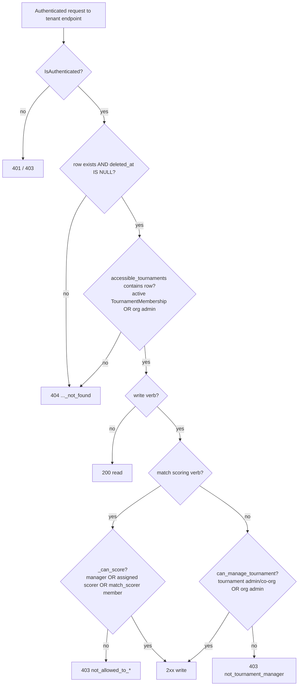
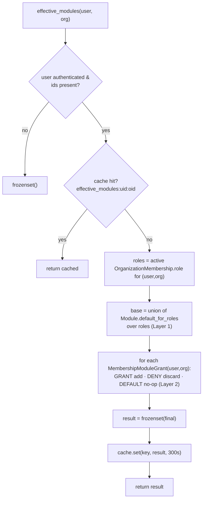

# Permissions & Multi-Tenancy — Exhaustive Reference

> Scope: the complete RBAC + multi-tenancy logic of the Fixture Platform backend.
> Source code is ground truth; every claim below cites `file:symbol` + line range.
> Canonical specs: `docs/superpowers/specs/v1Users.md` (Appendix A.2/A.3/A.4 — module
> catalog + resolver) and `docs/superpowers/specs/2026-04-30-fixture-platform-prd.md`
> §3.1/§3.2 (role catalog + verb matrix). Per CLAUDE.md invariant 12, both layers are
> canonical: `v1Users.md §§2-7 + Appendix A` supersedes PRD §3.2 *on modules*; the PRD
> §3.2 verb matrix governs fine-grained verbs *within* a module.

---

## 0. The two-layer mental model

The system has **two orthogonal authorization layers** plus a **tenant-isolation
boundary** underneath both:

| Layer | Question it answers | Mechanism | Code |
|-------|--------------------|-----------|------|
| **Layer 0 — Tenant isolation** | "Does this row even exist for you?" | Org-FK scoping → 404 on no access | `apps/tournaments/scope.py::accessible_tournaments`, `apps/permissions/scope.py::ScopedQuerySet`, `apps/organizations/scope.py::ScopedQuerySetMixin` |
| **Layer 1 — Module visibility** | "Can you see this *surface/screen*?" | Catalog `default_for_roles` ∪ per-(user,org) `MembershipModuleGrant` overrides | `apps/permissions/services/resolver.py::effective_modules` |
| **Layer 2 — Verb authorization** | "Can you perform this *action* within the surface?" | PRD §3.2 action×role matrix; enforced ad-hoc by `can_manage_tournament` + per-match role checks | `apps/tournaments/permissions.py::can_manage_tournament`, `apps/matches/views.py::_can_score` |

Layer 1 (module RBAC) is implemented and tested in the `permissions` app and is keyed
to **Organization** membership roles (`OrganizationMembership.role`). Layer 2 (the
tournament-scoped verb checks the live API actually enforces) is keyed to
**TournamentMembership.role** + org-admin fallback. These are *two different role
tables* — see §10 for the important consequence.

---

## 1. Module catalog — `apps/permissions/fixtures/modules.json`

The catalog is a JSON fixture, loaded into the `Module` table by
`python manage.py load_modules` (`apps/permissions/management/commands/load_modules.py`).
The fixture is the source of truth; the command upserts on `code`
(`Module` model docstring, `apps/permissions/models.py:43-49`).

**Count discrepancy (verified against the file):** the model/docstrings and
`v1Users.md` Appendix A.2 say "22 modules + a 23rd from the form builder = 23". The
**actual `modules.json` contains 23 entries** (counted: 5 org + 7 tournament-scoped
listed + `forms` + 4 match + 3 personal). The `forms` module
(`apps/permissions/fixtures/modules.json:86-92`, `code="forms"`,
`category="tournament_scoped"`) is the 23rd that A.2 describes as "added by the
registration form builder". `matrix.py` comments say "22" in places
(`apps/permissions/services/matrix.py:47`) but the code iterates `Module.objects.all()`
so it is count-agnostic.

### 1.1 Full catalog table (code · category · default_for_roles)

Source: `apps/permissions/fixtures/modules.json` (line ranges per row).
Role abbreviations: `admin`=A, `co_organizer`=CO, `game_coordinator`=GC,
`match_scorer`=MS, `referee`=R, `team_manager`=TM.

| # | `code` | category | default_for_roles | JSON lines |
|---|--------|----------|-------------------|-----------|
| 1 | `org.settings` | org_scoped | A, CO | 3-8 |
| 2 | `org.member_directory` | org_scoped | A, CO, GC | 10-15 |
| 3 | `org.audit_log` | org_scoped | A, CO, GC, R | 16-22 |
| 4 | `org.tournament_list` | org_scoped | A, CO, GC, MS, R, TM | 23-29 |
| 5 | `org.branding` | org_scoped | A, CO | 30-36 |
| 6 | `tournament.editor` | tournament_scoped | A, CO, GC | 37-43 |
| 7 | `tournament.bracket_editor` | tournament_scoped | A, CO, GC | 44-50 |
| 8 | `tournament.schedule_editor` | tournament_scoped | A, CO, GC | 51-57 |
| 9 | `tournament.team_registration` | tournament_scoped | A, CO, GC, TM | 58-64 |
| 10 | `tournament.player_roster` | tournament_scoped | A, CO, GC, TM | 65-71 |
| 11 | `tournament.lineup_manager` | tournament_scoped | A, CO, GC, MS, R, TM | 72-78 |
| 12 | `tournament.audit_log` | tournament_scoped | A, CO, GC | 79-85 |
| 13 | `forms` | tournament_scoped | A, CO, GC, TM | 86-92 |
| 14 | `tournament.report_export` | tournament_scoped | A, CO, GC | 93-99 |
| 15 | `tournament.organizer_checklist` | tournament_scoped | A, CO, GC | 100-106 |
| 16 | `tournament.day_pack_export` | tournament_scoped | A, CO, GC | 107-113 |
| 17 | `match.scoring_console` | match_scoped | A, CO, GC, MS | 114-120 |
| 18 | `match.referee_console` | match_scoped | A, CO, GC, R | 121-127 |
| 19 | `match.center_admin_view` | match_scoped | A, CO, GC, MS, R, TM | 128-134 |
| 20 | `match.lineup_submission` | match_scoped | A, CO, GC, TM | 135-141 |
| 21 | `personal.notification_prefs` | personal | A, CO, GC, MS, R, TM | 142-148 |
| 22 | `personal.profile` | personal | A, CO, GC, MS, R, TM | 149-155 |
| 23 | `personal.feedback_widget` | personal | A, CO, GC, MS, R, TM | 156-162 |

### 1.2 `Module` model fields — `apps/permissions/models.py:43-81`

| Field | Type | Notes |
|-------|------|-------|
| `id` | UUIDField PK, `default=uuid7` | invariant 1 (`models.py:51`) |
| `code` | CharField(64), **unique** | stable identifier (`models.py:54`) |
| `name` | CharField(200) | UI label (`models.py:57`) |
| `description` | TextField | `models.py:59` |
| `category` | CharField(64), `db_index` | grouping for matrix UI (`models.py:63`) |
| `default_for_roles` | JSONField (list) | MembershipRole string values (`models.py:68`) |
| `created_at` | DateTimeField auto | `models.py:70` |

`Meta`: `db_table="permissions_module"`, `app_label="permissions_app"`,
`ordering=["category","code"]`, index `perm_module_category_idx`
(`models.py:72-78`).

---

## 2. `MembershipModuleGrant` overrides — `apps/permissions/models.py:84-161`

A per-**(user, organization)** module override. The keying decision is the load-bearing
audit fix (`models.py:84-99`, restated in the module docstring `models.py:1-17` and
`v1Users.md:2187-2214`):

> AUDIT FIX (2026-05-02): keyed on (user, organization), NOT on OrganizationMembership.
> The original keying caused a multi-role resolver bug where a `granted=False` revoke
> was silently bypassed when the user had a SECOND active role granting the same module
> via the Layer-1 union. Per-(user, org) keying ensures a single source of truth for
> module overrides regardless of how many roles the user holds in the Org.

### 2.1 Tri-state — `GrantState` (`models.py:27-40`)

| State | Value | Effect on resolver |
|-------|-------|--------------------|
| `DEFAULT` | `"default"` | no-op; falls through to role defaults. Recommended NOT to materialize — treat row absence as default. |
| `GRANT` | `"grant"` | force module **ON** regardless of role default (`resolver.py:99-100`) |
| `DENY` | `"deny"` | force module **OFF** even if a role default would include it (`resolver.py:101-102`) |

### 2.2 Fields (`models.py:101-141`)

| Field | Notes |
|-------|-------|
| `id` | UUIDv7 PK |
| `user` → User | CASCADE, `related_name="module_grants"` |
| `organization` → Organization | CASCADE |
| `module` → Module | **PROTECT** (`models.py:113-117`) |
| `state` | CharField, choices=GrantState, default DEFAULT |
| `granted_by` → User | SET_NULL |
| `reason` | TextField, DB allows blank; **service layer enforces ≥20 chars** (`models.py:133-137`; `grants.py:25 MIN_REASON_LEN=20`) |
| `created_at`/`updated_at` | auto |

`Meta` (`models.py:142-156`): unique constraint
`unique_grant_per_user_org_module` on `(user, organization, module)`; index
`perm_grant_user_org_idx` on `(user, organization)`. `db_table=
"permissions_membership_module_grant"`.

### 2.3 Write paths — `apps/permissions/services/grants.py`

Every write does three things (docstring `grants.py:3-11`): (1) upsert/delete the row,
(2) invalidate the resolver cache, (3) emit exactly one `AuditEvent`
(`event_type="module_grant_changed"`) per module **changed**, with
`payload_before`/`payload_after` both carrying the prior + new state.

| Function | Behavior | Lines |
|----------|----------|-------|
| `set_grant(...)` | single upsert; `state=default` **collapses to row deletion** (`grants.py:91-96`); validates state + reason; one audit row | `grants.py:53-132` |
| `bulk_set_grants(...)` | atomic bulk over `[(code, state)]`; **skips rows whose prior==new** (no audit churn, `grants.py:169-173`); used by the matrix PUT | `grants.py:135-213` |
| `clear_grants(...)` | deletes every row for (user, org); one audit row per deletion | `grants.py:216-268` |

Reason gate: `MIN_REASON_LEN = 20` (`grants.py:25`), enforced in all three
(`grants.py:79-82`, `151-154`, `229-232`) — raises `GrantValidationError`
(a `ValueError` subclass, `grants.py:29`). `_validate_state` rejects unknown states
(`grants.py:33-39`); `_resolve_module` accepts a `Module` instance or a code string
(`grants.py:42-50`).

Cache invalidation calls `invalidate_cache(user.id, organization.id)` inside the
transaction (`grants.py:111`, `211`, `266`). A `TODO (Appendix B.3)` for cross-worker
Redis pub/sub invalidation is left at each call site — Phase 1A is single-process safe
via the shared cache backend (`resolver.py:42-50`).

---

## 3. `effective_modules()` resolution algorithm — `apps/permissions/services/resolver.py`

Public API (`resolver.py:107-137`):
`effective_modules(user, organization) -> frozenset[str]` and
`has_module(user, organization, module_code) -> bool`.

### 3.1 Algorithm (verbatim from `resolver.py:107-132`)

```
1. Guard: user None / not authenticated  → frozenset()   (resolver.py:113-114)
   Guard: missing user.id or org.id       → frozenset()   (resolver.py:116-119)
2. Cache lookup: key "effective_modules:{user.id}:{org.id}", TTL 300s
   - hit → return cached frozenset        (resolver.py:121-124)
3. roles = _user_active_roles(user, org)  (resolver.py:53-64)
   = set of OrganizationMembership.role WHERE user, org, is_active=True
4. base  = _base_modules_for_roles(roles) (resolver.py:67-86)
   = { module.code : roles ∩ module.default_for_roles ≠ ∅ }   (UNION across roles)
   - empty role set → empty set           (resolver.py:75-76)
5. final = _apply_overrides(base, user, org) (resolver.py:89-104)
   for each MembershipModuleGrant row (user, org):
       state == GRANT → add code
       state == DENY  → discard code
       state == DEFAULT → no-op
6. result = frozenset(final); cache.set(key, result, 300); return  (resolver.py:130-132)
```

Key semantic points, all test-verified:

- **Multi-role union then override.** Base is the *union* of `default_for_roles` over
  all active roles (`resolver.py:78-86`). A single `DENY` row removes the module even
  if multiple roles in the union would have added it — proven by
  `test_resolver_grant_overrides_role_default_deny.py::test_deny_wins_over_multi_role_union`
  (admin+co_organizer both default `tournament.editor` ON; one DENY removes it).
- **GRANT adds beyond role.** A module not in any role default can be forced ON.
- **DEFAULT rows are no-ops** (and `set_grant` deletes rather than materializes them).
- **Superuser is NOT special-cased here** — `effective_modules` ignores `is_superuser`.
  Superuser bypass lives in the *consumers* (`HasModule.has_permission`
  `permissions.py:43-44`; `ScopedQuerySet.scoped_for_user`/`module_gated`
  `scope.py:72-73`, `91-92`).

### 3.2 Caching contract (`resolver.py:32-50`, `cache_key`, `invalidate_cache`)

- Key: `f"effective_modules:{user_id}:{organization_id}"` (`resolver.py:37-39`).
- TTL: `CACHE_TTL_SECONDS = 300` (5 min) (`resolver.py:34`).
- Backend: Django cache (locmem dev / Redis prod) (`resolver.py:30`).
- Invalidation: `cache.delete(cache_key(...))` on every grant write
  (`resolver.py:42-50`). Cross-worker pub/sub deferred to Phase 1B (TODO at
  `resolver.py:45-49`). The full contract spec'd in `v1Users.md:2242-2250` (version
  suffix, `module_perm_invalidated` Redis channel, synthetic `permissions_changed`
  notification) is **not yet implemented** — the code uses a flat key + TTL.

### 3.3 DRF consumer — `HasModule` factory (`apps/permissions/permissions.py:30-83`)

`HasModule(module_code)` is a **class factory** returning a `BasePermission` subclass
(so `permission_classes=[..., HasModule("x")]` instantiates it). `has_permission`
(`permissions.py:39-50`):

1. unauthenticated → False
2. `is_superuser` → True (bypass)
3. resolve org context → if None, **False**
4. `has_module(user, org, module_code)`

Org resolution order (`_resolve_organization`, `permissions.py:52-80`):
`view.get_organization()` → `view.organization` → `view.kwargs['org_uuid'|'organization_uuid']`
→ `request.org_context`. **Note:** the live tournament API does *not* use `HasModule`
for tournament/match endpoints — it uses `can_manage_tournament` + `_can_score` directly
(see §6/§9). `HasModule` is wired into the org-scoped grant views via
`HasModule("org.member_directory")` mention but `UserGrantsView`/`MatrixView` actually
gate on `IsOrgAdminOrOwner` instead (see §3.4).

### 3.4 Permissions-app HTTP endpoints — `apps/permissions/views.py` + `urls.py`

| Method · Path | View | AuthZ | Notes |
|---------------|------|-------|-------|
| `GET /api/permissions/modules/` | `ModuleCatalogView` | `IsAuthenticated` | full catalog list (`views.py:73-88`) |
| `GET /api/permissions/me/modules/?org={uuid}` | `MyEffectiveModulesView` | `IsAuthenticated` | own effective set; 400 if no `org`, 404 if org missing (`views.py:91-136`) |
| `GET/PUT /api/permissions/orgs/{org_uuid}/users/{user_uuid}/grants/` | `UserGrantsView` | `IsAuthenticated` + **`IsOrgAdminOrOwner`** | per-user grant rows + effective set; PUT accepts `{grants:[...]}` or `{cells:{...}}` (cells wins) (`views.py:139-269`) |
| `GET /api/permissions/orgs/{slug}/me/modules/` | `MyModulesBySlugView` | `IsAuthenticated` | slug alias; 404 if org missing (`views.py:277-300`) |
| `GET/PUT /api/permissions/orgs/{slug}/users/{user_uuid}/grants/` | `UserGrantsBySlugView` | inherits `UserGrantsView` gate | slug alias (`views.py:303-337`) |
| `GET /api/permissions/orgs/{slug}/grants/matrix/` | `MatrixView` | `IsAuthenticated` + **`IsOrgAdminOrOwner`** | aggregate per-member×per-module matrix (B.16) (`views.py:340-371`) |

**Override-grant verb reserved to Admin (v1.0).** Even though Co-organizer and
Game-coordinator hold `org.member_directory` by default, they **cannot** view/mutate
the override matrix or per-user grants. The grant views therefore gate on
`IsOrgAdminOrOwner` (role check), **not** `HasModule("org.member_directory")`
(`views.py:139-148`, `340-355`; rationale cites `v1Users.md:738` "the override-grant
verb is reserved to Admin in v1.0"). The matrix payload is built by
`build_matrix(org)` (`apps/permissions/services/matrix.py:59-153`) showing per-member
`cells` (override state) + `role_defaults` (bool) for every catalog module.

---

## 4. PRD §3.2 verb matrix (canonical fine-grained actions)

Source: `docs/superpowers/specs/2026-04-30-fixture-platform-prd.md:137-186`.
Legend: ✅ allowed · ⚠️ allowed with audit + reason · ❌ denied · "scoped" = within the
role's natural scope (GameCoord → own sport; Scorer/Referee → assigned matches;
TeamMgr → own team). Columns: **SA**=Super-admin, **A**=Admin, **CO**=Co-org,
**GC**=GameCoord, **MS**=Scorer, **R**=Referee, **TM**=Team mgr, **PL**=Player,
**MD**=Media, **VW**=Viewer.

| Action (PRD line) | SA | A | CO | GC | MS | R | TM | PL | MD | VW |
|-------------------|:--:|:-:|:--:|:--:|:--:|:-:|:--:|:--:|:--:|:--:|
| Create Organization (143) | ✅ | self-signup only | ❌ | ❌ | ❌ | ❌ | ❌ | ❌ | ❌ | ❌ |
| Approve/suspend Org (144) | ✅ | ❌ | ❌ | ❌ | ❌ | ❌ | ❌ | ❌ | ❌ | ❌ |
| Edit own Org settings (145) | ✅ | ✅ | ✅ | ❌ | ❌ | ❌ | ❌ | ❌ | ❌ | ❌ |
| Delete Org (146) | ✅ | ⚠️ | ❌ | ❌ | ❌ | ❌ | ❌ | ❌ | ❌ | ❌ |
| Transfer Org ownership (147) | ✅ | ✅ | ❌ | ❌ | ❌ | ❌ | ❌ | ❌ | ❌ | ❌ |
| Invite Co-organizer (148) | ✅ | ✅ | ❌ | ❌ | ❌ | ❌ | ❌ | ❌ | ❌ | ❌ |
| Invite Game coordinator (149) | ✅ | ✅ | ✅ | ❌ | ❌ | ❌ | ❌ | ❌ | ❌ | ❌ |
| Invite Scorer/Referee (150) | ✅ | ✅ | ✅ | ✅ own sport | ❌ | ❌ | ❌ | ❌ | ❌ | ❌ |
| Invite Team manager (151) | ✅ | ✅ | ✅ | ✅ own sport | ❌ | ❌ | ❌ | ❌ | ❌ | ❌ |
| Invite Media/Player (152) | ✅ | ✅ | ✅ | ❌ | ❌ | ❌ | ❌ | ❌ | ❌ | ❌ |
| Revoke any role (153) | ✅ | ✅ | ✅ | scoped | ❌ | ❌ | ❌ | ❌ | ❌ | ❌ |
| Create Tournament (154) | ✅ | ✅ | ✅ | ❌ | ❌ | ❌ | ❌ | ❌ | ❌ | ❌ |
| Edit Tournament basics pre-publish (155) | ✅ | ✅ | ✅ | ❌ | ❌ | ❌ | ❌ | ❌ | ❌ | ❌ |
| Edit structured rules pre-freeze (156) | ✅ | ✅ | ✅ | ❌ | ❌ | ❌ | ❌ | ❌ | ❌ | ❌ |
| Amend rules post-freeze (157) | ✅ | ⚠️ | ⚠️ | ❌ | ❌ | ❌ | ❌ | ❌ | ❌ | ❌ |
| Lock/unlock bracket (158) | ✅ | ✅ | ✅ | scoped | ❌ | ❌ | ❌ | ❌ | ❌ | ❌ |
| Generate/drag-drop bracket (159) | ✅ | ✅ | ✅ | scoped | ❌ | ❌ | ❌ | ❌ | ❌ | ❌ |
| Generate/edit schedule (160) | ✅ | ✅ | ✅ | scoped | ❌ | ❌ | ❌ | ❌ | ❌ | ❌ |
| Register team (open-reg) (161) | ✅ | ✅ | ✅ | scoped | ❌ | ❌ | ✅ | ❌ | ❌ | ❌ |
| Approve team registration (162) | ✅ | ✅ | ✅ | scoped | ❌ | ❌ | ❌ | ❌ | ❌ | ❌ |
| Withdraw team (163) | ✅ | ✅ | ✅ | scoped | ❌ | ❌ | ✅ own | ❌ | ❌ | ❌ |
| Disqualify team mid-tournament (164) | ✅ | ⚠️ | ⚠️ | ❌ | ❌ | ❌ | ❌ | ❌ | ❌ | ❌ |
| Add/edit player pre-freeze (165) | ✅ | ✅ | ✅ | scoped | ❌ | ❌ | ✅ own team | ❌ | ❌ | ❌ |
| Edit player post-freeze (166) | ✅ | ⚠️ | ⚠️ | ❌ | ❌ | ❌ | ❌ | ❌ | ❌ | ❌ |
| Submit lineup (167) | ✅ | ✅ | ✅ | scoped | ⚠️ | ❌ | ✅ own team | ❌ | ❌ | ❌ |
| Confirm lineup at kickoff (168) | ✅ | ✅ | ✅ | scoped | ✅ assigned | ❌ | ❌ | ❌ | ❌ | ❌ |
| Live scoring / enter events (169) | ✅ | ⚠️ | ⚠️ | ⚠️ | ✅ assigned | ❌ | ❌ | ❌ | ❌ | ❌ |
| Correct event pre-final (170) | ✅ | ⚠️ | ⚠️ | ⚠️ | ⚠️ | ✅ assigned | ❌ | ❌ | ❌ | ❌ |
| Approve/reject final score (171) | ✅ | ⚠️ | ⚠️ | ⚠️ | ❌ | ✅ assigned | ❌ | ❌ | ❌ | ❌ |
| Force-finalize after timeout (172) | ✅ | ⚠️ | ⚠️ | ⚠️ | ❌ | ❌ | ❌ | ❌ | ❌ | ❌ |
| Raise dispute (173) | ✅ | ✅ | ✅ | scoped | ❌ | ✅ assigned | ✅ own team | ❌ | ❌ | ❌ |
| Resolve dispute (174) | ✅ | ✅ | ✅ | sport-scoped | ❌ | ❌ | ❌ | ❌ | ❌ | ❌ |
| Override player suspension (175) | ✅ | ⚠️ | ❌ | ❌ | ❌ | ❌ | ❌ | ❌ | ❌ | ❌ |
| View Org audit log (176) | ✅ | ✅ | ✅ | sport-scoped | ❌ | own matches | ❌ | ❌ | ❌ | ❌ |
| View platform audit log (177) | ✅ | ❌ | ❌ | ❌ | ❌ | ❌ | ❌ | ❌ | ❌ | ❌ |
| Impersonate user (178) | ✅ | ❌ | ❌ | ❌ | ❌ | ❌ | ❌ | ❌ | ❌ | ❌ |
| View opposing lineup pre-kickoff (179) | ✅ | ✅ | ✅ | ✅ | ✅ | ✅ | ❌ | ❌ | ❌ | ❌ |
| View own player DOB (180) | ✅ | ✅ own org | ✅ own org | ❌ | ❌ | ❌ | ✅ own team | ✅ self | ❌ | ❌ |
| View public match data (181) | ✅ | ✅ | ✅ | ✅ | ✅ | ✅ | ✅ | ✅ | ✅ | ✅ |
| Download CSV/PDF export (182) | ✅ | ✅ | ✅ | scoped | ❌ | ❌ | ❌ | ❌ | ✅ | ❌ |
| Delete `MatchEvent` row (183) | ❌ | ❌ | ❌ | ❌ | ❌ | ❌ | ❌ | ❌ | ❌ | ❌ |
| Void `MatchEvent` (184) | ✅ | ⚠️ | ⚠️ | ⚠️ | ⚠️ | ✅ assigned | ❌ | ❌ | ❌ | ❌ |

**Verb-matrix vs. implemented-API caveat:** the PRD matrix is the *design intent*. The
live v1B API enforces a **coarser** model: most tournament/match write verbs collapse
to "is this user a tournament manager?" (`can_manage_tournament`, §6) plus a
scorer-specific check (`_can_score`, §9). Fine-grained distinctions like "Scorer enters
events but Referee approves final" are **not** all individually enforced in code yet —
e.g. `_can_score` lets any tournament-manager OR assigned-scorer OR any active
`match_scorer` member do scoring, transitions, lineup-set, lineup-confirm, and incident
filing alike (`matches/views.py:71-83`). The "Delete `MatchEvent`" ❌-for-everyone row
is structurally enforced: scores are event-sourced and corrections are append-only
`VOID` events (CLAUDE.md architecture; `apps/matches/services/events.py`).

---

## 5. Roles & statuses

### 5.1 PRD §3.1 — 10 platform roles (design)

`prd.md:118-135`. Super-admin, Admin(Organizer), Co-organizer, Game coordinator, Match
scorer, Referee/verifier, Team manager, Player, Viewer(public), Media/press. Only the
first 7 (minus Super-admin's platform scope) map to enum members below; Player/Media/
Viewer are Phase 1.5+ / public.

### 5.2 The 6 tournament-scoped roles — `TournamentMembershipRole`

`apps/tournaments/models.py:36-44`. "decision #91 widens v1Users §4.7 to 6 roles"
(`models.py:37`):

| Enum member | value | PRD role |
|-------------|-------|----------|
| `ADMIN` | `"admin"` | Admin/Organizer |
| `CO_ORGANIZER` | `"co_organizer"` | Co-organizer |
| `GAME_COORDINATOR` | `"game_coordinator"` | Game coordinator |
| `MATCH_SCORER` | `"match_scorer"` | Match scorer |
| `REFEREE` | `"referee"` | Referee/verifier |
| `TEAM_MANAGER` | `"team_manager"` | Team manager |

The **identical** 6-member enum also exists as `MembershipRole`
(`apps/organizations/models.py:46-54`) for org-level memberships. The module-RBAC
resolver keys on the **org** `MembershipRole` (`resolver.py:53-64`); the live tournament
API keys on the **tournament** `TournamentMembershipRole` (`permissions.py:11-14`). See
§10.

### 5.3 The 3 tournament membership statuses — `TournamentMembershipStatus`

`apps/tournaments/models.py:47-50`:

| Status | value | Meaning / behavior |
|--------|-------|--------------------|
| `ACTIVE` | `"active"` | full privileges; only status counted by `accessible_tournaments` + `can_manage_tournament` (§6) |
| `SUSPENDED` | `"suspended"` | listed in roster (`_ROSTER_STATUSES`, `views.py:171-174`) but **not** active → no access via scope/manage helpers |
| `REVOKED` | `"revoked"` | removed from roster; stamps `revoked_at` (`views.py:259-261`) |

`TournamentMembership` (`models.py:116-159`): UUIDv7 PK; FK user (CASCADE), tournament
(CASCADE); `role`, `status` (default ACTIVE), `assigned_by` (SET_NULL),
`assigned_at` (auto), `revoked_at`. Unique constraint
`unique_active_tournament_role` on `(user, tournament, role)` **WHERE status='active'**
(`models.py:144-149`) — allows multi-role per (user, tournament). Indexes
`trnmem_t_role_status_idx`, `trnmem_user_status_idx`.

### 5.4 Tournament status enum — `TournamentStatus` (`models.py:24-33`)

7 states: `DRAFT`, `PUBLISHED`, `REGISTRATION_OPEN`, `SCHEDULED`, `LIVE`, `COMPLETED`,
`ARCHIVED`. Relevant to RBAC: **rules are editable only in DRAFT/PUBLISHED**
(`apps/tournaments/services/rules.py::can_edit_rules`, `rules.py:61-63`); frozen at
`registration_open` (invariant 7). `update_settings` raises `PermissionError
("rules_frozen")` once not editable unless `amend=True`+reason (`rules.py:96-99`),
surfaced as **409** by the view (`views.py:147-148`).

### 5.5 Org-level enums (for completeness)

- `OrgStatus` (`organizations/models.py:36-43`): `pending_review`, `active`,
  `suspended`, `archived`, `orphaned`.
- `MembershipRole` (`organizations/models.py:46-54`): the same 6 as §5.2.
- `OrganizationMembership` (`organizations/models.py:172-235`): `role`, `is_org_owner`
  (only valid with role=admin via `CheckConstraint owner_flag_only_on_admin_role`,
  `models.py:231-234`), `is_active`. Constraints: `unique_active_role_per_user_per_org`
  (multi-role allowed since role is in the key, `models.py:213-218`), `one_owner_per_org`
  (active rows, `models.py:225-229`). PRD §3.3 OrganizationMembership status enum
  (`prd.md:188-201`) is a richer 8-state set (`invited`, `pending_email_verification`,
  `pending_approval`, `active`, `suspended`, `revoked`, `declined`, `left`) — the
  *implemented* model uses a boolean `is_active` instead.

---

## 6. `accessible_tournaments` scope + `can_manage_tournament`

### 6.1 `accessible_tournaments(user)` — `apps/tournaments/scope.py:19-32`

Returns the QuerySet of tournaments a user may **see**. A user sees a tournament iff:

- they hold an **active TournamentMembership** in it
  (`TournamentMembership WHERE user, status=ACTIVE`, `scope.py:25-27`), **OR**
- they are an **active org ADMIN** of the workspace it lives in
  (`OrganizationMembership WHERE user, is_active=True, role=ADMIN`, `scope.py:22-24`).

Always filters `deleted_at__isnull=True` (`scope.py:29`) and `.distinct()`
(`scope.py:31`). Unauthenticated → `Tournament.objects.none()` (`scope.py:20-21`).

Important narrowness (verified): **only org `ADMIN`** confers blanket visibility — an
org `co_organizer`/`game_coordinator` who is *not* a TournamentMembership member gets
**nothing** from `accessible_tournaments`. This differs from the broader
`ScopedQuerySet.scoped_for_user` (any active org membership). The two scoping systems
are independent (see §10).

### 6.2 `can_manage_tournament(user, tournament)` — `apps/tournaments/permissions.py:17-36`

True (may invite/assign/edit) iff:

- active TournamentMembership with role in `_MANAGE_ROLES =
  {ADMIN, CO_ORGANIZER}` (`permissions.py:11-14`, `24-30`), **OR**
- active org ADMIN of `tournament.organization_id`
  (`OrganizationMembership WHERE is_active=True, role=ADMIN`, `permissions.py:31-36`).

So **manager = tournament admin/co-organizer OR org admin**. Game coordinators, match
scorers, referees, and team managers are **not** managers (read/act-only). Unauthenticated
→ False (`permissions.py:22-23`).

### 6.3 The standard endpoint guard pattern

The duplicated-but-consistent idiom across every tenant view (e.g.
`tournaments/views.py::_get_tournament_or_404`, `62-71`):

```
1. fetch row by id WHERE deleted_at IS NULL
2. if row is None OR not accessible_tournaments(user).filter(id=...).exists():
       raise NotFound("..._not_found")            # 404 — existence hidden
3. (write paths) if not can_manage_tournament(user, t):
       raise PermissionDenied("not_tournament_manager")   # 403 — exists, but no verb
```

This two-step is the heart of the "404-not-403" policy (§8). Re-implemented verbatim in
`matches/views.py:52-68`, `teams/views.py:36-39 / 101-102`, `fixtures/views.py:24-25`,
`disputes/views.py:23-37`, `forms/views.py:50-63 / 74-75`.

---

## 7. Org-scoping on every tenant model (invariant 2)

Every tenant-scoped model carries an `organization` FK (and usually a `tournament` FK
for tournament-children). Verified across `backend/apps/*/models.py`:

| Model | `organization` FK | `tournament` FK | soft-delete | source lines |
|-------|:----------------:|:---------------:|:-----------:|--------------|
| `organizations.Organization` | (is the tenant) | — | `deleted_at` | `organizations/models.py:114-164` |
| `organizations.OrganizationMembership` | ✅ | — | `is_active`/`removed_at` | `organizations/models.py:172-235` |
| `organizations.AdminInvitation` | ✅ | ✅ (nullable; tournament-scoped invite) | status enum | `organizations/models.py:252-337` |
| `organizations.SlugRedirect` | ✅ | — | — | `organizations/models.py:345-359` |
| `permissions.MembershipModuleGrant` | ✅ | — | — | `permissions/models.py:108-112` |
| `tournaments.Tournament` | ✅ (CASCADE) | (is the tenant child) | `deleted_at` | `tournaments/models.py:55-93` |
| `tournaments.TournamentMembership` | (via tournament) | ✅ | `status`/`revoked_at` | `tournaments/models.py:116-156` |
| `teams.Team` | ✅ | ✅ | `deleted_at` | `teams/models.py:49-72` |
| `teams.Player` | ✅ | ✅ | `deleted_at` | `teams/models.py:96-114` |
| `teams.Person` | — (platform identity, not org-scoped by design — invariant 8) | — | `deleted_at` | `teams/models.py:28-37` |
| `teams.RegistrationLink` | ✅ | ✅ | — | `teams/models.py:146-157` |
| `matches.Match` | ✅ | ✅ | `deleted_at` | `matches/models.py:52-93` |
| `matches.Lineup` | ✅ | (via match) | `deleted_at` | `matches/models.py:132-150` |
| `matches.LineupEntry` | — (via lineup) | — | — | `matches/models.py:171-204` |
| `matches.MatchIncident` | ✅ | (via match) | — | `matches/models.py:206-243` |
| `matches.MatchEvent` | ✅ | ✅ | append-only (VOID events) | `matches/models.py:245-257` |
| `forms.Form` | ✅ | ✅ | `deleted_at` | `forms/models.py:17-46` |
| `forms.FormShareLink` | ✅ | — | — | `forms/models.py:65-70` |
| `forms.FormResponse` | ✅ | ✅ | `deleted_at` | `forms/models.py:94-118` |
| `forms.FormFileUpload` | ✅ | — | — | `forms/models.py:139-142` |
| `disputes.Dispute` | ✅ | ✅ | status enum | `disputes/models.py:24-30` |
| `notifications.Notification` | — (per-user) | ✅ (nullable, SET_NULL) | — | `notifications/models.py:12-18` |

**Note on `Person`** (`teams/models.py:28`): deliberately *not* org-scoped — it is the
cross-tournament platform identity (invariant 8: Person↔Player split). `Player` is the
org+tournament-scoped registration referencing a Person.

### 7.1 The three scope-filter implementations

There are **three** scoping helpers (some redundancy across apps):

1. **`apps/permissions/scope.py::ScopedQuerySet`** (`scope.py:38-111`) — the sanctioned
   base. `scoped_for_user(user)`: rows in orgs where the user has ANY active
   OrganizationMembership (superuser bypass → all; anon → `.none()`)
   (`scope.py:64-75`). `module_gated(user, code)`: further narrows to orgs where
   `effective_modules` contains `code` (per-org loop, ≤50 orgs; `scope.py:77-111`).
   `ScopedManager.from_queryset(...)` composes it (`scope.py:114-121`).
2. **`apps/organizations/scope.py::ScopedQuerySetMixin`** (`scope.py:21-66`) —
   `.scoped_for(user)` using `OrganizationMembership.objects.user_org_ids(user)`
   (configurable `ORG_FIELD`, default `"organization"`); superuser bypass; anon →
   `.none()`. `OrgScopedQuerySet` variant filters on `id` when the row *is* an Org.
3. **`apps/tournaments/scope.py::accessible_tournaments`** (§6.1) — the
   tournament-specific function actually used by every tournament/match endpoint.

`OrganizationMembership.objects.user_org_ids(user)` (`organizations/models.py:90-101`)
is the single mapping for "orgs the user belongs to" (filters
`is_active=True, organization__deleted_at__isnull=True`). The
`accessible_tournaments` path does **not** call `scoped_for_user` — it has its own,
stricter logic (org-admin-only blanket access).

---

## 8. The 404-not-403 existence-hiding policy

The platform deliberately returns **404 (not 403)** when a user lacks *access to a
resource that may or may not exist*, so an outsider cannot probe existence by status
code. 403 is reserved for "the resource is accessible to you, but you lack the *verb*."

### 8.1 Policy statement (from code + tests)

- **No access → 404** "..._not_found" via `accessible_tournaments(...).exists()` checks.
  Docstrings state it explicitly: `tournaments/views.py:63` "Resolve a tournament the
  user can access, else 404 (no existence leak)"; `forms/views.py:4` "404 on no-access,
  no existence leak — invariant #2".
- **Has access but not a manager → 403** `PermissionDenied("not_tournament_manager")`
  (e.g. `tournaments/views.py:84-85`, `disputes/views.py:79-80`,
  `matches/views.py:125-126`).
- **Invalid/expired public token → 404** "invalid_link" (`teams/views.py:63,71`;
  `forms/views.py:194`).

### 8.2 Decision rule (which code applies)

```
caller authenticated?               no  → 401/403 (DRF IsAuthenticated) [public AllowAny views skip]
row exists & deleted_at IS NULL?    no  → 404 "..._not_found"
accessible_tournaments contains it? no  → 404 "..._not_found"     ← existence hidden here
write verb & can_manage_tournament? no  → 403 "not_tournament_manager"
                                    yes → proceed
```

### 8.3 Test evidence

`apps/forms/tests/test_isolation.py` (whole file dedicated to this invariant):

- `test_outsider_cannot_read_form_404` — outsider GET + PATCH a form they don't own →
  **404** (`test_isolation.py:23-31`).
- `test_outsider_cannot_act_on_form_404` — outsider publish/close/duplicate/delete →
  **404** (`test_isolation.py:34-47`).
- `test_outsider_cannot_list_forms_on_others_tournament` →
  `GET /api/tournaments/{id}/forms/` = **404** (`test_isolation.py:50-57`).
- `test_outsider_cannot_create_form_on_others_tournament` — asserts status in
  `(403, 404)` for the create path (`test_isolation.py:60-68`).

Cross-org isolation tests with the same 404 expectation exist in `disputes`, `matches`,
`teams`, `audit`, `organizations`, `notifications`, `permissions`, `sadmin` test suites
(per the file inventory in the repo). CLAUDE.md invariant 2 makes a cross-org isolation
test mandatory for every endpoint.

### 8.4 Where 403 (not 404) is correctly used

- Tournament managers-only write verbs (settings PATCH, invitations, member detail,
  audit feed, generate-fixtures, dispute resolve/reject, scorer assign) — the *resource
  is visible* to the caller (they're a member), they just can't perform the verb.
- `WithdrawDisputeView` — `403 only_raiser_can_withdraw` when a visible dispute is not
  the caller's own (`disputes/views.py:108-110`).
- `email_verified_at` gate on tournament create — **403** `verify_email_first`
  (`tournaments/views.py:48-49`).

---

## 9. Match-scoping (a fourth, finer scope layer)

Matches add a per-match scorer gate on top of tournament access:

`_can_score(user, match)` (`matches/views.py:71-83`) → True iff **any** of:
1. `can_manage_tournament(user, match.tournament)` (org admin / tournament admin/co-org),
2. `match.scorer_id == user.id` (the per-match assigned scorer),
3. user has an active `match_scorer` TournamentMembership in the tournament.

`_can_score` gates: record score, record event, transition, set lineup, confirm lineup,
file incident (`matches/views.py:143, 171, 232, 325, 362, 398`). Read endpoints
(`MatchLineupView.get`, `MatchIncidentView.get`, `TournamentMatchListView`,
`TournamentStandingsView`, `MatchEventsExportView`) require only tournament access via
`_match_or_404`/`_accessible_tournament_or_404`. **This is coarser than PRD §3.2** — it
does not separately enforce Referee-only "approve final score" vs Scorer-only "enter
events" (see §4 caveat).

---

## 10. Critical cross-cutting consequence: TWO role systems

This is the single most important thing for the restructuring to understand:

- **Module RBAC (Layer 1)** keys on `OrganizationMembership.role`
  (`resolver.py:53-64`) and answers "what screens can you see."
- **Tournament verb authz (Layer 2)** keys on `TournamentMembership.role`
  (`permissions.py:11-36`, `scope.py:22-27`) and answers "what can you do in this
  tournament."

A user can be an org `admin` (full modules) but hold **no** TournamentMembership in a
specific tournament — `accessible_tournaments` still lets them in *because of the
org-admin branch* (`scope.py:22-24`), and `can_manage_tournament` lets them manage it
(`permissions.py:31-36`). Conversely, a user with only a TournamentMembership
(`game_coordinator`, say) and **no** OrganizationMembership gets an **empty**
`effective_modules` set (the resolver finds no active org roles) yet **can** still reach
the tournament via the TournamentMembership branch of `accessible_tournaments`. The two
systems are not unified; `effective_modules`/`HasModule` is effectively unused by the
tournament/match/teams/forms/disputes/fixtures endpoints, which rely solely on
`accessible_tournaments` + `can_manage_tournament` + `_can_score`. The `forms` catalog
module exists but the forms endpoints do **not** gate on `HasModule("forms")` — they use
the tournament-manager pattern.

---

## 11. Role → module/verb access matrix (consolidated)

### 11.1 Role → module (Layer-1 defaults, from `modules.json`)

Derived from §1.1. ✅ = default-on for that role (overrides can add/remove per user).

| Module | admin | co_org | game_coord | match_scorer | referee | team_mgr |
|--------|:-----:|:------:|:----------:|:------------:|:-------:|:--------:|
| `org.settings` | ✅ | ✅ | — | — | — | — |
| `org.member_directory` | ✅ | ✅ | ✅ | — | — | — |
| `org.audit_log` | ✅ | ✅ | ✅ | — | ✅ | — |
| `org.tournament_list` | ✅ | ✅ | ✅ | ✅ | ✅ | ✅ |
| `org.branding` | ✅ | ✅ | — | — | — | — |
| `tournament.editor` | ✅ | ✅ | ✅ | — | — | — |
| `tournament.bracket_editor` | ✅ | ✅ | ✅ | — | — | — |
| `tournament.schedule_editor` | ✅ | ✅ | ✅ | — | — | — |
| `tournament.team_registration` | ✅ | ✅ | ✅ | — | — | ✅ |
| `tournament.player_roster` | ✅ | ✅ | ✅ | — | — | ✅ |
| `tournament.lineup_manager` | ✅ | ✅ | ✅ | ✅ | ✅ | ✅ |
| `tournament.audit_log` | ✅ | ✅ | ✅ | — | — | — |
| `forms` | ✅ | ✅ | ✅ | — | — | ✅ |
| `tournament.report_export` | ✅ | ✅ | ✅ | — | — | — |
| `tournament.organizer_checklist` | ✅ | ✅ | ✅ | — | — | — |
| `tournament.day_pack_export` | ✅ | ✅ | ✅ | — | — | — |
| `match.scoring_console` | ✅ | ✅ | ✅ | ✅ | — | — |
| `match.referee_console` | ✅ | ✅ | ✅ | — | ✅ | — |
| `match.center_admin_view` | ✅ | ✅ | ✅ | ✅ | ✅ | ✅ |
| `match.lineup_submission` | ✅ | ✅ | ✅ | — | — | ✅ |
| `personal.notification_prefs` | ✅ | ✅ | ✅ | ✅ | ✅ | ✅ |
| `personal.profile` | ✅ | ✅ | ✅ | ✅ | ✅ | ✅ |
| `personal.feedback_widget` | ✅ | ✅ | ✅ | ✅ | ✅ | ✅ |

> `v1Users.md` Appendix A.3 (`v1Users.md:2148-2168`) additionally annotates scope
> qualifiers (👁 read-only, 🔵 assigned-tournament/own-team/assigned/own-matches). Those
> qualifiers are NOT encoded in `default_for_roles` (which is a flat on/off list) — they
> are intended to be enforced by row-level filters layered on top (`v1Users.md:2170-2172`).
> The implemented row-level layer is `accessible_tournaments`/`can_manage_tournament`/
> `_can_score` (§6/§9), which is coarser than A.3's per-role scope qualifiers.

### 11.2 Role → verb (Layer-2, as the live API enforces it)

This collapses the PRD §3.2 design into what the code actually checks. "Manager" =
`can_manage_tournament` True (org admin OR tournament admin/co-org).

| Verb (endpoint) | Enforced gate | Who passes |
|-----------------|---------------|-----------|
| See a tournament / its children | `accessible_tournaments` | active TournamentMembership (any role) OR org admin |
| Create tournament | `IsAuthenticated` + `email_verified_at` | any verified user (auto-becomes its admin) |
| Edit settings/rules (PATCH) | `can_manage_tournament` + freeze gate | manager |
| Invite to tournament | `can_manage_tournament` | manager |
| Manage member (role/status) | `can_manage_tournament` + last-admin guard | manager |
| View tournament audit | `can_manage_tournament` | manager |
| Generate fixtures | `can_manage_tournament` | manager |
| Mint registration link | `can_manage_tournament` | manager |
| Resolve/reject dispute | `can_manage_tournament` | manager |
| Raise dispute | `accessible_tournaments` | any accessible member |
| Withdraw dispute | `raised_by == user` | the raiser only |
| Assign scorer to match | `can_manage_tournament` | manager |
| Score / event / transition / set+confirm lineup / file incident | `_can_score` | manager OR assigned scorer OR any active `match_scorer` member |
| Read match/lineups/incidents/standings/event-export | `accessible_tournaments` (via `_match_or_404`) | any accessible member |
| Manage per-user module grants / view matrix | `IsOrgAdminOrOwner` | org admin only |
| Read own effective modules | `IsAuthenticated` | self |

---

## 12. Per-endpoint scope-enforcement table

Every authenticated tenant endpoint, its access gate, and its 404/403 behavior.
Verb gate column: **AT** = `accessible_tournaments` existence check (→404 on miss);
**CMT** = `can_manage_tournament` (→403 on miss); **CS** = `_can_score` (→403);
**OAO** = `IsOrgAdminOrOwner` (DRF, →403); — = none beyond auth.

| Method · Path | View (file:line) | Access gate | Verb gate | Miss → |
|---------------|------------------|-------------|-----------|--------|
| `GET /api/tournaments/` | `TournamentListCreateView.get` (`tournaments/views.py:43-45`) | `accessible_tournaments` (filters list) | — | empty list |
| `POST /api/tournaments/` | `.post` (`tournaments/views.py:47-59`) | `IsAuthenticated` | `email_verified_at` else 403 | 403 verify_email_first |
| `GET /api/tournaments/constraint-types/` | `ConstraintTypesView` (`tournaments/views.py:154-162`) | `IsAuthenticated` | — | — |
| `GET /api/tournaments/{id}/settings/` | `TournamentSettingsView.get` (`tournaments/views.py:128-130`) | AT | — | 404 |
| `PATCH /api/tournaments/{id}/settings/` | `.patch` (`tournaments/views.py:132-151`) | AT | CMT; freeze→409 | 404 / 403 / 409 |
| `POST /api/tournaments/{id}/invitations/` | `TournamentInvitationCreateView` (`tournaments/views.py:74-106`) | AT | CMT | 404 / 403 |
| `GET /api/tournaments/{id}/members/` | `TournamentMembersView` (`tournaments/views.py:177-196`) | AT | — | 404 |
| `PATCH /api/tournaments/{id}/members/{mid}/` | `TournamentMemberDetailView` (`tournaments/views.py:199-281`) | AT | CMT; last-admin→400 | 404 / 403 / 400 |
| `GET /api/tournaments/{id}/audit/` | `TournamentAuditView` (`tournaments/views.py:284-317`) | AT | CMT | 404 / 403 |
| `POST /api/tournaments/{id}/registration-link/` | `RegistrationLinkCreateView` (`teams/views.py:24-49`) | AT | CMT | 404 / 403 |
| `GET /api/tournaments/{id}/teams/` | `TournamentTeamsListView` (`teams/views.py:95-125`) | AT | — | 404 |
| `GET /api/tournaments/{id}/forms/` | `TournamentFormsView.get` (`forms/views.py:73-79`) | AT | — | 404 |
| `POST /api/tournaments/{id}/forms/` | `.post` (`forms/views.py:81-92`) | AT | CMT | 404 / 403 |
| `GET/PATCH/DELETE /api/forms/{fid}/`, publish/close/duplicate, responses, send-stage2 | `forms` detail views (`forms/views.py:94-151,278-360`) | AT (via `_form_or_404`) | CMT | 404 / 403 |
| `GET /api/tournaments/{id}/matches/` | `TournamentMatchListView` (`matches/views.py:86-96`) | AT | — | 404 |
| `GET /api/tournaments/{id}/standings/` | `TournamentStandingsView` (`matches/views.py:99-114`) | AT | — | 404 |
| `POST /api/tournaments/{id}/generate-fixtures/` | `GenerateFixturesView` (`fixtures/views.py:20-46`) | AT | CMT | 404 / 403 |
| `POST /api/matches/{id}/scorer/` | `AssignScorerView` (`matches/views.py:117-135`) | AT (via `_match_or_404`) | CMT | 404 / 403 |
| `POST /api/matches/{id}/score/` | `RecordScoreView` (`matches/views.py:138-160`) | AT | CS | 404 / 403 |
| `POST /api/matches/{id}/events/` | `RecordMatchEventView` (`matches/views.py:163-221`) | AT | CS | 404 / 403 |
| `POST /api/matches/{id}/transition/` | `TransitionMatchView` (`matches/views.py:224-247`) | AT | CS | 404 / 403 |
| `GET /api/matches/{id}/events/export/` | `MatchEventsExportView` (`matches/views.py:250-293`) | AT | — | 404 |
| `GET /api/matches/{id}/lineups/` | `MatchLineupView.get` (`matches/views.py:313-321`) | AT | — | 404 |
| `POST /api/matches/{id}/lineups/` | `.post` (`matches/views.py:323-351`) | AT | CS | 404 / 403 |
| `POST /api/matches/{id}/lineups/confirm/` | `ConfirmLineupView` (`matches/views.py:354-382`) | AT | CS | 404 / 403 |
| `GET /api/matches/{id}/incidents/` | `MatchIncidentView.get` (`matches/views.py:391-394`) | AT | — | 404 |
| `POST /api/matches/{id}/incidents/` | `.post` (`matches/views.py:396-425`) | AT | CS | 404 / 403 |
| `GET/POST /api/tournaments/{id}/disputes/` | `TournamentDisputeView` (`disputes/views.py:40-70`) | AT | GET: own-only if not manager; POST: any member | 404 |
| `POST /api/disputes/{id}/resolve/` | `ResolveDisputeView` (`disputes/views.py:94-95,73-91`) | AT (via `_dispute_or_404`) | CMT | 404 / 403 |
| `POST /api/disputes/{id}/reject/` | `RejectDisputeView` (`disputes/views.py:98-99`) | AT | CMT | 404 / 403 |
| `POST /api/disputes/{id}/withdraw/` | `WithdrawDisputeView` (`disputes/views.py:102-119`) | AT | `raised_by==user` | 404 / 403 |
| `GET /api/permissions/modules/` | `ModuleCatalogView` (`permissions/views.py:73-88`) | `IsAuthenticated` | — | — |
| `GET /api/permissions/me/modules/` | `MyEffectiveModulesView` (`permissions/views.py:91-136`) | `IsAuthenticated` | — | 400 no-org / 404 org-missing |
| `GET/PUT /api/permissions/orgs/{org}/users/{u}/grants/` | `UserGrantsView` (`permissions/views.py:139-269`) | OAO | OAO | 403 / 404 org-missing |
| `GET /api/permissions/orgs/{slug}/grants/matrix/` | `MatrixView` (`permissions/views.py:340-371`) | OAO | OAO | 403 / 404 |
| `GET/POST /api/register/{token}/` (public) | `PublicRegistrationView` (`teams/views.py:52-92`) | **AllowAny** + throttle | token valid else 404 | 404 invalid_link |
| `GET/POST /api/forms/r/{token}/`, `{fid}/public/`, `{fid}/uploads/` (public) | `PublicFormView`/`PublicUploadView` (`forms/views.py:179-276`) | **AllowAny** + throttle | token/form valid else 404 | 404 |

---

## 13. Tenant-isolation flow (mermaid)



## 14. Module-RBAC resolution flow (mermaid)



---

## 15. Restructuring-relevant observations (verified, neutral)

1. **Two un-unified role tables** (`OrganizationMembership.role` vs
   `TournamentMembership.role`), both the identical 6-member enum but consumed by
   different layers (§10). Module RBAC ignores TournamentMembership; tournament/match
   API ignores `effective_modules`.
2. **`accessible_tournaments` blanket-access is org-`admin`-only** (`scope.py:22-24`) —
   org co-organizers/game-coordinators without a TournamentMembership see nothing,
   which is narrower than `ScopedQuerySet.scoped_for_user` (any active membership) and
   narrower than A.3's intent for org co-org.
3. **`HasModule` and the `forms` catalog module are effectively dead** for the live
   tenant endpoints — the only `HasModule` reference in views is a doc comment; gating
   is done by role checks (`UserGrantsView`/`MatrixView` use `IsOrgAdminOrOwner`).
4. **Verb granularity gap** — PRD §3.2 distinguishes Scorer-enter vs Referee-approve vs
   manager-override (with ⚠️ audit semantics); the code collapses these into
   `_can_score` (§9). The ⚠️ "audit + reason" semantics are partially realized via
   `actor_role` in audit emits but not via per-verb gating.
5. **The `_get_tournament_or_404` / `_*_or_404` pattern is duplicated** across six apps
   (verbatim logic) — a natural consolidation target.
6. **Status-model divergence** — implemented `OrganizationMembership` uses boolean
   `is_active`; PRD §3.3 specifies an 8-state status enum. `TournamentMembership` has 3
   statuses; PRD has none directly for it (decision #91 is newer than §3.2).
7. **Module count "22" vs actual 23** in docstrings/comments (`models.py:44`,
   `matrix.py:8`) — cosmetic; code is count-agnostic.
8. **Cache invalidation is single-process only** — cross-worker Redis pub/sub
   (`v1Users.md:2242-2250` / Appendix B.3) is a documented TODO, not implemented
   (`resolver.py:45-49`).
