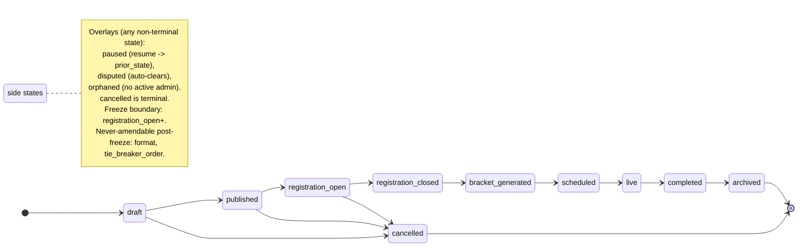
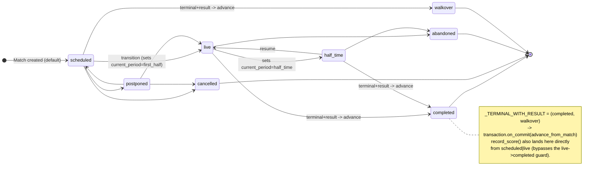

# State Machine Catalog — Match, Tournament, Dispute & Organization status

Exhaustive, code-verified reference for the state machines in the Fixture
Platform. **There are THREE fully-realized guarded+audited machines — Match
(§2), Dispute (§7), and Organization-lifecycle (§6) — plus the declared-but-
unrealized Tournament enum (§1).** Every claim cites `file:symbol` + line ranges
from the actual source as of this analysis. The PRD
(`docs/superpowers/specs/2026-04-30-fixture-platform-prd.md`) §5.2 / §5.5 is the
*canonical spec* for the **Tournament + Match** machines; the Dispute and Org
machines are product features outside §5.2/§5.5. Where the implemented code is a
subset of (or diverges from) the spec, this document flags it explicitly.

> Invariant #6 (CLAUDE.md): "State machines, not booleans. Tournament + Match
> status are enums with audit-logged transitions matching PRD §5.2/§5.5."
> **Reality check (corrected):** the invariant *names* Tournament + Match, but the
> codebase actually ships **three** realized SMs — **Match** (§2), **Dispute**
> (§7), and the **Organization lifecycle** (§6) — each a guarded, audited
> transition path that raises `ValidationError` on an illegal jump and emits audit
> inline. The one machine that is **NOT** realized is the *Tournament* one: it is
> an enum with a freeze gate but **no transition guard, no `ALLOWED_TRANSITIONS`,
> no transition endpoint** — see §1.3. The three real machines are near-identical
> in shape (see §8) → the obvious target for one shared guarded-transition seam.
> The `disputed`/`orphaned` PRD *tournament* states discussed in §1.3 are
> **distinct** from the implemented `Dispute.status` (§7) and `OrgStatus.orphaned`
> (§6) — do not conflate them.

---

## 0. Cross-reference: where the code lives

| Concern | File:symbol | Lines |
|---|---|---|
| Match status enum | `backend/apps/matches/models.py::MatchStatus` | 16-24 |
| Match `ALLOWED_TRANSITIONS` table | `backend/apps/matches/services/state.py::ALLOWED_TRANSITIONS` | 22-31 |
| Match transition guard `can_transition` | `backend/apps/matches/services/state.py::can_transition` | 36-37 |
| Match transition executor `transition_match` | `backend/apps/matches/services/state.py::transition_match` | 40-70 |
| Match terminal-with-result set | `backend/apps/matches/services/state.py::_TERMINAL_WITH_RESULT` | 33 |
| Advancement on_commit fire helper | `backend/apps/matches/services/state.py::_fire_advancement` | 73-80 |
| Direct-score path (own COMPLETED transition) | `backend/apps/matches/services/scoring.py::record_score` | 53-103 |
| Advancement resolver | `backend/apps/fixtures/services/advance.py::advance_from_match` | 16-46 |
| Winner/loser derivation | `backend/apps/matches/models.py::Match.winner_id / .loser_id` | 107-124 |
| Typed source pointers (fields) | `backend/apps/matches/models.py::Match.home_source / away_source` | 73-75 |
| Source pointers produced by generators | `backend/apps/fixtures/services/generate.py::generate_single_elimination` | 90-143 |
| Transition HTTP endpoint | `backend/apps/matches/views.py::TransitionMatchView` | 224-247 |
| Transition permission gate `_can_score` | `backend/apps/matches/views.py::_can_score` | 71-83 |
| Tournament status enum | `backend/apps/tournaments/models.py::TournamentStatus` | 24-33 |
| Tournament rule-freeze gate `can_edit_rules` | `backend/apps/tournaments/services/rules.py::can_edit_rules` | 61-63 |
| Tournament freeze stamp `freeze_rules` | `backend/apps/tournaments/services/rules.py::freeze_rules` | 66-70 |
| Tournament default status on create | `backend/apps/tournaments/services/create.py` | 71 |
| **Dispute** status enum | `backend/apps/disputes/models.py::DisputeStatus` | (see §7) |
| **Dispute** `ALLOWED_TRANSITIONS` table | `backend/apps/disputes/services/lifecycle.py::ALLOWED_TRANSITIONS` | 16-22 |
| **Dispute** transition executor `transition_dispute` | `backend/apps/disputes/services/lifecycle.py::transition_dispute` | 60-95 |
| **Organization** status enum | `backend/apps/organizations/models.py::OrgStatus` | (see §6) |
| **Organization** lifecycle verbs (per-verb guards) | `backend/apps/organizations/services/lifecycle.py` | 84-298 |
| **Organization** orphan-detect cron driver | `backend/apps/organizations/management/commands/mark_orphaned_orgs.py` | 13-18 |

---

# 1. Tournament status enum

## 1.1 The enum (implemented)

`backend/apps/tournaments/models.py::TournamentStatus` (lines 24-33) — a
`models.TextChoices` of **7 states**:

| Value (DB) | Label | Order in lifecycle |
|---|---|---|
| `draft` | Draft | 1 (default — `create.py:71`) |
| `published` | Published | 2 |
| `registration_open` | Registration open | 3 |
| `scheduled` | Scheduled | 4 |
| `live` | Live | 5 |
| `completed` | Completed | 6 |
| `archived` | Archived | 7 |

The field: `Tournament.status = CharField(max_length=24, choices=TournamentStatus.choices, default=TournamentStatus.DRAFT, db_index=True)` (`models.py:69-74`). New tournaments are created in `draft` by `create_tournament` (`backend/apps/tournaments/services/create.py:71`).

The model docstring (`models.py:6-8`) is explicit that this is "the v1 subset"
of the canonical PRD §5.2 set.

## 1.2 ALLOWED_TRANSITIONS — **does not exist for Tournament**

There is **no transition table, no guard function, and no transition executor**
for `TournamentStatus` anywhere in the backend. A repo-wide search for
`TournamentStatus` outside membership code returns only:

- the enum definition + field (`models.py:24, 71-72`),
- the freeze gate (`rules.py:14, 63`),
- the create default (`create.py:24, 71`).

There is **no `transition_tournament` function**, **no `ALLOWED_TRANSITIONS`
dict** in the tournaments app, and **no HTTP route** that mutates
`Tournament.status` (the only status PATCH endpoint, `TournamentSettingsView` at
`views.py:119-151`, edits `rules`/`constraints`, never `status`; the members
PATCH at `views.py:203-` edits `TournamentMembership.status`, a different field).

**Implication for the restructuring:** invariant #6 is only *half* satisfied. The
Tournament status is a typed enum but is never advanced by application code — it
stays `draft` for the entire lifetime of every tournament created through the
normal flow (the seed/demo command may set others directly). Any transition the
product needs (publish, open registration, go live, complete, archive) is
currently a no-op surface: the states exist as a vocabulary but the machine that
walks them has not been built. This is the single largest gap in the state-machine
layer.

### 1.2.1 The one place status is *read* as a gate

The only behavioral consumer of `TournamentStatus` is the **rule-freeze gate**
(`backend/apps/tournaments/services/rules.py`):

```python
def can_edit_rules(tournament) -> bool:                       # rules.py:61-63
    """Rules are editable only while the tournament is draft or published."""
    return tournament.status in {TournamentStatus.DRAFT, TournamentStatus.PUBLISHED}
```

- `update_settings` (`rules.py:73-124`) calls `can_edit_rules`; if it returns
  `False` and the caller did not pass `amend=True`, it raises
  `PermissionError("rules_frozen")` (lines 96-97), surfaced as HTTP **409**
  (`views.py:147-148`). An amend requires a non-blank `reason` (`rules.py:98-99`).
- `freeze_rules` (`rules.py:66-70`) stamps `Tournament.rules_frozen_at` once
  (idempotent). Its docstring says it is "called on transition to
  registration_open" — **but no such transition code exists** to call it. In the
  current tree `rules_frozen_at` is never set by application flow; the freeze is
  enforced purely by the status-set comparison in `can_edit_rules`, which can only
  ever return `True` because status never leaves `draft`.

This is invariant #7 (rule freeze at the boundary): the *intent* is encoded, but
because the status never advances past `published`, rules are in practice always
editable. Flag for the restructure.

## 1.3 Canonical PRD §5.2 (spec — NOT all implemented)

PRD §5.2 (`2026-04-30-fixture-platform-prd.md:285-327`) defines a richer machine.
Documented here because §5.2 is binding spec and the restructure should target it.
States/transitions in **bold** are *absent from the implemented `TournamentStatus`
enum*.

Canonical happy path (PRD line 287-290):

```
draft → published → registration_open → registration_closed
  → bracket_generated → scheduled → live → completed → archived
```

Canonical side states (PRD lines 292-296): `cancelled` (terminal), `paused`
(resume returns to prior state), `disputed` (overlay, auto-clears), `orphaned`
(org has no active admin).

| Canonical transition | Trigger (PRD) | Precondition (PRD) | In v1 enum? |
|---|---|---|---|
| `draft → published` | Admin "Publish" | Wizard complete + validation | both states ✅; transition ❌ not coded |
| `published → registration_open` | window start (auto) OR force-open | still `published` | both ✅; transition ❌ |
| **`registration_open → registration_closed`** | window end (auto) OR force-close | still `registration_open` | `registration_closed` **missing** |
| **`registration_closed → bracket_generated`** | admin/coordinator gen+lock | teams ≥ `min_teams_to_start` | both **missing** |
| **`bracket_generated → scheduled`** | lock schedule | zero hard conflicts | `bracket_generated` **missing** |
| `scheduled → live` | T-1h first match (auto) OR force | ≥1 match has scorer+referee | both ✅; transition ❌ |
| `live → completed` | all matches terminal | no `disputed` outstanding | both ✅; transition ❌ |
| `completed → archived` | after `archive_after_days` OR force | — | both ✅; transition ❌ |
| **`* → cancelled`** | admin, reason ≥20 chars | not already terminal | `cancelled` **missing** |
| **`* → paused`** | admin, reason | not terminal | `paused` **missing** |
| **`paused → prior_state`** | admin resume | — | **missing** |
| **`* → disputed` (overlay)** | any match disputed | — | `disputed` **missing** |
| **`* → orphaned`** | all admins removed | — | `orphaned` **missing** |

Gap summary: the v1 enum collapses `registration_closed`, `bracket_generated`
into adjacent states, and omits all four side states (`cancelled`, `paused`,
`disputed`, `orphaned`). None of the canonical transitions are executed in code.

> **Do NOT conflate these PRD *Tournament* side states with the real, implemented
> machines elsewhere.** The PRD `disputed` overlay above is a *tournament* status
> that does not exist; the platform's actual dispute handling is the fully-realized
> **`Dispute.status` machine** (a separate model — §7). Likewise the PRD `orphaned`
> *tournament* status does not exist, but **`OrgStatus.orphaned` is a real,
> implemented organization status** with a guarded transition and a cron driver
> (§6). A restructurer reading only §1.3 would wrongly believe "orphaned" and
> "disputed" are entirely unbuilt — they are unbuilt **for the Tournament enum**,
> but built (under different owning models) for orgs and disputes.

## 1.4 Tournament mermaid — implemented enum vs canonical spec

**Implemented enum (states only; no transition code wires them — dashed = intended-but-not-coded):**

```mermaid
stateDiagram-v2
    direction LR
    [*] --> draft : create_tournament (default)
    draft --> published : (intended; not coded)
    published --> registration_open : (intended; not coded)
    registration_open --> scheduled : (intended; not coded)
    scheduled --> live : (intended; not coded)
    live --> completed : (intended; not coded)
    completed --> archived : (intended; not coded)
    archived --> [*]

    note right of draft
        Only draft is ever set by app code.
        can_edit_rules() reads draft|published.
        No transition_tournament() exists.
    end note
```



**Canonical PRD §5.2 (target for restructure):**



---

# 2. Match status enum

This machine **is** fully implemented: a typed enum, an explicit
`ALLOWED_TRANSITIONS` table, a `can_transition` guard, a row-locked +
audited `transition_match` executor, and an `on_commit` advancement hook.

## 2.1 The enum

`backend/apps/matches/models.py::MatchStatus` (lines 16-24) — `TextChoices` of
**8 states**:

| Value (DB) | Label | Kind |
|---|---|---|
| `scheduled` | Scheduled | initial (default) |
| `live` | Live | active |
| `half_time` | Half time | active |
| `completed` | Completed | **terminal (with result)** |
| `cancelled` | Cancelled | terminal |
| `postponed` | Postponed | intermediate (re-enters lifecycle) |
| `abandoned` | Abandoned | terminal |
| `walkover` | Walkover | **terminal (with result)** |

The field: `Match.status = CharField(max_length=16, choices=MatchStatus.choices, default=MatchStatus.SCHEDULED, db_index=True)` (`models.py:77-80`). Default initial state is `scheduled`.

Two of the eight terminal states carry a *result* and therefore trigger
advancement: `_TERMINAL_WITH_RESULT = (S.COMPLETED, S.WALKOVER)` (`state.py:33`).

## 2.2 ALLOWED_TRANSITIONS (verbatim)

`backend/apps/matches/services/state.py:22-31`:

```python
ALLOWED_TRANSITIONS: dict[str, set[str]] = {
    S.SCHEDULED: {S.LIVE, S.CANCELLED, S.POSTPONED, S.WALKOVER},
    S.LIVE:      {S.HALF_TIME, S.COMPLETED, S.ABANDONED},
    S.HALF_TIME: {S.LIVE, S.COMPLETED, S.ABANDONED},
    S.POSTPONED: {S.SCHEDULED, S.LIVE, S.CANCELLED},
    S.COMPLETED: set(),   # terminal
    S.CANCELLED: set(),   # terminal
    S.ABANDONED: set(),   # terminal
    S.WALKOVER:  set(),   # terminal
}
```

`can_transition(frm, to)` (`state.py:36-37`) is simply
`to in ALLOWED_TRANSITIONS.get(frm, set())`. An unknown `frm` (not a key)
defaults to the empty set → every transition out of it is illegal.

### 2.2.1 Allowed transition matrix (rows = from, cols = to)

`A` = allowed; `—` = blocked. Columns: SCH=scheduled, LIV=live, HT=half_time,
CMP=completed, CXL=cancelled, PST=postponed, ABN=abandoned, WO=walkover.

| from \ to | SCH | LIV | HT | CMP | CXL | PST | ABN | WO |
|---|:--:|:--:|:--:|:--:|:--:|:--:|:--:|:--:|
| **scheduled** | — | A | — | — | A | A | — | A |
| **live** | — | — | A | A | — | — | A | — |
| **half_time** | — | A | — | A | — | — | A | — |
| **postponed** | A | A | — | — | A | — | — | — |
| **completed** (terminal) | — | — | — | — | — | — | — | — |
| **cancelled** (terminal) | — | — | — | — | — | — | — | — |
| **abandoned** (terminal) | — | — | — | — | — | — | — | — |
| **walkover** (terminal) | — | — | — | — | — | — | — | — |

### 2.2.2 Explicitly blocked / notable transitions

- **`scheduled → completed` is blocked** via `transition_match`. You must pass
  through `live` first. Verified by `test_state.py::test_illegal_transition_raises`
  (lines 49-52) and `test_can_transition_table` line 64. (The *direct-score path*
  `record_score` bypasses this — see §2.5.)
- **`scheduled → half_time / abandoned` blocked** (only `live`/`cancelled`/
  `postponed`/`walkover` allowed out of scheduled).
- **All four terminal states (`completed`, `cancelled`, `abandoned`, `walkover`)
  have empty out-sets** — no transition can leave them. Verified:
  `test_no_transition_out_of_terminal` (lines 55-59), `walkover → live` raises;
  `test_can_transition_table` line 65, `completed → live` is `False`.
- **`live → cancelled / postponed / walkover` blocked** — once a match is live it
  can only go to `half_time`, `completed`, or `abandoned`. (Cancellation/postpone/
  walkover are pre-kickoff or scheduled-stage actions.)
- **`half_time → postponed / cancelled / walkover / scheduled` blocked** — from
  half-time only `live` (resume), `completed`, or `abandoned`.
- **`postponed → half_time / completed / abandoned / walkover` blocked** — a
  postponed match re-enters via `scheduled` or `live`, or terminates as
  `cancelled`.
- **No self-loops** anywhere (no `X → X`); re-issuing the same status raises
  `ValidationError`.
- **Divergence from PRD §5.5:** the PRD allows `* → walkover`, `* → abandoned`,
  `* → cancelled`, `* → postponed` from *any* active state (PRD lines 419-422).
  The implementation is **stricter**: walkover only from `scheduled`; cancelled
  only from `scheduled`/`postponed`; abandoned only from `live`/`half_time`;
  postponed only from `scheduled`. The PRD's `disputed` overlay (line 423) and the
  fine-grained live sub-states (`lineup_pending`, `live_first_half`,
  `awaiting_referee_approval`, etc., PRD lines 393-417) are **not modeled** — the
  v1 enum collapses them into `live` / `half_time`.

## 2.3 transition_match — guard, mutation, audit, advancement

`backend/apps/matches/services/state.py::transition_match` (lines 40-70).
Signature: `transition_match(*, match, to_status, by=None, reason="", request=None) -> Match`.

Step-by-step (line-cited):

1. **Atomic + row lock (no TOCTOU).** Opens `transaction.atomic()` (line 41) and
   re-reads the row under `select_for_update()` (line 42) — `frm = locked.status`
   is the authoritative current state, immune to concurrent scorers.
2. **Guard.** `if not can_transition(frm, to_status): raise ValidationError(f"Illegal match transition: {frm} -> {to_status}")` (lines 44-45). This is the *only* legality check; the serializer (`TransitionSerializer`, see §2.6) does **not** validate `to_status` against the enum, so an unknown string falls through to here and is rejected as illegal.
3. **State mutation + period side-effects.** Sets `locked.status = to_status`
   (line 47). Period derivation (lines 48-51):
   - `to_status == LIVE` **and** `current_period` is empty → `current_period = "first_half"`.
   - `to_status == HALF_TIME` → `current_period = "half_time"`.
   - (No other status touches `current_period`; resuming `half_time → live`
     leaves `current_period` as-is because `current_period` is already set, so the
     `not locked.current_period` guard is false.)
   Persists with `save(update_fields=["status", "current_period", "updated_at"])`
   (line 52).
4. **Audit emission** (lines 54-65) — see §2.4.
5. **Advancement scheduling.** `if to_status in _TERMINAL_WITH_RESULT:` (line 67),
   captures `mid = locked.id` and registers
   `transaction.on_commit(lambda: _fire_advancement(mid))` (lines 68-69). Fires
   only for `completed` / `walkover`.
6. Returns the locked instance (line 70).

## 2.4 Audit emission (per transition)

Every successful `transition_match` emits exactly one audit row via
`apps.audit.services.emit_audit` (`state.py:54-65`):

| emit_audit kwarg | Value | Source line |
|---|---|---|
| `actor_user` | `by` (the user, may be `None`) | 55 |
| `actor_role` | `ActorRole.ADMIN` (hard-coded) | 56 |
| `event_type` | `"match_status_changed"` | 57 |
| `target_type` | `"match"` | 58 |
| `target_id` | `locked.id` | 59 |
| `organization_id` | `locked.organization_id` | 60 |
| `reason` | the `reason` arg (default `""`) | 61 |
| `payload_before` | `{"status": frm}` | 62 |
| `payload_after` | `{"status": to_status}` | 63 |
| `request` | the DRF request (for IP/UA capture) | 64 |

Note `actor_role` is always `ADMIN` regardless of whether the actor is a scorer/
referee — the role label is not derived from the actor's tournament membership.
This is a fidelity gap worth flagging for the restructure (the audit "who" is the
user, but the "as what role" is fixed).

The **direct-score path** emits a *different* event type, `"match_scored"`
(`scoring.py:88-97`), with `payload_before` `{home, away, status}` and
`idempotency_key=event_id`. So a normal "complete" can produce either
`match_status_changed` (via `transition_match`) or `match_scored` (via
`record_score`) depending on which API the client called.

## 2.5 Two paths into `completed` (important duplication)

There are **two** code paths that can put a match into `completed` and both
schedule advancement. The restructure must reconcile them.

| Path | Entry | Sets status to | Guard on source state | Advancement scheduling | Audit event |
|---|---|---|---|---|---|
| **State machine** | `transition_match` (`state.py:40`) | any allowed `to_status` | `ALLOWED_TRANSITIONS` (so `completed` only from `live`/`half_time`) | `on_commit(_fire_advancement)` if `to_status ∈ {completed, walkover}` (`state.py:67-69`) | `match_status_changed` |
| **Direct score** | `record_score` (`scoring.py:53`) | `completed` (hard-coded, `scoring.py:84`) | `status ∈ {scheduled, live}` (`scoring.py:73-75`); rejects `half_time`, terminal | `on_commit(_fire_advancement)` unconditionally (`scoring.py:99-102`) | `match_scored` |

Notable: `record_score` **allows `scheduled → completed` directly** (its guard
permits `scheduled`, `scoring.py:73`), which the *state machine* forbids. It also
**rejects scoring from `half_time`** (only `scheduled`/`live`), whereas the state
machine *does* allow `half_time → completed`. So the two paths have inconsistent
preconditions. `record_score` is idempotent on `event_id` (replays return the
match unchanged, `scoring.py:64-69`); `transition_match` is **not idempotent**
(re-issuing the same target raises because of no self-loop).

`record_score` never sets `status = walkover`; the only way into `walkover` is
`transition_match(..., to_status=WALKOVER)` from `scheduled`.

## 2.6 HTTP surface, permissions & guards

`backend/apps/matches/views.py::TransitionMatchView` (lines 224-247) —
`POST /api/matches/{id}/transition/` (route `match-transition`,
`matches/urls.py:27-29`).

Flow:
1. `_match_or_404(request.user, match_id)` (`views.py:231`, helper at 58-68) —
   resolves the match and enforces **multi-tenant scope**: 404 unless
   `accessible_tournaments(user)` contains the match's tournament (no existence
   leak). Soft-deleted matches (`deleted_at` set) 404.
2. **Permission gate** `_can_score(request.user, match)` (`views.py:232`, helper
   at 71-83): allowed if **any** of —
   - `can_manage_tournament(user, match.tournament)` — active tournament
     `admin`/`co_organizer`, OR active org `admin`/owner
     (`tournaments/permissions.py:11-36`); OR
   - `match.scorer_id == user.id` (the per-match assigned scorer); OR
   - an active `TournamentMembership` with role `MATCH_SCORER`
     (`views.py:78-83`).
   On failure → `PermissionDenied("not_allowed_to_transition")` (line 233).
   **Note:** the same `_can_score` gate covers *all* transitions — there is **no
   per-transition role differentiation** (PRD §5.5 wanted "Admin with reason" for
   cancel vs "Scorer/Coordinator" for walkover; the code does not distinguish).
   `referee` and `game_coordinator` roles do **not** pass `_can_score` unless they
   are also the assigned scorer or a manager.
3. `TransitionSerializer` (`serializers.py:56-58`) validates the body:
   `to_status` (free `CharField(max_length=16)`, **not** constrained to the enum)
   + optional `reason`. Invalid enum values are caught downstream by
   `can_transition` → `ValidationError` → DRF 400 (`views.py:244-245`).
4. Calls `transition_match(...)`; `ValidationError` (illegal transition) →
   `DRFValidationError({"detail": ...})` → HTTP 400 (lines 244-245).
5. On success refreshes and returns `MatchSerializer(match).data` (200).

## 2.7 Match mermaid (implemented)



---

# 3. The on_commit advancement hook

## 3.1 Fire mechanism

`_fire_advancement(match_id)` (`state.py:73-80`) is the post-commit callback.
It lazily imports and calls `advance_from_match(match_id)` inside a broad
`try/except` that logs (`logger.exception`) but **never re-raises** (lines 79-80)
— a post-commit hook must not crash the originating request. Registered via
`transaction.on_commit(lambda: _fire_advancement(mid))` from **two** sites:

- `state.py:68-69` — when a transition lands in `completed` or `walkover`.
- `scoring.py:99-102` — at the end of `record_score` (always, since it always
  lands in `completed`).

Because it runs `on_commit`, it executes *after* the DB transaction commits — so
inside a single test transaction it won't fire automatically (tests call
`advance_from_match` manually; see `test_advance.py:52, 57`).

## 3.2 advance_from_match — typed-pointer resolution

`backend/apps/fixtures/services/advance.py::advance_from_match` (lines 16-46).
Signature: `advance_from_match(match_id) -> list[Match]` (returns the dependents
it updated).

Algorithm:
1. Load the just-finished match: `Match.objects.filter(id=match_id, deleted_at__isnull=True).first()` (line 18). `None` → return `[]` (lines 19-20).
2. Read `winner_id` / `loser_id` (lines 21-22) — *derived properties*, not stored
   (see §3.3). If `winner_id is None` (a draw, or not yet final) → return `[]`
   (lines 23-24): **a drawn knockout match resolves nothing**, leaving dependents
   unfilled.
3. Iterate **all** non-deleted matches in the same tournament
   (`tournament_id=m.tournament_id`, line 28), skipping self (lines 30-31).
4. For each dependent, examine **both** sides `("home", "away")` (line 33):
   - `src = getattr(dep, f"{side}_source") or {}` (line 34).
   - If `src.get("match_id") != mid` (string compare; `mid = str(m.id)`, line 26)
     → skip (lines 35-36).
   - If `src["type"] == "winner_of"` → set `{side}_team_id = winner_id` (lines 37-39).
   - elif `src["type"] == "loser_of"` → set `{side}_team_id = loser_id` (lines 40-42).
5. If any side changed, `dep.save(update_fields=["home_team", "away_team", "updated_at"])` (lines 43-44) and append to the result list.

It does **not** itself trigger a status change on the dependent, and does **not**
recursively cascade (it resolves only one level — the matches that directly point
at *this* match). A chain (semi → final) advances correctly only because each
match firing its own completion triggers its own `advance_from_match`.

## 3.3 winner_id / loser_id derivation

`backend/apps/matches/models.py` (lines 107-124), both `@property`:

- `winner_id` (107-117): returns `None` unless `status ∈ {COMPLETED, WALKOVER}`
  (lines 108-109) **and** both scores are non-null (lines 110-111). Then the
  higher score's team id; **equal scores → `None`** (a draw resolves no winner,
  line 117).
- `loser_id` (119-124): `None` if `winner_id` is `None`; else the other team's id.

Consequence: `walkover` only advances if the walkover row also has `home_score`/
`away_score` set (e.g. an awarded 3-0). `transition_match(... WALKOVER)` does
**not** set scores — so a bare walkover via the state machine leaves
`winner_id == None` and advances nothing. (PRD §5.5 line 420 and §5.20 line 488
want walkover to apply a default `walkover_score` of 3-0; that auto-score logic is
**not implemented** — flag for restructure.)

## 3.4 Source pointer type taxonomy — claimed vs implemented

`Match.home_source` / `Match.away_source` are `JSONField(default=dict)` (`models.py:73-75`). The model comment (line 73) and CLAUDE.md list **five** pointer types: `winner_of`, `loser_of`, `group_position`, `team`, `tbd`. Reality:

| Pointer `type` | Shape | **Produced by** | **Resolved by `advance_from_match`** |
|---|---|---|---|
| `team` | `{"type":"team","team_id":"<uuid>"}` | `generate_single_elimination` R1 (`generate.py:115-116`) | n/a — concrete team, never needs resolution |
| `winner_of` | `{"type":"winner_of","match_id":"<uuid>"}` | `generate_single_elimination` R2+ (`generate.py:133-134`) | **yes** (`advance.py:37-39`) |
| `loser_of` | `{"type":"loser_of","match_id":"<uuid>"}` | **nothing** (no generator emits it) | yes (`advance.py:40-42`) — dead branch in practice |
| `group_position` | (per CLAUDE.md/comment) | **nothing** | **no** — not handled in `advance.py` |
| `tbd` | (per CLAUDE.md/comment) | **nothing** | **no** — not handled |

Verified by grep across `backend/apps/**/*.py`: `group_position` and `tbd` appear
**only** in the `models.py:73` comment and CLAUDE.md — never in any generator or
resolver. `loser_of` appears only in `advance.py` (the resolver branch + its
docstring) — no generator produces it, so the `loser_of` branch is currently
unreachable through the normal flow (third-place playoffs etc. are not generated).

The groups→knockout path (`generate_knockout_from_groups`, `generate.py:146-189`)
does **not** use `group_position` pointers; it eagerly computes standings via
`compute_standings`, picks the top-N concrete `Team` rows, cross-seeds, and hands
**concrete teams** to `generate_single_elimination` (lines 173-189). So the
knockout-from-groups bracket has `type:"team"` round-1 sources, not
`group_position` — confirmed by `test_advance.py::test_knockout_from_groups_advances_top_two`
(lines 62-86, asserting R1 has concrete `home_team_id`/`away_team_id`).

## 3.5 Advancement mermaid (sequence)

```mermaid
sequenceDiagram
    participant C as Scorer (HTTP)
    participant V as TransitionMatchView / RecordScoreView
    participant S as transition_match / record_score
    participant DB as Postgres
    participant H as _fire_advancement (on_commit)
    participant A as advance_from_match

    C->>V: POST .../transition (to=completed) | .../score
    V->>V: _match_or_404 + _can_score
    V->>S: call (atomic, select_for_update)
    S->>DB: UPDATE match.status = completed/walkover
    S->>DB: INSERT AuditEvent (match_status_changed | match_scored)
    S->>DB: register on_commit(_fire_advancement(mid))
    DB-->>S: COMMIT
    DB->>H: post-commit callback
    H->>A: advance_from_match(mid)
    A->>DB: winner_id/loser_id (derived)
    A->>DB: for deps where {home,away}_source.match_id == mid:\n       set team_id = winner/loser
    A->>DB: UPDATE dependent matches (home_team, away_team)
    Note over H,A: try/except swallows + logs;\nnever crashes the request.\nDraw (winner_id=None) -> no-op.
```

---

# 4. Test coverage (state-machine suite)

| Test | File:line | Asserts |
|---|---|---|
| `test_legal_transitions` | `matches/tests/test_state.py:37-46` | `scheduled→live` sets `current_period=first_half`; `live→completed` |
| `test_illegal_transition_raises` | `test_state.py:49-52` | `scheduled→completed` raises (must go via live) |
| `test_no_transition_out_of_terminal` | `test_state.py:55-59` | `scheduled→walkover` ok; `walkover→live` raises |
| `test_can_transition_table` | `test_state.py:62-65` | `scheduled→live` True; `scheduled→completed` False; `completed→live` False |
| `test_single_elim_..._winner_pointers` | `fixtures/tests/test_advance.py:35-42` | 4 teams → 3 matches; final has `winner_of` sources; final teams null until semis done |
| `test_scoring_semis_advances_winners_into_final` | `test_advance.py:45-59` | `record_score` + manual `advance_from_match` fills final's home/away with semi winners |
| `test_knockout_from_groups_advances_top_two` | `test_advance.py:62-86` | groups→KO yields 3 KO matches, R1 concrete teams |
| `test_single_elim_requires_power_of_two` | `test_advance.py:89-97` | 3 teams → `ValueError` |

The suite does **not** exhaustively cover *every* blocked cell of the §2.2.1
matrix (e.g. `live→walkover`, `half_time→postponed`, `postponed→completed` are
not individually asserted), nor any Tournament-status transition (there is none to
test). CLAUDE.md §"Tests-first" mandates "every transition + every blocked
transition" — the Match suite is partial against that bar; the Tournament suite is
absent.

---

# 5. Restructure call-outs (precise gaps)

1. **Tournament has no machine.** Enum + freeze-gate read exist; no
   `ALLOWED_TRANSITIONS`, no `transition_tournament`, no endpoint. Status never
   leaves `draft` via app code. (§1.2)
2. **Freeze is effectively never armed.** `can_edit_rules` only returns `False`
   past `published`, and status never advances → rules are always editable;
   `freeze_rules` is never called. (§1.2.1, §3.3)
3. **v1 Tournament enum is missing 6 canonical states** (`registration_closed`,
   `bracket_generated`, `cancelled`, `paused`, `disputed`, `orphaned`). (§1.3)
4. **Two divergent paths to `completed`** (`transition_match` vs `record_score`)
   with inconsistent preconditions (`scheduled→completed` allowed by score path,
   forbidden by machine; `half_time→completed` allowed by machine, forbidden by
   score path) and different audit event types. (§2.5)
5. **No per-transition role gating** for matches — one `_can_score` gate for all;
   PRD §5.5 wanted admin-only cancel, scorer/coordinator walkover, etc. `referee`/
   `game_coordinator` roles can't transition unless also scorer/manager. (§2.6)
6. **`actor_role` hard-coded to ADMIN** in transition audit regardless of actor.
   (§2.4)
7. **Walkover advances nothing** unless scores are also set; no auto
   `walkover_score`. (§3.3)
8. **Pointer taxonomy half-built:** only `team` + `winner_of` are produced;
   `loser_of` is a dead resolver branch; `group_position` and `tbd` are
   documented but unimplemented (no third-place playoff, no lazy group seeding).
   (§3.4)
9. **Match enum collapses PRD live sub-states** (`lineup_*`, `live_first_half`,
   `awaiting_referee_approval`, ET/penalties) into `live`/`half_time`; no
   `disputed` overlay. (§2.2.2)
10. **`transition_match` not idempotent** (no self-loop, re-issue raises), unlike
    `record_score` which is idempotent on `event_id`. (§2.5)
11. **The catalog is incomplete on its own terms.** This document long covered only
    the Match + Tournament enums and never cataloged the **two other realized
    machines** — Dispute (§7) and Organization (§6) — nor proposed the obvious
    shared seam (§8). Corrected below.

---

# 6. Organization lifecycle state machine (REALIZED)

A fully-realized, guarded + audited state machine over `OrgStatus`, encoded as
**one guarded verb per transition** (rather than a single `ALLOWED_TRANSITIONS`
table). It is **driven in production** by a cron-style management command — there
is no Celery in 1A, so periodic jobs are `manage.py` commands.

## 6.1 The enum

`backend/apps/organizations/models.py::OrgStatus` (lines 36-43) — a
`models.TextChoices`:

| Value (DB) | Label |
|---|---|
| `pending_review` | Pending review (default — `models.py:123`) |
| `active` | Active |
| `suspended` | Suspended |
| `archived` | Archived |
| `orphaned` | Orphaned |

Field: `Organization.status = CharField(max_length=…, choices=OrgStatus.choices,
default=OrgStatus.PENDING_REVIEW, db_index=True)` (`models.py:120-123`), indexed by
`org_status_idx` (`models.py:154`). Two creation paths set the *initial* state:
`create_organization` defaults to `pending_review` (`lifecycle.py:38`), while
`provision_personal_workspace` creates an org directly **ACTIVE** with no
super-admin approval (`workspace.py:80-88`) — the self-serve workspace primitive.

## 6.2 Transitions (per-verb guards, `services/lifecycle.py`)

Each verb wraps the change in `transaction.atomic()`, asserts the source status,
raises `ValidationError` on an illegal source, mutates, and emits audit inline.

| Verb | File:lines | From → To | Guard / extra precondition | Audit `event_type` | Actor role |
|---|---|---|---|---|---|
| `create_organization` | `lifecycle.py:32-76` | (∅) → `pending_review` (or arg) | non-empty name; `validate_slug` | `org_created` | `SUPER_ADMIN` |
| `approve_org` | `lifecycle.py:84-109` | `pending_review` → `active` | `status == pending_review` else `ValidationError` | `org_approved` | `SUPER_ADMIN` |
| `reject_org` | `lifecycle.py:112-144` | `pending_review` → `archived` | `status == pending_review`; reason ≥8 chars; stamps `archived_at` | `org_rejected` | `SUPER_ADMIN` |
| `suspend_org` | `lifecycle.py:152-187` | `{active, pending_review, orphaned}` → `suspended` | already-`suspended` is a **no-op return** (idempotent); reason ≥3 chars; stamps `suspended_at`/`suspended_reason` | `org_suspended` | `SUPER_ADMIN` |
| `unsuspend_org` | `lifecycle.py:190-219` | `suspended` → `active` | `status == suspended` else `ValidationError`; clears `suspended_at`/`suspended_reason` | `org_unsuspended` | `SUPER_ADMIN` |
| `archive_org` | `lifecycle.py:227-257` | `*` → `archived` | already-`archived` no-op; reason ≥3 chars; stamps `archived_at` | `org_deleted` | `ADMIN` |
| `detect_orphaned` | `lifecycle.py:265-298` | `active` → `orphaned` (bulk) | per-org: no active `ADMIN` membership; iterates `active` orgs | `org_orphaned` | `SYSTEM` (actor `None`) |

Notes:
- The guards are **asymmetric / verb-local**, not a symmetric `ALLOWED_TRANSITIONS`
  matrix — `archive_org`/`suspend_org` accept multiple sources; `approve_org`/
  `unsuspend_org` pin a single source. This is a real but *differently-shaped*
  machine vs Match/Dispute, and a prime candidate to normalize onto a shared table
  (§8).
- `suspend_org` and `archive_org` are **idempotent** on the target state (early
  return); the single-source verbs are not.
- `detect_orphaned()` is the only transition with a `SYSTEM` actor and no `request`;
  it is **the production driver**.

## 6.3 The production driver (cron command)

`backend/apps/organizations/management/commands/mark_orphaned_orgs.py` (lines
13-18) calls `detect_orphaned()` and prints the flip count. Its docstring states it
is meant to be run periodically (cron / systemd timer) because "there's no Celery
in 1A", and that re-runs on already-orphaned orgs are no-ops. This command is the
de-facto background-job mechanism this state machine relies on — see the management-
command catalog in DEEP-DIVE §3 and BLUEPRINT S18/WS8.

## 6.4 Restructure call-outs (org SM)

1. **Normalize onto the shared seam (§8).** The per-verb guard style differs from
   the `ALLOWED_TRANSITIONS` dict style of Match/Dispute; a generic helper would
   express these as one table (`{pending_review: {active, archived}, active:
   {suspended, archived, orphaned}, suspended: {active, archived}, orphaned:
   {suspended, archived}, …}`).
2. **`archive_org` accepts `*` as source** — no explicit terminal guard means an
   already-`archived` org returns early but other terminal semantics aren't
   enforced by a table; a shared SM would make terminality explicit.
3. **Two initial-state entry points** (`pending_review` vs direct-`active` via
   `provision_personal_workspace`) must both be preserved by any refactor.

---

# 7. Dispute lifecycle state machine (REALIZED)

A fully-realized, guarded + audited machine over `DisputeStatus`, using a
**standalone `ALLOWED_TRANSITIONS` dict identical in shape to the Match machine**
(and to what BLUEPRINT S5 proposes for tournaments) — making it the **cleanest
template** for the missing Tournament SM.

## 7.1 The enum

`backend/apps/disputes/models.py::DisputeStatus` (lines 16-21):

| Value (DB) | Label |
|---|---|
| `open` | Open (default — `models.py:43`) |
| `under_review` | Under review |
| `resolved` | Resolved (upheld) |
| `rejected` | Rejected |
| `withdrawn` | Withdrawn |

Field: `Dispute.status = CharField(max_length=16, choices=DisputeStatus.choices,
default=DisputeStatus.OPEN, …)` (`models.py:43`).

## 7.2 `ALLOWED_TRANSITIONS` (verbatim, `lifecycle.py:16-22`)

```python
ALLOWED_TRANSITIONS: dict[str, set[str]] = {
    S.OPEN: {S.UNDER_REVIEW, S.RESOLVED, S.REJECTED, S.WITHDRAWN},
    S.UNDER_REVIEW: {S.RESOLVED, S.REJECTED},
    S.RESOLVED: set(),   # terminal
    S.REJECTED: set(),   # terminal
    S.WITHDRAWN: set(),  # terminal
}
```

## 7.3 `transition_dispute` (`lifecycle.py:60-95`)

- Locks the row: `Dispute.objects.select_for_update().get(pk=…)`.
- Guards: `to_status not in ALLOWED_TRANSITIONS.get(frm, set())` → `ValidationError`
  ("Illegal dispute transition: …").
- **Extra precondition:** transitioning to `resolved`/`rejected` requires a
  resolution note ≥5 chars (`lifecycle.py:68-69`).
- Stamps `reviewed_by`/`reviewed_at` on `under_review`/`resolved`/`rejected`.
- Emits audit `dispute_status_changed` inline (`payload_before`/`payload_after`
  carry `status`), actor role hard-coded `ADMIN`.
- Fires a `dispute_resolved` notification (no `event_id` → not idempotent) on
  `resolved`/`rejected` to the raiser, on the same transaction.

`raise_dispute` (`lifecycle.py:25-57`) is the entry that creates a dispute in
`open`, idempotent on `event_id` (returns the prior row), audited
(`dispute_raised`), and notifies the tournament creator.

## 7.4 Restructure call-outs (dispute SM)

1. **Use this as the Tournament-SM template, not "mirror matches."** Its standalone
   `ALLOWED_TRANSITIONS` dict + locked `transition_*` + ≥N-char-reason gate is
   exactly the shape BLUEPRINT S5 wants.
2. **`actor_role` hard-coded ADMIN** regardless of the real actor (same smell as
   Match §2.4).
3. **Notifications carry no `event_id`** → double-fire on re-delivery (DEEP-DIVE §6
   LOW).

---

# 8. The consolidation opportunity — one generic guarded-transition seam

There are **three** realized guarded+audited transition implementations, all the
same shape (lock the row → check the source against an allow-set → mutate → inline
`emit_audit` in the same txn), differing only in incidentals:

| Machine | Allow-set style | Lock | Extra gate | Audit `event_type` | Driver |
|---|---|---|---|---|---|
| Match (§2) | `ALLOWED_TRANSITIONS` dict | `select_for_update` | period stamping; on_commit advancement | `match_status_changed` | HTTP `TransitionMatchView` |
| Dispute (§7) | `ALLOWED_TRANSITIONS` dict | `select_for_update` | ≥5-char resolution; reviewer stamps | `dispute_status_changed` | HTTP transition views |
| Organization (§6) | per-verb source guards (no table) | `transaction.atomic` only (no row lock) | reason-length; timestamp stamps; idempotent no-ops | `org_{approved,rejected,suspended,…}` | `mark_orphaned_orgs` **cron** + sadmin verbs |

A restructurer who reads only the old version of this catalog (or DEEP-DIVE's
"the only realized state machine" line) would believe they are **inventing** the
state-machine pattern for the Tournament SM. They are not — they are adding the
**fourth** instance and have an obvious opportunity to extract a single
`guarded_transition(*, entity, to_status, allowed, on_apply, audit_event, …)`
helper that all four collapse onto:

- Normalize the org machine's per-verb guards into one `ALLOWED_TRANSITIONS` table.
- Add `select_for_update` to the org machine (it currently locks only via
  `atomic`, not a row lock) for parity.
- Preserve each machine's exact `event_type` strings and per-machine extra gates
  (period stamping, resolution length, reason length) as injected callbacks.

This is BLUEPRINT **S5** (generic state-machine seam) / **WS4**. Building the
Tournament SM is then "model on the Dispute dict + register with the shared
helper", not green-field invention.
