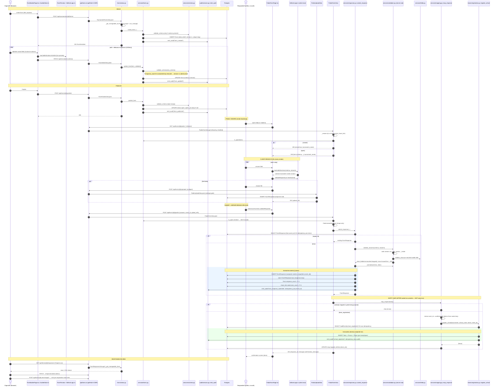

# Deep flow — Forms engine (build → publish → public wizard → branch eval client+server → submit → validate → entity-map → responses)

> Scope: the data-driven (FET-style) registration-form subsystem. One JSONB schema
> (`Form.schema`) is authored in a Zustand builder, validated + persisted via the
> builder API, published, served unauthenticated, rendered as a paged wizard whose
> branching is computed by `frontend/src/lib/formLogic.ts`, then **re-walked by an
> intentionally-mirrored** server traversal in `apps/forms/services/validation.py`
> on submit, stored as a `FormResponse`, and — for `team_registration` forms —
> mapped into `Team`/`Player`/`Person` by reusing `apps/teams` `register_school`.
>
> Every claim below is cited to `file::symbol` + line range and was verified
> against source (not the breadth-pass notes). Cross-file invariants: CLAUDE.md
> §"Architectural invariants" #1 (uuid7 PK), #2 (org scope), #3 (idempotent
> writes), #7 (rule/schema freeze at boundary).

---

## Participants (concrete modules/files)

| Alias | Concrete module |
|---|---|
| Builder UI | `frontend/src/features/forms/FormBuilderPage.tsx`, `builderStore.ts` (Zustand), `FormPreview.tsx` |
| FormLogic (client eval) | `frontend/src/lib/formLogic.ts` |
| Public UI | `frontend/src/features/forms/PublicFormPage.tsx`, `fieldRenderers.tsx` |
| API client | `frontend/src/api/forms.ts` → `frontend/src/api/client.ts` (`apiFetch`) |
| Builder API | `apps/forms/views.py` (`TournamentFormsView`, `FormDetailView`, `FormPublishView`, `FormCloseView`, `FormDuplicateView`, `FieldTypesView`) |
| Public API | `apps/forms/views.py` (`PublicFormView`, `PublicUploadView`) |
| Responses API | `apps/forms/views.py` (`FormResponsesView`, `FormResponseDetailView`, `FormSendStage2View`) |
| Serializers | `apps/forms/serializers.py` (`FormSerializer`/`FormSchemaField`, `FormCreateSerializer`, `PublicSubmitSerializer`, `FormResponseSerializer`) |
| Lifecycle svc | `apps/forms/services/forms.py` (`create_form`/`update_form`/`publish_form`/`close_form`/`duplicate_form`/`is_open`) |
| Schema validator | `apps/forms/services/schema.py` (`validate_schema`) |
| Answer validator (server eval) | `apps/forms/services/validation.py` (`validate_answers`/`_visible`/`_next_section`/`promote`) |
| Field registry | `apps/forms/services/fields.py` (`_HANDLERS`/`validate_value`) |
| Submit svc | `apps/forms/services/responses.py` (`submit_response`) |
| Mapping svc | `apps/forms/services/mapping.py` (`map_response`/`_map_team_registration`) |
| Links svc | `apps/forms/services/links.py` (`create_share_link`/`resolve_share_link`) |
| Teams svc | `apps/teams/services/registration.py` (`register_school`) |
| Audit | `apps/audit/services.py` (`emit_audit`) |
| Scope/perm | `apps/tournaments/scope.py` (`accessible_tournaments`), `apps/tournaments/permissions.py` (`can_manage_tournament`) |
| Models | `apps/forms/models.py` (`Form`, `FormShareLink`, `FormResponse`, `FormFileUpload`) |

URL mounts: builder/public/responses routes are `apps/forms/urls.py` mounted at
`/api/forms/` (`fixture/urls.py:66`); the **create/list** endpoint is
`apps/tournaments/urls.py:62-66` → `TournamentFormsView` at
`/api/tournaments/{id}/forms/`. SPA public routes are `/f/:formId` and `/r/:token`
(`frontend/src/App.tsx:133-134`), both → `PublicFormPage`; builder is
`/tournaments/:id/forms/:formId/edit` (`App.tsx:177`).

---

## Sequence diagram

---

## Ordered walkthrough (file::function + line ranges)

### A. Build (client)

1. **Working schema lives in Zustand.** `builderStore.ts::useBuilderStore`
   (lines 85-181) holds a single `schema: FormSchema`. `defaultSchema()`
   (44-49) seeds one section. Mutators `addSection`/`removeSection`/
   `updateSection`/`addField`/`updateField`/`removeField`/`reorderFields`
   (98-176) immutably edit `schema.sections[].fields[]` via `mapSection`
   (74-83). `newField` (36-42) seeds `CHOICE_TYPES` with one default option;
   `uid()` (5-6) mints client-local keys (`f_…`/`s_…`) used as the durable
   `key`/section `key` (these become the persisted schema keys, so the
   uniqueness invariant the validator enforces is satisfied by construction).

2. **Live correctness via the SAME evaluator.** `FormPreview.tsx`
   (`FormPreview`, 16-81) holds its own `answers` and renders only
   `reachableSections(schema, answers)` + `isVisible` from
   `lib/formLogic.ts` — i.e. the exact functions the public renderer (step 12)
   uses, so branching shown in preview == public == server.

3. **Hydration.** `FormBuilderPage.tsx` (145-363) queries the form
   (`useQuery ["form", formId]` → `formsApi.get`, 155-158) and, once, calls
   `useBuilderStore.load(query.data.schema)` (160-166) guarded by a
   `loadedId` ref so re-renders don't clobber edits.

4. **Debounce-autosave (1200 ms).** `FormBuilderPage.tsx:186-196`: a
   `dirtyRef` skips the first effect run (hydration), then every `schema`
   change schedules `saveSchema.mutate()` after 1200 ms; the timeout is
   cleared on each keystroke. `saveSchema` (169-184) = `formsApi.update(formId,
   { schema })` → `PATCH /api/forms/{id}/`. Errors surface as a toast
   (`onError`, 175-183). Manual **Save** button (282-287) calls the same
   mutation. A separate `SettingsPanel` (43-137) PATCHes title/closes_at/
   confirmation independently.

### B. Persist + schema validation (server)

5. **Create.** `views.py::TournamentFormsView.post` (81-91) →
   `_get_manageable_tournament` (49-55: scope via
   `accessible_tournaments(user).filter(id=…).exists()` ⇒ **404 no-leak**, then
   `can_manage_tournament` ⇒ 403) → `FormCreateSerializer`
   (`serializers.py:39-45`; default purpose `organization_registration`) →
   `forms.py::create_form` (40-52). `create_form` defaults
   `{version:1, sections:[]}`, runs `validate_schema` **only if** sections are
   present (42-43), mints a unique slug (`_unique_slug`, 31-37: `_slugify` then
   `-2/-3…` collision suffix, scoped to `tournament`+`deleted_at__isnull`),
   inserts the `Form`, and `emit_audit("form_created")` (49-51).

6. **Update / partial PATCH.** `views.py::FormDetailView.patch` (102-107) →
   `_get_manageable_form` (58-65, same 404/403 gate keyed on
   `f.tournament_id`) → `FormSerializer(partial=True)` → `forms.py::update_form`
   (70-95). `update_form`:
   - If `schema` present & non-null: `validate_schema(new_schema)` (76).
   - **Destructive-change version bump (invariant #7/#10):** if
     `form.response_count > 0` and an answered key disappeared
     (`_answered_keys(form) - _schema_field_keys(new_schema)`, 77-82), then
     `form.version += 1`. `_answered_keys` (55-59) scans all responses' answer
     keys; `_schema_field_keys` (62-67) scans schema field keys (top-level
     only — note: it does NOT descend into `group` children, unlike
     `schema._collect_fields`).
   - Copies whitelisted scalar fields (`title`, `description`,
     `confirmation_message`, `closes_at`, `opens_at`, `max_responses`,
     `settings`; 85-89).
   - `form.save(update_fields=…)` then `emit_audit("form_updated", changed)`
     (90-94).

7. **Two-layer schema validation.** Both the serializer **and** the service
   validate:
   - `serializers.py::FormSchemaField.to_internal_value` (15-22) runs
     `validate_schema` on any non-empty schema at the API boundary → 400 on
     `SchemaError` (so malformed JSON never reaches the service as a 500). Used
     by `FormSerializer.schema` (26) and `FormCreateSerializer.schema` (45).
   - `services/schema.py::validate_schema` (67-93) re-validates (defence in
     depth; also the path `create_form`/`publish_form` take directly): schema
     is an object with ≥1 section; section keys unique + non-empty (75-78);
     `_collect_fields` (18-36) builds a key→field map across sections **and**
     `group` children, raising on missing/duplicate keys; per field
     `_check_field` (39-54: known `type` in `FIELD_TYPES`, required `label`,
     `role` ∈ `PROMOTED_ROLES`, `options` with `value`+`label` for
     `CHOICE_TYPES`); `_check_visibility` (56-65: rule has `field`+`op`,
     `field` exists, `op` ∈ `VISIBILITY_OPS`) for both section and field
     visibility; and **target existence** for `section.next` (84-86) and
     `option.goto` (90-93) — each must be a real section key or the sentinel
     `_end`. **This is the contract `validate_answers` trusts: keys are unique,
     all goto/next/visibility targets exist.**

### C. Publish

8. **`POST /api/forms/{id}:publish/`** → `views.py::FormPublishView.post`
   (121-127) → `forms.py::publish_form` (98-109): rejects empty forms
   (`FormEditError` → caught at view 125-126 → 400), re-runs `validate_schema`,
   sets `status=OPEN`, sets `opens_at=now()` **only if currently null** (so a
   pre-scheduled open time is honoured), `save(update_fields=[status,opens_at,
   updated_at])`, `emit_audit("form_published")`. `close_form` (112-118) is the
   inverse (`status=CLOSED`). `duplicate_form` (121-128) clones schema/settings
   into a fresh draft (new unique slug, no responses). Frontend wires these via
   `formsApi.publish/close/duplicate` (`api/forms.ts:47-52`); the Publish/Close
   button toggles on `status` (`FormBuilderPage.tsx:302-317`).

### D. Public GET (render bootstrap)

9. **`GET /api/forms/{id}/public/` or `/api/forms/r/{token}/`** →
   `views.py::PublicFormView.get` (203-207). Class is `AllowAny` + throttled
   (`PublicFormThrottle`, 187-188). `_resolve` (190-201):
   - token path → `links.py::resolve_share_link` (42-64): hashes the plaintext
     (sha256, 18-19), filters `is_active` + `form.deleted_at__isnull`, then
     rejects expired (`expires_at ≤ now`) or over-cap
     (`submission_count ≥ max_submissions`) links → `None` ⇒ 404 `invalid_link`.
   - id path → `Form.objects.filter(id, deleted_at__isnull).select_related
     ("tournament")` ⇒ 404 `form_not_found` if missing.
   - `is_open` gate (`forms.py:131-139`): `status==OPEN` AND (`opens_at` null or
     past) AND (`closes_at` null or future). Closed → `{closed:true,
     tournament_name}`; open → `_public_payload` (166-176: `{form:{id,title,
     description,schema,confirmation_message}, tournament_name}`). **Note: the
     public payload ships the full `schema` to the client — branching is not
     hidden; security is enforced server-side at submit (step 16).**

   Frontend: `PublicFormPage.tsx:43-50` `useQuery` → `formsApi.publicGet` /
   `publicGetByToken` (`api/forms.ts:69-70,97-98`); `retry:false`. Terminal
   states: error → "could not be found" (162-178); `closed` → "Registration
   closed" (180-196); `done` → confirmation screen (198-218); loading (220-230).

### E. Render as paged wizard + client branch eval

10. **State.** `PublicFormPage.tsx:52-57`: `answers`, `uploadRefs`,
    `stepIndex`, `errors`, a **stable** `eventId = useState(newEventId)` (fixed
    across re-renders/retries for idempotency — `lib/eventId.ts::newEventId`
    uses `crypto.randomUUID()` with a fallback), and `done`.

11. **Reachable path recomputed every render.** `sections = useMemo(() =>
    reachableSections(schema, answers), [schema, answers])` (68-71); `clamped`
    clamps `stepIndex` to the live path length (72), so choosing a branching
    option immediately re-routes the wizard. Per-field within a section is
    filtered by `isVisible` (232-234). Widgets come from
    `fieldRenderers.tsx::FieldRenderer` (276-285).

12. **Client traversal — `lib/formLogic.ts`** (the client half of the parity
    contract; the file header 1-14 states it MUST mirror `validation.py`):
    - `isVisible(rule, answers)` (35-60): the 7 ops `answered`/`equals`/
      `not_equals`/`in`/`includes`/`gt`/`lt`. `isEmpty` (21-33) mirrors
      backend `raw in (None,"",[],{})`.
    - `nextSectionKey(section, answers)` (68-82): first `single_choice`/
      `dropdown` field whose chosen option (compared by `String(o.value) ===
      String(chosen)`) has a `goto` → that goto; else `section.next`.
    - `reachableSections(schema, answers)` (89-107): walk from
      `sections[0].key`; stop at `_end` or a cycle (`seen` set, 97); push
      section if `isVisible(sec.visibility)`; advance to `nextSectionKey(sec)`
      **else** next section in document order (104). Returns ordered list.
    - `validateRequired(schema, answers)` (128-142): over reachable+visible
      non-display fields, flag `required && isEmpty` → `{key:"required"}`.

13. **Navigation.** `onNext` (133-136) runs `validateCurrent` (122-131:
    `validateRequired` filtered to the current section's fields) before
    advancing; `onBack` (138-141) clears errors and steps back; `onSubmit`
    (143-158) runs a **full-schema** `validateRequired` and aborts (highlighting
    + scroll-to-top) if anything is missing, then `submit.mutate()`.

### F. Uploads (optional, pre-submit)

14. **`POST /api/forms/{id}/uploads/`** → `views.py::PublicUploadView.post`
    (249-269), `AllowAny` + throttled + `MultiPartParser`. Gates: form exists
    and `is_open` (else 404, 250-252); a `file` present (else 400); `size ≤
    MAX_BYTES (10 MiB)`; `content_type ∈ ALLOWED {pdf,png,jpeg}` (256-259).
    Creates a **detached** `FormFileUpload` (`response=null`) and returns
    `{upload_ref}` (260-269). Client: `FieldRenderer` → `handleUpload`
    (`PublicFormPage.tsx:86-91`) → `formsApi.publicUpload` (multipart, fields
    `file`+`field_key`, `api/forms.ts:88-96`), storing `{fieldKey: upload_ref}`
    in `uploadRefs`. The upload row is later **claimed** at submit (step 17).

### G. Submit + server branch re-eval

15. **`POST /api/forms/{id}/public/`** → `views.py::PublicFormView.post`
    (209-232). Re-`_resolve`, re-`is_open` (closed → 400 `registration_closed`,
    211-212 — handles the close-between-render-and-submit race), validate body
    shape with `PublicSubmitSerializer` (`serializers.py:60-66`:
    `answers:DictField`, optional `event_id:UUIDField`, optional
    `upload_refs:DictField`). Then `submit_response(...)` (216-223); `AnswerError`
    → `{errors: e.errors}` 400 (224-225). Client wraps server `errors` map back
    onto fields and jumps to the first failing section
    (`PublicFormPage.tsx:101-118`, `serverFieldErrors` 19-28).

16. **`submit_response` — `services/responses.py::submit_response`** (21-94):
    - **Idempotency pre-check (16a):** if `event_id` given,
      `FormResponse.objects.filter(form, event_id).first()` returns the prior
      row immediately (31-34) — replay yields the same response, no duplicate.
    - **Server branch eval (16b):** `validate_answers(form.schema, answers)`
      (36; `validation.py:67-116`) — the server half of the parity contract.
      Walk from `sections[0]` with two guards: a `visited` cycle set (83-85)
      and an `order_guard < len(sections)+1` counter (81). At each section:
      skip if section `visibility` fails (`_visible`, 90); for each field, skip
      `DISPLAY_TYPES` (93) and field-`visibility` failures (95); if the value is
      empty (`raw in (None,"",[],{})`, 99) and `required` → `errors[key]
      ="required"` (101); `group` fields stored **as-is** (104-105, deep
      validation is a v1 follow-up); otherwise coerce via
      `fields.py::validate_value` (107-110). Advance via `_next_section`
      (47-64): first `single_choice`/`dropdown` chosen-option `goto` (compared
      `str(o["value"]) == str(chosen)`), else `section.next`, else next in
      document order, else `None`. **Crucially, `clean` contains ONLY
      reached+visible fields — answers to hidden/unreached fields are dropped**
      so branching can't be bypassed by POSTing hidden values (security
      boundary; client filtering in step 12 is UX only). Raises `AnswerError`
      with the full `{key:reason}` map if any field failed.
    - **Per-field coercion — `services/fields.py::validate_value`** (155-166):
      dispatches the `_HANDLERS` registry (145-152). Examples: `_single_choice`/
      `_email`/`_phone`/`_number` (with min/max), `_multi_choice`
      (min/maxSelections, all values in `_opt_values`), `_date`/`_time` regex,
      `_rating`/`_linear_scale` ranges, `_address` (whitelisted keys),
      `_yes_no`, `_file_upload` (coerces to a list of `upload_ref` strings;
      the actual row-ownership check is the claim at 69-74). `_number` (55-65)
      returns `int` when the string is integral else `float`.
    - **Promote (16c):** `promote(form.schema, clean)` (37; `validation.py:
      119-127`) maps `role`-tagged answers (`email`/`phone`/`name`/`title` ∈
      `PROMOTED_ROLES`) to a `{role: str(value)}` dict for the indexed columns.

17. **Atomic write — `responses.py:39-94`** under `transaction.atomic()`
    (outer, 39):
    - **Savepoint-guarded INSERT (17a):** an inner `transaction.atomic()`
      (47) creates the `FormResponse` (`answers=clean`,
      `form_version=form.version` — **schema-version pinning, invariant #7**,
      truncated promoted columns, `event_id`, `submitted_via=share_link`). On
      `IntegrityError` from the partial-unique `(form, event_id)` constraint
      (`models.py:123-129`), the inner savepoint rolls back and the existing
      racing row is returned (62-68) — closes the gap between the 16a pre-check
      and the create under concurrent identical submits. If `event_id` is None
      (no constraint) the `IntegrityError` re-raises.
    - **Claim uploads (17b):** `FormFileUpload.objects.filter(form,
      upload_ref__in=upload_refs.values(), response__isnull=True).update
      (response=resp)` (69-74) — only **unclaimed** rows for **this form** are
      attached (cross-form/double-claim safe).
    - **Counters (17c):** `Form.response_count = F("response_count")+1` (75)
      and, if via a link, `share_link.submission_count = F(...)+1` (76-79) —
      `F()` expressions are concurrency-safe.
    - **Audit (17d):** `emit_audit("form_response_submitted",
      idempotency_key=event_id, …)` emitted **inside** the txn (81-93) so audit
      + state share atomicity. `emit_audit` (`audit/services.py:24-77`) is
      itself idempotent on `idempotency_key` (45-48: returns the existing row
      on a key match).
    - **No `transaction.on_commit`** anywhere in this flow — submit does not
      publish to channels/SSE (unlike the match-event flow); the audit/counters
      are all inline-atomic.

### H. Entity mapping (after the submit txn commits)

18. **`map_response(resp)`** is called by the **view** AFTER `submit_response`
    returns (`views.py:226-228`, local import) — i.e. **outside and after** the
    submit transaction; it is **not** wrapped in `on_commit` and **not** in the
    same transaction. `mapping.py::map_response` (29-38):
    - **Skip-if-mapped (18a):** early-return if `resp.mapped_entities` is
      truthy (33-34) — makes replays (which return the existing row from step
      16a, then re-enter `map_response`) safe.
    - Dispatch by `Form.purpose`: `generic` / `organization_registration` →
      no-op (the response row **is** the participant record); `team_registration`
      → `_map_team_registration`.

19. **`_map_team_registration` — `mapping.py:41-76`:** reads
    `form.settings["bindings"]` (44) to locate keys: `school_name` (falls back
    to `resp.title` then `"School"`, 45), `team_name` (51), `players_group`
    (52), `player_name` (53). Builds `players` from the repeating `group`
    answer, copying `full_name` + optional `jersey_no`/`position`/`dob_year`
    (54-62; malformed dicts without the name key are silently skipped). Derives
    a **distinct, stable** audit key `uuid5(NAMESPACE_URL,
    "formresp-teamreg:"+resp.id)` (65). Calls `register_school` (67-73), stores
    `resp.mapped_entities = {"team_ids":[…]}` (74-75).

    **Why the distinct key (module docstring 9-19, verified):**
    `AuditEvent.idempotency_key` is **globally unique** (not per-event-type).
    The submit audit at step 17d already burned `event_id`. If `register_school`
    were passed that same `event_id`, `emit_audit` would return the pre-existing
    `form_response_submitted` row (no error) and **never write
    `school_registered`** — which would defeat `register_school`'s **own**
    idempotency (it keys off `AuditEvent(event_type="school_registered")`,
    would never find one, and would **re-create teams on every replay**). The
    `uuid5(resp.id)` key keeps the two audits independent and both idempotent.

20. **`register_school` — `teams/registration.py::register_school`** (86-159):
    - **Own idempotency (20a):** if `event_id` set, look up
      `AuditEvent(idempotency_key, event_type="school_registered")`; if found,
      return the already-created `Team` rows (101-110) instead of creating new
      ones.
    - **Own atomic txn (20b):** `with transaction.atomic()` (114) creates each
      `Team` (unique slug via `_unique_team_slug`), and per player a `Person`
      (platform identity) + `Player` (per-tournament registration — invariant
      #8 Person↔Player split), then `emit_audit("school_registered",
      idempotency_key=event_id)` inside the txn (148-158). Returns `[Team]`.

21. **View response.** `views.py:229-232` returns `{response_id,
    message=form.confirmation_message}` with **201**.
    `PublicFormPage.tsx:100` `onSuccess` sets `done=res.message` → confirmation
    screen (198-218).

### I. Responses review / CSV / Stage-2

22. **List + CSV.** `views.py::FormResponsesView.get` (283-308), organizer-only
    via `_get_manageable_form`. Default: `FormResponseSerializer` rows
    (`serializers.py:48-57`). `?export=csv` → `_csv` (292-308): header is
    `[title,email,phone,status,submitted_at, *<every non-section_text field
    key>]`, one row per response pulling `r.answers.get(key,"")`. Client
    `formsApi.csvUrl` (`api/forms.ts:107`).

23. **Status review.** `views.py::FormResponseDetailView.patch` (316-328) sets
    `status ∈ ResponseStatus.values` (submitted/accepted/rejected/waitlisted),
    `save(update_fields=["status"])`. Client `formsApi.setResponseStatus`.

24. **Stage-1 → Stage-2 bridge.** `views.py::FormSendStage2View.post` (342-365):
    for each `ACCEPTED` response on this (stage-1) form, mint a single-use
    (`max_submissions=1`) `FormShareLink` against the target
    `team_registration` form via `links.py::create_share_link`, returning
    `{response_id,email,path:"/r/{token}"}`. Email enqueue is an explicit
    `TODO(notify)` (364). Client `formsApi.sendStage2`.

---

## Explicit transaction boundaries & on_commit

| Operation | Transaction boundary | `on_commit`? |
|---|---|---|
| `create_form` / `update_form` / `publish_form` / `close_form` | DRF request implicit txn (no explicit `atomic()` in service); audit emitted inline | No |
| `PublicUploadView.post` | Single `FormFileUpload.create` (request txn) | No |
| `submit_response` core write | **Explicit `transaction.atomic()`** (`responses.py:39`) wrapping INSERT + savepoint + upload-claim + counters + audit | **No** (no channel/SSE fan-out in this flow) |
| Savepoint inside submit | **Nested `transaction.atomic()`** (`responses.py:47`) to catch the unique-constraint `IntegrityError` and return the racing row | n/a |
| `map_response` / `register_school` | **Separate transaction** — `map_response` runs in the view AFTER `submit_response`'s `atomic()` has committed (`views.py:226-228`); `register_school` opens its **own** `transaction.atomic()` (`registration.py:114`) | No |
| `emit_audit` | Always inside the current txn (`audit/services.py`); `emit_audit_on_commit` exists but is **not used** by the forms flow | n/a |

**Atomicity gap (verified, by design today):** `FormResponse` and the mapped
`Team`/`Player` are **NOT** atomic together. They are two sequential
transactions in the view. If `register_school` raises after `submit_response`
committed, the response exists unmapped and the client sees a 500. On retry the
same `event_id` returns the existing response (16a) and `map_response` re-runs
(skip-if-mapped sees `mapped_entities` still empty, so it re-attempts mapping) —
eventual consistency, not a single transaction. This is the #1 candidate for a
restructure into one `atomic()` + `transaction.on_commit` (mirroring the
match-events pattern in `apps/matches/services/events.py`).

---

## Idempotency points

1. **Client-stable `event_id`** — `PublicFormPage.tsx:56`
   `useState(newEventId)`; one UUID per form session, reused across submit
   retries (`lib/eventId.ts`).
2. **Submit pre-check** — `responses.py:31-34` returns the prior
   `(form, event_id)` `FormResponse`.
3. **Submit savepoint** — `responses.py:47-68` catches the partial-unique
   `(form, event_id)` `IntegrityError` (`models.py:123-129`) under a race and
   returns the racing row.
4. **Submit audit** — `emit_audit(idempotency_key=event_id)`; idempotent in
   `audit/services.py:45-48`.
5. **Mapping skip-if-mapped** — `mapping.py:33-34` no-ops when
   `resp.mapped_entities` already set.
6. **`register_school` idempotency** — `registration.py:101-110` returns
   existing teams when its `school_registered` audit (keyed on the
   `uuid5(resp.id)`) already exists.
7. **Distinct mapping audit key** — `mapping.py:65` `uuid5` keeps the
   register-school audit from colliding with the submit audit (globally-unique
   key), preserving #6.

Not idempotent / not enforced (gaps): `max_responses` and a
`one_response_per_email` setting exist on the model/settings but are **not**
checked in `submit_response`; `response_count` (`F()+1`) is never decremented on
delete/failed-map and freeze logic keys off it.

---

## Client ↔ server contracts this flow depends on

1. **Branching parity — the central contract.** `lib/formLogic.ts`
   (`isVisible`/`nextSectionKey`/`reachableSections`/`validateRequired`) MUST
   mirror `validation.py` (`_visible`/`_next_section`/`validate_answers`)
   exactly: identical 7 visibility ops; identical empty test (`(None,"",[],{})`
   vs `isEmpty`); identical resolution order (chosen option `goto` →
   `section.next` → document order → `_end`); identical "first goto-bearing
   `single_choice`/`dropdown` field wins" with string-coerced value comparison;
   identical `DISPLAY_TYPES = {section_text}` skip; identical cycle guard.
   Divergence ⇒ a field required server-side but hidden client-side (or vice
   versa) ⇒ spurious 400s the user cannot clear. Both file headers
   (`formLogic.ts:1-14`, `validation.py:1-4`) call this out. Only loosely
   guarded by **parallel** tests (`frontend/src/lib/__tests__/formLogic.test.ts`
   vs `apps/forms/tests/test_validation.py`) with no shared fixtures.

2. **Hidden answers dropped server-side.** `validate_answers` returns only
   reached+visible fields (`clean`); client filtering is UX-only — POSTing
   hidden values cannot bypass branching.

3. **Public payload shape.** GET returns `{form:{id,title,description,schema,
   confirmation_message}, tournament_name}` or `{closed:true,tournament_name}`
   (`views.py:166-176,206`). Typed on the client as
   `PublicFormPayload` (`api/forms.ts:8-19`).

4. **Submit body shape.** `{answers:object, event_id?:UUID, upload_refs?:
   {fieldKey:upload_ref}}` (`PublicSubmitSerializer`, `serializers.py:60-66`;
   client `api/forms.ts:71-82,99-106`). **Token-path submits omit
   `upload_refs`** (`PublicFormPage.tsx:96-98`, `publicSubmitByToken` has no
   `upload_refs` param) — a latent asymmetry: file uploads via a personalised
   `/r/{token}` link are not claimed.

5. **Submit success.** `201 {response_id, message}` where `message` is
   `confirmation_message` (`views.py:229-232`).

6. **Submit field-error shape.** `400 {errors:{fieldKey:reason}}` (view 225;
   client `serverFieldErrors` 19-28 unwraps it and jumps to the failing
   section); other 400s use `{detail}` (e.g. `registration_closed`).

7. **Upload contract.** multipart `file`+`field_key` → `201 {upload_ref}`
   (`views.py:260-269`, client `api/forms.ts:88-96`); 10 MiB cap, content-type
   whitelist `{pdf,png,jpeg}`.

8. **Auth/CSRF.** Builder/responses endpoints are `IsAuthenticated` + session
   cookie + `X-CSRFToken` header on unsafe verbs (`api/client.ts:59-69`,
   `lib/csrf.ts`; DRF `SessionAuthentication`, `settings/base.py:161-162`).
   Public endpoints are `AllowAny` + `PublicFormThrottle` (30/hour per IP,
   `throttling.py`); an anonymous request has no session so DRF
   `SessionAuthentication` does not enforce CSRF (confirmed by
   `test_public_api.py` posting with a sessionless `APIClient`).

9. **Share-link path.** `/r/{token}` resolves a sha256-hashed token, gated on
   active + unexpired + under submission cap (`links.py:42-64`); 404
   `invalid_link` otherwise.

---

## Restructuring seams (clean re-architecture points)

1. **Single source of branching truth.** Generate one evaluator from a shared
   rule grammar emitting both TS + Python, or expose `/api/forms/{id}/eval`, to
   eliminate the prose-only parity contract.
2. **Unify submit + map into one `transaction.atomic()` + `transaction.on_commit`**
   for side effects (notifications/email), mirroring `apps/matches/services/
   events.py`, so `FormResponse` + `Team/Player` are all-or-nothing.
3. **Field registry as the sole type authority.** `fields.py::_HANDLERS` already
   centralizes coercion; extend it to own `group` deep validation and to drive
   the builder (today `FieldTypesView` returns only `{type,has_options}` and the
   builder hardcodes widgets in `fieldRenderers.tsx`).
4. **Declarative schema→entity binding.** Replace `promote` + ad-hoc
   `settings.bindings` parsing in `_map_team_registration` with one binding spec
   validated at publish (incl. `group` child keys, which `update_form`'s
   `_schema_field_keys` currently ignores for the version-bump check).
5. **Central lifecycle/quota gate.** Enforce `max_responses`,
   `one_response_per_email`, and freeze in one place alongside `is_open`; fix
   the token-path `upload_refs` asymmetry (contract #4) and `response_count`
   drift.
